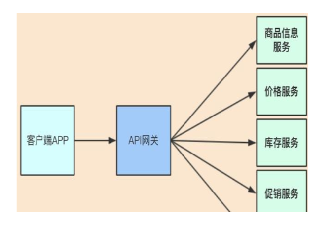
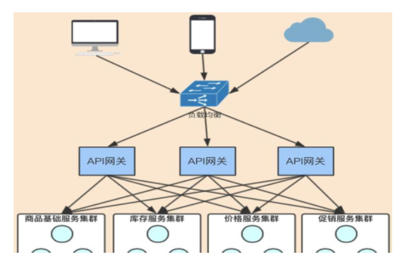
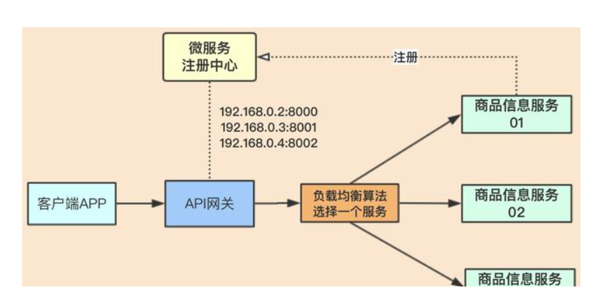
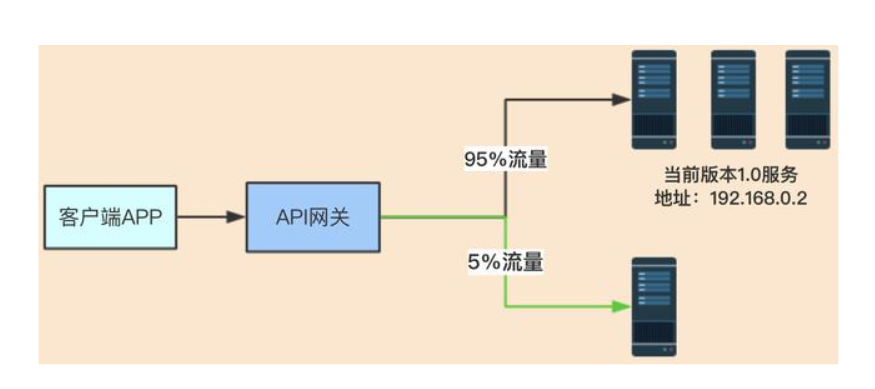
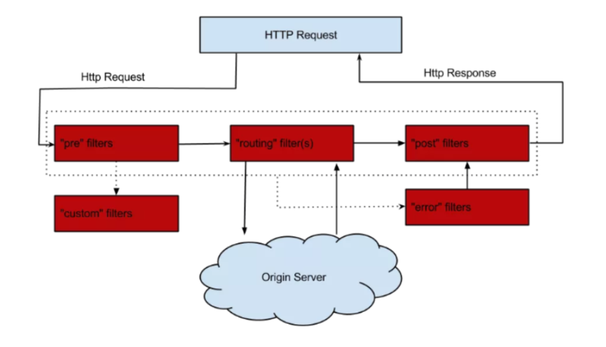

## 概述简介

### 官网资料

https://github.com/Netflix/zuul/wiki/Getting-Started

https://cloud.spring.io/spring-cloud-static/spring-cloud-netflix/2.2.1.RELEASE/reference/html/#router-and-filter-zuul


### 是什么

Zuul是一种提供动态路由、监视、弹性、安全性等功能的边缘服务。
Zuul是Netflix出品的一个基于JVM路由和服务端的负载均衡器。

API网关为微服务架构中的服务提供了统一的访问入口，客户端通过API网关访问相关服务。API网关的定义类似于设计模式中的门面模式，它相当于整个微服务架构中的门面，所有客户端的访问都通过它来进行路由及过滤。它实现了请求路由、负载均衡、校验过滤、服务容错、服务聚合等功能。





Zuul包含了如下最主要的功能：
代理+路由+过滤三大功能


### 能干嘛

#### 路由

#### 过滤

#### 负载均衡

网关为入口，由网关与微服务进行交互，所以网关必须要实现负载均衡的功能；
网关会获取微服务注册中心里面的服务连接地址，再配合一些算法选择其中一个服务地址，进行处理业务。
这个属于客户端侧的负载均衡，由调用方去实现负载均衡逻辑。



#### 灰度发布

又称金丝雀发布

起源是，矿井工人发现，金丝雀对瓦斯气体很敏感，矿工会在下井之前，先放一只金丝雀到井中，如果金丝雀不叫了，就代表瓦斯浓度高。



在灰度发布开始后，先启动一个新版本应用，但是并不直接将流量切过来，而是测试人员对新版本进行线上测试，启动的这个新版本应用，就是我们的金丝雀。如果没有问题，那么可以将少量的用户流量导入到新版本上，然后再对新版本做运行状态观察，收集各种运行时数据，如果此时对新旧版本做各种数据对比，就是所谓的A/B测试。新版本没什么问题，那么逐步扩大范围、流量，把所有用户都迁移到新版本上面来。


## 路由基本配置

功能：路由功能负责将外部请求转发到具体的服务实例上去，是实现统一访问入口的基础


新建Module模块cloud-zuul-gateway9527


POM

```xml
    <dependencies>
        <dependency>
            <groupId>org.springframework.cloud</groupId>
            <artifactId>spring-cloud-starter-netflix-eureka-client</artifactId>
        </dependency>
        <dependency>
            <groupId>org.springframework.cloud</groupId>
            <artifactId>spring-cloud-starter-netflix-zuul</artifactId>
        </dependency>

        <dependency>
            <groupId>org.springframework.boot</groupId>
            <artifactId>spring-boot-starter-actuator</artifactId>
        </dependency>
        <dependency>
            <groupId>org.springframework.boot</groupId>
            <artifactId>spring-boot-devtools</artifactId>
            <scope>runtime</scope>
            <optional>true</optional>
        </dependency>
        <dependency>
            <groupId>org.projectlombok</groupId>
            <artifactId>lombok</artifactId>
            <optional>true</optional>
        </dependency>
        <dependency>
            <groupId>org.springframework.boot</groupId>
            <artifactId>spring-boot-starter-test</artifactId>
            <scope>test</scope>
        </dependency>
    </dependencies>
```


YML

```yaml
server:
  port: 9527

spring:
  application:
    name: cloud-zuul-gateway

eureka:
  client:
    service-url:
      #defaultZone: http://eureka7001.com:7001/eureka,http://eureka7002.com:7002/eureka,http://eureka7003.com:7003/eureka
      defaultZone: http://eureka7001.com:7001/eureka
  instance:
    instance-id: gateway-9527.com
    prefer-ip-address: true
```


hosts修改

127.0.0.1  myzuul.com


主启动类：@EnableZuulProxy

```java
@SpringBootApplication
@EnableZuulProxy
public class Zuul_9527_StartSpringCloudApp
{
    public static void main(String[] args)
    {
        SpringApplication.run(Zuul_9527_StartSpringCloudApp.class, args);
    }
}
```


启动

eureka单机

一个服务提供类cloud-provider-payment8001

一个路由cloud-zuul-gateway9527


测试

不用路由

http://localhost:8001/paymentInfo

启用路由

zuul映射配置+注册中心注册后对外暴露的服务名称+rest调用地址

http://myzuul.com:9527/cloud-payment-service/paymentInfo


## 路由访问映射规则

工程cloud-zuul-gateway9527


代理名称

YML

```yaml
zuul:
  #ignored-services: cloud-payment-service
  routes: # 路由映射配置
    mypayment.serviceId: cloud-payment-service
    mypayment.path: /weixin/**
```

通过http://myzuul.com:9527/weixin/paymentInfo访问


此时：

如果不想使用默认的路由规则，可以添加以下配置来忽略默认路由配置


原有真实服务名忽略

```yaml
zuul:
  ignored-services: cloud-payment-service
  routes: # 路由映射配置
    mypayment.serviceId: cloud-payment-service
    mypayment.path: /weixin/**
```

单个具体，多个可以用"*"

```yaml
zuul: 
  ignored-services: "*"
  routes: 
    mydept.serviceId: microservicecloud-dept
    mydept.path: /mydept/**
```


### 路由转发和负载均衡功能

#### 服务提供者SMS短信模块

建模块cloud-provider-sms8008

POM

```xml
<dependencies>
        <dependency>
            <groupId>org.springframework.boot</groupId>
            <artifactId>spring-boot-starter-web</artifactId>
        </dependency>
        <dependency>
            <groupId>org.springframework.cloud</groupId>
            <artifactId>spring-cloud-starter-netflix-eureka-client</artifactId>
        </dependency>
        <dependency>
            <groupId>org.springframework.boot</groupId>
            <artifactId>spring-boot-starter-actuator</artifactId>
        </dependency>

        <dependency>
            <groupId>org.springframework.boot</groupId>
            <artifactId>spring-boot-devtools</artifactId>
            <scope>runtime</scope>
            <optional>true</optional>
        </dependency>
        <dependency>
            <groupId>org.projectlombok</groupId>
            <artifactId>lombok</artifactId>
            <optional>true</optional>
        </dependency>
        <dependency>
            <groupId>org.springframework.boot</groupId>
            <artifactId>spring-boot-starter-test</artifactId>
            <scope>test</scope>
        </dependency>
    </dependencies>
```


YML

```yaml
server:
  port: 8008

###服务名称(服务注册到eureka名称)
spring:
  application:
    name: cloud-provider-sms

eureka:
  client: #服务提供者provider注册进eureka服务列表内
    service-url:
      register-with-eureka: true
      fetch-registry: true
      #defaultZone: http://eureka7001.com:7001/eureka,http://eureka7002.com:7002/eureka,http://eureka7003.com:7003/eureka
      #defaultZone: http://127.0.0.1:7001/eureka,http://127.0.0.1:7002/eureka
      defaultZone: http://eureka7001.com:7001/eureka   # eureka集群加@老本版

```


主启动

```java
@SpringBootApplication
@EnableEurekaClient
public class MainAppSMS8008
{
    public static void main(String[] args)
    {
        SpringApplication.run(MainAppSMS8008.class,args);
    }
}
```


业务类

```java
@RestController
public class SMSController
{
    @Value("${server.port}")
    private String serverPort;

    @GetMapping("/sms")
    public String sms()
    {
        return "sms provider service: "+"\t"+serverPort;
    }
}
```


启动8008并成功注册进eureka服务器上


#### 修改我们的zuul服务9527

修改YML，体现路由转发和负载均衡

```yaml
zuul:
  ignored-services: cloud-payment-service
  routes: # 路由映射配置
    mypayment.serviceId: cloud-payment-service
    mypayment.path: /weixin/**
    mysms.serviceId: cloud-provider-sms
    mysms.path: /mysms/**
```


由于Zuul自动集成了Ribbon和Hystrix，所以Zuul天生就有负载均衡和服务容错能力


#### 测试

http://myzuul.com:9527/weixin/paymentInfo 负载均衡

http://myzuul.com:9527/mysms/sms  路由转发

微信服务找8001/8002

短信服务找8008


### 设置统一公共前缀

YML

```yaml
zuul:
  ignored-services: cloud-payment-service
  routes: # 路由映射配置
    mypayment.serviceId: cloud-payment-service
    mypayment.path: /weixin/**
    mysms.serviceId: cloud-provider-sms
    mysms.path: /mysms/**
  prefix: /test #访问路径前缀
```


最后YML

```yaml
server:
  port: 9527

spring:
  application:
    name: cloud-zuul-gateway

eureka:
  client:
    service-url:
      #defaultZone: http://eureka7001.com:7001/eureka,http://eureka7002.com:7002/eureka,http://eureka7003.com:7003/eureka
      defaultZone: http://eureka7001.com:7001/eureka
  instance:
    instance-id: gateway-9527.com
    prefer-ip-address: true

zuul:
  ignored-services: cloud-payment-service
  routes: # 路由映射配置
    mypayment.serviceId: cloud-payment-service  #普通服务提供者
    mypayment.path: /weixin/**
    mysms.serviceId: cloud-provider-sms #短信服务
    mysms.path: /mysms/**   #短信服务访问路径
  prefix: /test #访问路径前缀
```


## 查看路由信息

POM

```xml
<dependency>
    <groupId>org.springframework.boot</groupId>
    <artifactId>spring-boot-starter-actuator</artifactId>
</dependency>
```


YML

```yaml
# 开启查看路由的端点
management:
  endpoints:
    web:
      exposure:
        include: 'routes'
```


查看路由详细信息

http://localhost:9527/actuator/routes

```json
{
    "/test/weixin/**": "cloud-payment-service",
    "/test/mysms/**": "cloud-provider-sms",
    "/test/cloud-provider-sms/**": "cloud-provider-sms"
}
```


## 过滤器

### 功能

过滤功能负责对请求过程进行额外的处理，是请求校验过滤及服务聚合的基础。


### 过滤器的生命周期



### ZuulFilter

过滤类型:

pre：在请求被路由到目标服务前执行，比如权限校验、打印日志等功能；

routing：在请求被路由到目标服务时执行

post：在请求被路由到目标服务后执行，比如给目标服务的响应添加头信息，收集统计数据等功能；

error：请求在其他阶段发生错误时执行。


过滤顺序:

数字小的先执行


过滤是否开启:

shouldFilter方法为true走


执行逻辑:

自己的业务逻辑


#### 案例Case

前置过滤器，用于在请求路由到目标服务前打印请求日志


业务代码

```java
@Component
@Slf4j
public class PreLogFilter extends ZuulFilter
{
    @Override
    public String filterType()
    {
        return "pre";
    }

    @Override
    public int filterOrder()
    {
        return 1;
    }

    @Override
    public boolean shouldFilter()
    {
        return true;
    }

    @Override
    public Object run() throws ZuulException
    {
        RequestContext requestContext = RequestContext.getCurrentContext();
        HttpServletRequest request = requestContext.getRequest();
        String host = request.getRemoteHost();
        String method = request.getMethod();
        String uri = request.getRequestURI();
        //log.info("=====> Remote host:{},method:{},uri:{}", host, method, uri);
        System.out.println("********"+new Date().getTime());
        return null;
    }
}
```


测试

http://myzuul.com:9527/atguigu/mysms/sms

在调用8008之前会打印日志


开关，YML配置

```yaml
zuul:
  PreLogFilter:
    pre:
      disable: false #true 禁用过滤 false 启用
```

