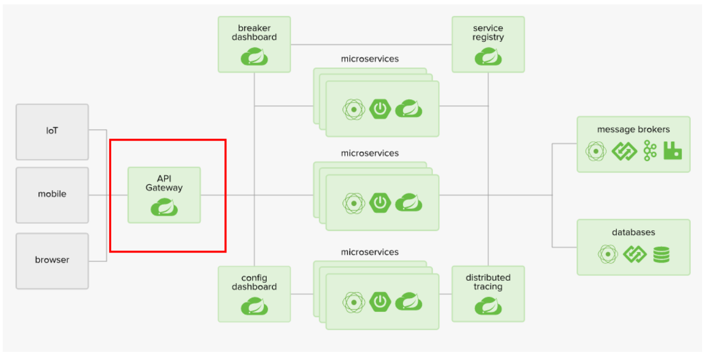
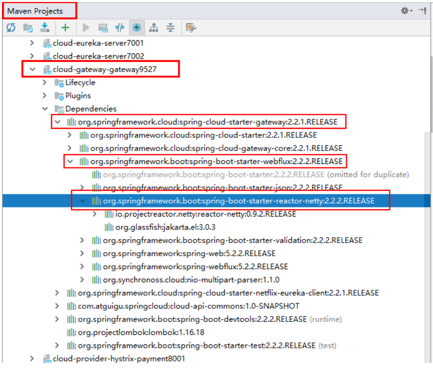
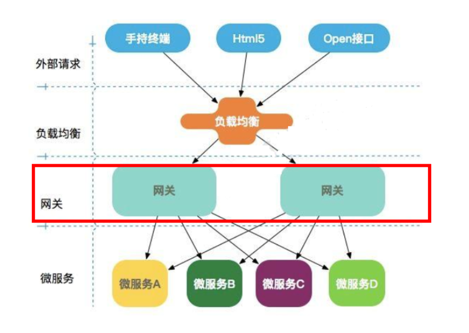
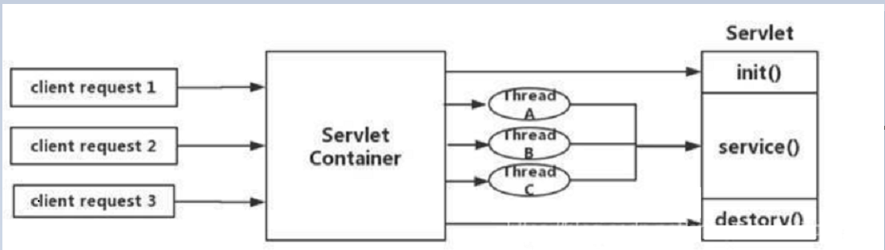
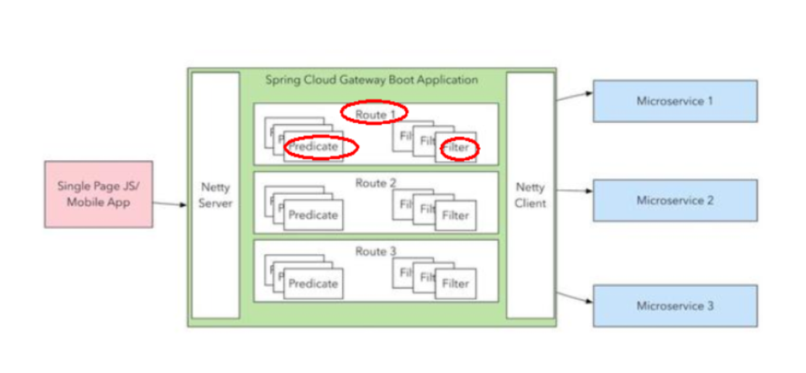
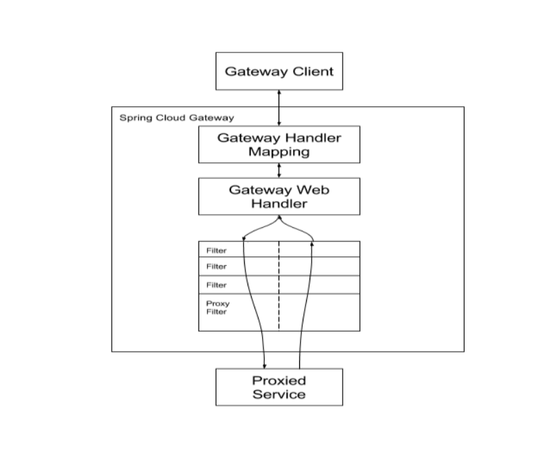
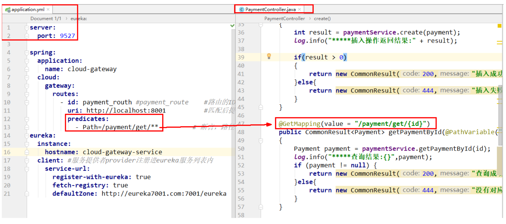
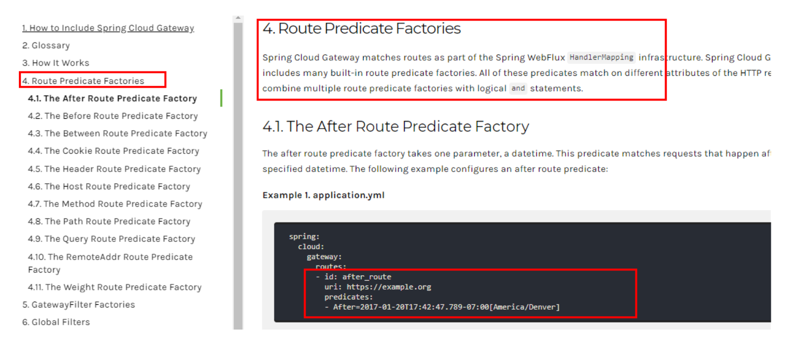
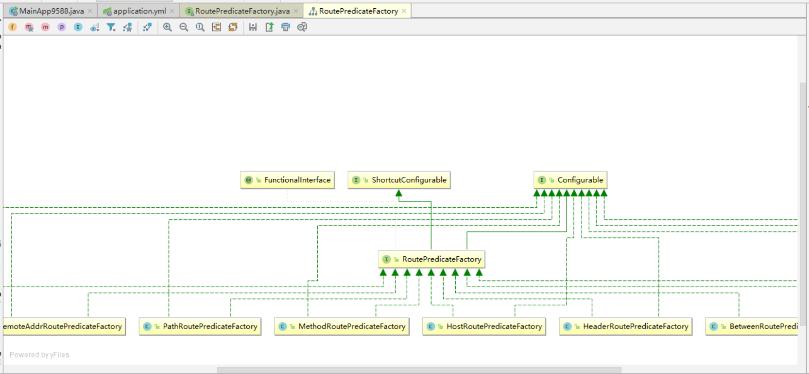

## 概述简介

### 官网

上一代zuul 1.X

https://github.com/Netflix/zuul/wiki


当前gateway

https://cloud.spring.io/spring-cloud-static/spring-cloud-gateway/2.2.1.RELEASE/reference/html/


### 是什么

Cloud全家桶中有个很重要的组件就是网关，在1.x版本中都是采用的Zuul网关；
但在2.x版本中，zuul的升级一直跳票，SpringCloud最后自己研发了一个网关替代Zuul，
那就是SpringCloud Gateway一句话：gateway是原zuul1.x版的替代




概述

SpringCloud Gateway 是 Spring Cloud 的一个全新项目，基于 Spring 5.0+Spring Boot 2.0 和 Project Reactor 等技术开发的网关，它旨在为微服务架构提供一种简单有效的统一的 API 路由管理方式。

SpringCloud Gateway 作为 Spring Cloud 生态系统中的网关，目标是替代 Zuul，在Spring Cloud 2.0以上版本中，没有对新版本的Zuul 2.0以上最新高性能版本进行集成，仍然还是使用的Zuul 1.x非Reactor模式的老版本。而为了提升网关的性能，SpringCloud Gateway是基于WebFlux框架实现的，而WebFlux框架底层则使用了高性能的Reactor模式通信框架Netty。

Spring Cloud Gateway的目标提供统一的路由方式且基于 Filter 链的方式提供了网关基本的功能，例如：安全，监控/指标，和限流。


一句话：SpringCloud Gateway 使用的Webflux中的reactor-netty响应式编程组件，底层使用了Netty通讯框架。


源码架构




### 能干嘛

反向代理

鉴权

流量控制

熔断

日志监控

。。。。。。


### 微服务架构中网关在哪里




### 有Zuul了怎么又出来了gateway


#### 我们为什么选择Gateway？

1.neflix不太靠谱，zuul2.0一直跳票，迟迟不发布

一方面因为Zuul1.0已经进入了维护阶段，而且Gateway是SpringCloud团队研发的，是亲儿子产品，值得信赖。
而且很多功能Zuul都没有用起来也非常的简单便捷。

Gateway是基于异步非阻塞模型上进行开发的，性能方面不需要担心。虽然Netflix早就发布了最新的 Zuul 2.x，
但 Spring Cloud 貌似没有整合计划。而且Netflix相关组件都宣布进入维护期；不知前景如何？

多方面综合考虑Gateway是很理想的网关选择。


2.SpringCloud Gateway具有如下特性

Spring Cloud Gateway 具有如下特性：

基于Spring Framework 5, Project Reactor 和 Spring Boot 2.0 进行构建；
动态路由：能够匹配任何请求属性；
可以对路由指定 Predicate（断言）和 Filter（过滤器）；
集成Hystrix的断路器功能；
集成 Spring Cloud 服务发现功能；
易于编写的 Predicate（断言）和 Filter（过滤器）；
请求限流功能；
支持路径重写。


3.Spring Cloud Gateway 与 Zuul的区别
在SpringCloud Finchley 正式版之前，Spring Cloud 推荐的网关是 Netflix 提供的Zuul：

1、Zuul 1.x，是一个基于阻塞 I/ O 的 API Gateway

2、Zuul 1.x 基于Servlet 2. 5使用阻塞架构它不支持任何长连接(如 WebSocket) Zuul 的设计模式和Nginx较像，每次 I/ O 操作都是从工作线程中选择一个执行，请求线程被阻塞到工作线程完成，但是差别是Nginx 用C++ 实现，Zuul 用 Java 实现，而 JVM 本身会有第一次加载较慢的情况，使得Zuul 的性能相对较差。

3、Zuul 2.x理念更先进，想基于Netty非阻塞和支持长连接，但SpringCloud目前还没有整合。 Zuul 2.x的性能较 Zuul 1.x 有较大提升。在性能方面，根据官方提供的基准测试， Spring Cloud Gateway 的 RPS（每秒请求数）是Zuul 的 1. 6 倍。

4、Spring Cloud Gateway 建立 在 Spring Framework 5、 Project Reactor 和 Spring Boot 2 之上， 使用非阻塞 API。

5、Spring Cloud Gateway 还 支持 WebSocket， 并且与Spring紧密集成拥有更好的开发体验


#### Zuul1.x模型

Springcloud中所集成的Zuul版本，采用的是Tomcat容器，使用的是传统的Servlet IO处理模型。

学过尚硅谷web中期课程都知道一个题目，Servlet的生命周期?servlet由servlet container进行生命周期管理。
container启动时构造servlet对象并调用servlet init()进行初始化；
container运行时接受请求，并为每个请求分配一个线程（一般从线程池中获取空闲线程）然后调用service()。
container关闭时调用servlet destory()销毁servlet；



上述模式的缺点：
servlet是一个简单的网络IO模型，当请求进入servlet container时，servlet container就会为其绑定一个线程，在并发不高的场景下这种模型是适用的。但是一旦高并发(比如抽风用jemeter压)，线程数量就会上涨，而线程资源代价是昂贵的（上线文切换，内存消耗大）严重影响请求的处理时间。在一些简单业务场景下，不希望为每个request分配一个线程，只需要1个或几个线程就能应对极大并发的请求，这种业务场景下servlet模型没有优势

所以Zuul 1.X是基于servlet之上的一个阻塞式处理模型，即spring实现了处理所有request请求的一个servlet（DispatcherServlet）并由该servlet阻塞式处理处理。所以Springcloud Zuul无法摆脱servlet模型的弊端


#### GateWay模型


WebFlux是什么


 https://docs.spring.io/spring/docs/current/spring-framework-reference/web-reactive.html#webflux-new-framework


传统的Web框架，比如说：struts2，springmvc等都是基于Servlet API与Servlet容器基础之上运行的。
但是
在Servlet3.1之后有了异步非阻塞的支持。而WebFlux是一个典型非阻塞异步的框架，它的核心是基于Reactor的相关API实现的。相对于传统的web框架来说，它可以运行在诸如Netty，Undertow及支持Servlet3.1的容器上。非阻塞式+函数式编程（Spring5必须让你使用java8）

Spring WebFlux 是 Spring 5.0 引入的新的响应式框架，区别于 Spring MVC，它不需要依赖Servlet API，它是完全异步非阻塞的，并且基于 Reactor 来实现响应式流规范。

 

## 三大核心概念

### Route(路由)


路由是构建网关的基本模块，它由ID，目标URI，一系列的断言和过滤器组成，如果断言为true则匹配该路由


### Predicate(断言)

参考的是Java8的java.util.function.Predicate
开发人员可以匹配HTTP请求中的所有内容(例如请求头或请求参数)，如果请求与断言相匹配则进行路由


### Filter(过滤)

指的是Spring框架中GatewayFilter的实例，使用过滤器，可以在请求被路由前或者之后对请求进行修改。


### 总体



web请求，通过一些匹配条件，定位到真正的服务节点。并在这个转发过程的前后，进行一些精细化控制。
predicate就是我们的匹配条件；
而filter，就可以理解为一个无所不能的拦截器。有了这两个元素，再加上目标uri，就可以实现一个具体的路由了


## Gateway工作流程

官网总结



客户端向 Spring Cloud Gateway 发出请求。然后在 Gateway Handler Mapping 中找到与请求相匹配的路由，将其发送到 Gateway Web Handler。


核心逻辑

路由转发+执行过滤器链


## 入门配置

新建Module

cloud-gateway-gateway9527


POM

```xml
<dependencies>
        <!--gateway-->
        <dependency>
            <groupId>org.springframework.cloud</groupId>
            <artifactId>spring-cloud-starter-gateway</artifactId>
        </dependency>
        <!--eureka-client-->
        <dependency>
            <groupId>org.springframework.cloud</groupId>
            <artifactId>spring-cloud-starter-netflix-eureka-client</artifactId>
        </dependency>
        <!-- 引入自己定义的api通用包，可以使用Payment支付Entity -->
        <dependency>
            <groupId>com.springcloud</groupId>
            <artifactId>cloud-api-commons</artifactId>
            <version>${project.version}</version>
        </dependency>
        <!--一般基础配置类-->
        <dependency>
            <groupId>org.springframework.boot</groupId>
            <artifactId>spring-boot-devtools</artifactId>
            <scope>runtime</scope>
            <optional>true</optional>
        </dependency>
        <dependency>
            <groupId>org.projectlombok</groupId>
            <artifactId>lombok</artifactId>
            <optional>true</optional>
        </dependency>
        <dependency>
            <groupId>org.springframework.boot</groupId>
            <artifactId>spring-boot-starter-test</artifactId>
            <scope>test</scope>
        </dependency>
    </dependencies>
```


YML

```yaml
server:
  port: 9527

spring:
  application:
    name: cloud-gateway
  cloud:
    gateway:
      routes:
        - id: payment_routh #payment_route    #路由的ID，没有固定规则但要求唯一，建议配合服务名
          uri: http://localhost:8001          #匹配后提供服务的路由地址
          predicates:
            - Path=/payment/get/**         # 断言，路径相匹配的进行路由

        - id: payment_routh2 #payment_route    #路由的ID，没有固定规则但要求唯一，建议配合服务名
          uri: http://localhost:8001          #匹配后提供服务的路由地址
          predicates:
            - Path=/payment/lb/**         # 断言，路径相匹配的进行路由

eureka:
  instance:
    hostname: cloud-gateway-service
  client: #服务提供者provider注册进eureka服务列表内
    service-url:
      register-with-eureka: true
      fetch-registry: true
      defaultZone: http://eureka7001.com:7001/eureka
```


主启动类

```java
@SpringBootApplication
@EnableEurekaClient
public class GateWayMain9527
{
    public static void main(String[] args)
    {
        SpringApplication.run(GateWayMain9527.class,args);
    }
}
```


~~9527网关如何做路由映射那？？？~~

我们目前不想暴露8001端口，希望在8001外面套一层9527


YML新增网关配置


测试：

启动7001

启动8001：cloud-provider-payment8001

启动9527网关


访问说明



添加网关前http://localhost:8001/payment/get/31

添加网关后http://localhost:9527/payment/get/31


### YML配置说明

Gateway网关路由有两种配置方式：

在配置文件yml中配置


代码中注入RouteLocator的Bean

业务需求:通过9527网关访问到外网的百度新闻网址

```java
@Configuration
public class GateWayConfig
{
    /**
     * 配置了一个id为route-name的路由规则，
     * 当访问地址 http://localhost:9527/guonei时会自动转发到地址：http://news.baidu.com/guonei
     * @param builder
     * @return
     */
    @Bean
    public RouteLocator customRouteLocator(RouteLocatorBuilder builder)
    {
        RouteLocatorBuilder.Builder routes = builder.routes();

        routes.route("path_route_atguigu", r -> r.path("/guonei").uri("http://news.baidu.com/guonei")).build();

        return routes.build();

    }
    @Bean
    public RouteLocator customRouteLocator2(RouteLocatorBuilder builder)
    {
        RouteLocatorBuilder.Builder routes = builder.routes();
        routes.route("path_route_atguigu2", r -> r.path("/guoji").uri("http://news.baidu.com/guoji")).build();
        return routes.build();
    }
}
```


## 通过微服务名实现动态路由

默认情况下Gateway会根据注册中心注册的服务列表，
以注册中心上微服务名为路径创建动态路由进行转发，从而实现动态路由的功能


启动：

一个eureka7001 + 两个服务提供者8001/8002


POM

```xml
<dependency>
    <groupId>org.springframework.cloud</groupId>
    <artifactId>spring-cloud-starter-netflix-eureka-client</artifactId>
</dependency>
```


YML

需要注意的是uri的协议为lb，表示启用Gateway的负载均衡功能。

lb://serviceName是spring cloud gateway在微服务中自动为我们创建的负载均衡uri

```yaml
spring:
  application:
    name: cloud-gateway
  cloud:
    gateway:
      discovery:
        locator:
          enabled: true #开启从注册中心动态创建路由的功能，利用微服务名进行路由
      routes:
        - id: payment_routh #payment_route    #路由的ID，没有固定规则但要求唯一，建议配合服务名
          # uri: http://localhost:8001          #匹配后提供服务的路由地址
          uri: lb://cloud-payment-service #匹配后提供服务的路由地址
          predicates:
            - Path=/payment/get/**         # 断言，路径相匹配的进行路由

        - id: payment_routh2 #payment_route    #路由的ID，没有固定规则但要求唯一，建议配合服务名
          # uri: http://localhost:8001          #匹配后提供服务的路由地址
          uri: lb://cloud-payment-service #匹配后提供服务的路由地址
          predicates:
            - Path=/payment/lb/**         # 断言，路径相匹配的进行路由
```


测试

http://localhost:9527/payment/lb

8001/8002两个端口切换


## Predicate的使用

是什么

```markdown
2022-04-29 16:11:50.392  INFO 13400 --- [  restartedMain] o.s.c.g.r.RouteDefinitionRouteLocator    : Loaded RoutePredicateFactory [After]
2022-04-29 16:11:50.393  INFO 13400 --- [  restartedMain] o.s.c.g.r.RouteDefinitionRouteLocator    : Loaded RoutePredicateFactory [Before]
2022-04-29 16:11:50.393  INFO 13400 --- [  restartedMain] o.s.c.g.r.RouteDefinitionRouteLocator    : Loaded RoutePredicateFactory [Between]
2022-04-29 16:11:50.393  INFO 13400 --- [  restartedMain] o.s.c.g.r.RouteDefinitionRouteLocator    : Loaded RoutePredicateFactory [Cookie]
2022-04-29 16:11:50.393  INFO 13400 --- [  restartedMain] o.s.c.g.r.RouteDefinitionRouteLocator    : Loaded RoutePredicateFactory [Header]
2022-04-29 16:11:50.393  INFO 13400 --- [  restartedMain] o.s.c.g.r.RouteDefinitionRouteLocator    : Loaded RoutePredicateFactory [Host]
2022-04-29 16:11:50.393  INFO 13400 --- [  restartedMain] o.s.c.g.r.RouteDefinitionRouteLocator    : Loaded RoutePredicateFactory [Method]
2022-04-29 16:11:50.393  INFO 13400 --- [  restartedMain] o.s.c.g.r.RouteDefinitionRouteLocator    : Loaded RoutePredicateFactory [Path]
2022-04-29 16:11:50.393  INFO 13400 --- [  restartedMain] o.s.c.g.r.RouteDefinitionRouteLocator    : Loaded RoutePredicateFactory [Query]
2022-04-29 16:11:50.393  INFO 13400 --- [  restartedMain] o.s.c.g.r.RouteDefinitionRouteLocator    : Loaded RoutePredicateFactory [ReadBodyPredicateFactory]
2022-04-29 16:11:50.393  INFO 13400 --- [  restartedMain] o.s.c.g.r.RouteDefinitionRouteLocator    : Loaded RoutePredicateFactory [RemoteAddr]
2022-04-29 16:11:50.393  INFO 13400 --- [  restartedMain] o.s.c.g.r.RouteDefinitionRouteLocator    : Loaded RoutePredicateFactory [Weight]
2022-04-29 16:11:50.393  INFO 13400 --- [  restartedMain] o.s.c.g.r.RouteDefinitionRouteLocator    : Loaded RoutePredicateFactory [CloudFoundryRouteService]
```


Route Predicate Factories这个是什么东东?



Spring Cloud Gateway将路由匹配作为Spring WebFlux HandlerMapping基础架构的一部分。
Spring Cloud Gateway包括许多内置的Route Predicate工厂。所有这些Predicate都与HTTP请求的不同属性匹配。多个Route Predicate工厂可以进行组合

Spring Cloud Gateway 创建 Route 对象时， 使用 RoutePredicateFactory 创建 Predicate 对象，Predicate 对象可以赋值给 Route。 Spring Cloud Gateway 包含许多内置的Route Predicate Factories。

所有这些谓词都匹配HTTP请求的不同属性。多种谓词工厂可以组合，并通过逻辑and。


### 常用的Route Predicate




After Route Predicate

```yaml
          predicates:
       - Path=/payment/lb/**         # 断言，路径相匹配的进行路由
             - After=2020-02-05T15:10:03.685+08:00[Asia/Shanghai]         # 断言，路径相匹配的进行路由
```


Before Route Predicate

```yaml
            - After=2020-02-05T15:10:03.685+08:00[Asia/Shanghai]         # 断言，路径相匹配的进行路由
            - Before=2020-02-05T15:10:03.685+08:00[Asia/Shanghai]         # 断言，路径相匹配的进行路由
```


Between Route Predicate


Cookie Route Predicate

Cookie Route Predicate需要两个参数，一个是 Cookie name ,一个是正则表达式。
路由规则会通过获取对应的 Cookie name 值和正则表达式去匹配，如果匹配上就会执行路由，如果没有匹配上则不执行

不带cookies访问:curl http://localhost:9527/payment/lb

带上cookies访问:curl http://localhost:9527/payment/lb --cookie "username=zzyy"

加入curl返回中文乱码:https://blog.csdn.net/leedee/article/details/82685636


Header Route Predicate


Host Route Predicate


Method Route Predicate


Path Route Predicate


Query Route Predicate


小总结

```yaml
 
server:
  port: 9527

spring:
  application:
    name: cloud-gateway
  cloud:
    gateway:
      discovery:
        locator:
          enabled: true #开启从注册中心动态创建路由的功能
      routes:
        - id: payment_routh #payment_route    #路由的ID，没有固定规则但要求唯一，建议配合服务名
          # uri: http://localhost:8001          #匹配后提供服务的路由地址
          uri: lb://cloud-payment-service #匹配后提供服务的路由地址
          predicates:
            - Path=/payment/get/**         # 断言，路径相匹配的进行路由

        - id: payment_routh2 #payment_route    #路由的ID，没有固定规则但要求唯一，建议配合服务名
          # uri: http://localhost:8001          #匹配后提供服务的路由地址
          uri: lb://cloud-payment-service #匹配后提供服务的路由地址
          predicates:
            - Path=/payment/lb/**         # 断言，路径相匹配的进行路由
            - After=2020-02-05T15:10:03.685+08:00[Asia/Shanghai]         # 断言，路径相匹配的进行路由
            #- Before=2020-02-05T15:10:03.685+08:00[Asia/Shanghai]         # 断言，路径相匹配的进行路由
            #- Between=2020-02-02T17:45:06.206+08:00[Asia/Shanghai],2020-03-25T18:59:06.206+08:00[Asia/Shanghai]
            #- Cookie=username,zzyy
            #- Header=X-Request-Id, \d+  # 请求头要有X-Request-Id属性并且值为整数的正则表达式
            #- Host=**.atguigu.com
            - Method=GET
            - Query=username, \d+  # 要有参数名username并且值还要是整数才能路由


eureka:
  instance:
    hostname: cloud-gateway-service
  client: #服务提供者provider注册进eureka服务列表内
    service-url:
      register-with-eureka: true
      fetch-registry: true
      defaultZone: http://eureka7001.com:7001/eureka

#id：我们自定义的路由 ID，保持唯一
 ##uri：目标服务地址
 ##predicates：路由条件，Predicate接受一个输入参数返回一个布尔值。
 ##            该属性包含多种默认方法来将Predicate组合成其他复杂的逻辑(比如：与，或，非)

```


说白了，Predicate就是为了实现一组匹配规则，
让请求过来找到对应的Route进行处理。


## Filter的使用

### 是什么

路由过滤器可用于修改进入的HTTP请求和返回的HTTP响应，路由过滤器只能指定路由进行使用。

Spring Cloud Gateway 内置了多种路由过滤器，他们都由GatewayFilter的工厂类来产生


### Spring Cloud Gateway的Filter

生命周期，Only Two

pre

post


种类，Only Two

GatewayFilter 

https://cloud.spring.io/spring-cloud-static/spring-cloud-gateway/2.2.1.RELEASE/reference/html/#the-addrequestparameter-gatewayfilter-factory
31种之多。。。。。 

GlobalFilter


### 常用的GatewayFilter

AddRequestParameter

```yaml
spring:
  application:
    name: cloud-gateway
  cloud:
    gateway:
      discovery:
        locator:
          enabled: true #开启从注册中心动态创建路由的功能
          lower-case-service-id: true #使用小写服务名，默认是大写
      routes:
        - id: payment_routh #payment_route #路由的ID，没有固定规则但要求唯一，建议配合服务名
          uri: lb://cloud-provider-payment #匹配后的目标服务地址，供服务的路由地址
          #uri: http://localhost:8001 #匹配后提供服务的路由地址
          filters:
            - AddRequestParameter=X-Request-Id,1024 #过滤器工厂会在匹配的请求头加上一对请求头，名称为X-Request-Id值为1024
          predicates:
            - Path=/paymentInfo/**        # 断言，路径相匹配的进行路由
            - Method=GET,POST
```


### 自定义过滤器

自定义全局GlobalFilter

两个主要接口介绍:implements GlobalFilter,Ordered


能干嘛:

全局日志记录 

统一网关鉴权

。。。。。。


案例代码

```java
@Component //必须加，必须加，必须加
public class MyLogGateWayFilter implements GlobalFilter, Ordered
{
    @Override
    public Mono<Void> filter(ServerWebExchange exchange, GatewayFilterChain chain)
    {
        System.out.println("time:"+new Date()+"\t 执行了自定义的全局过滤器: "+"MyLogGateWayFilter"+"hello");

        String uname = exchange.getRequest().getQueryParams().getFirst("uname");
        if (uname == null) {
            System.out.println("****用户名为null，无法登录");
            exchange.getResponse().setStatusCode(HttpStatus.NOT_ACCEPTABLE);
            return exchange.getResponse().setComplete();
        }
        return chain.filter(exchange);
    }

    @Override
    public int getOrder()
    {
        return 0;
    }
}
```


测试

启动:7001  9527 8001 8002


正确

http://localhost:9527/payment/lb?uname=z3


错误

没有参数uname

http://localhost:9527/payment/lb：无法正常使用转发