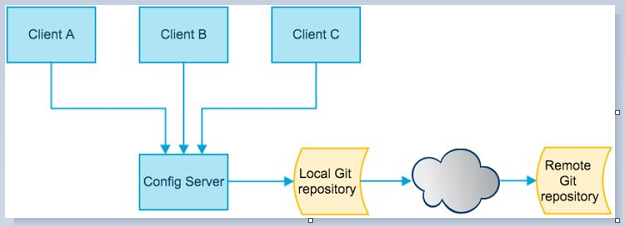

## 概述

### 分布式系统面临的---配置问题

   微服务意味着要将单体应用中的业务拆分成一个个子服务，每个服务的粒度相对较小，因此系统中会出现大量的服务。由于每个服务都需要必要的配置信息才能运行，所以一套集中式的、动态的配置管理设施是必不可少的。

SpringCloud提供了ConfigServer来解决这个问题，我们每一个微服务自己带着一个application.yml，上百个配置文件的管理......
/(ㄒoㄒ)/~~





### 是什么

SpringCloud Config为微服务架构中的微服务提供集中化的外部配置支持，配置服务器为各个不同微服务应用的所有环境提供了一个中心化的外部配置。

### 怎么玩

SpringCloud Config分为服务端和客户端两部分。

服务端也称为分布式配置中心，它是一个独立的微服务应用，用来连接配置服务器并为客户端提供获取配置信息，加密/解密信息等访问接口


### 能干嘛

集中管理配置文件

不同环境不同配置，动态化的配置更新，分环境部署比如dev/test/prod/beta/release

运行期间动态调整配置，不再需要在每个服务部署的机器上编写配置文件，服务会向配置中心统一拉取配置自己的信息

当配置发生变动时，服务不需要重启即可感知到配置的变化并应用新的配置

将配置信息以REST接口的形式暴露：post、curl访问刷新均可......


### 与GitHub整合配置

由于SpringCloud Config默认使用Git来存储配置文件(也有其它方式,比如支持SVN和本地文件)，
但最推荐的还是Git，而且使用的是http/https访问的形式


### 官网

https://cloud.spring.io/spring-cloud-static/spring-cloud-config/2.2.1.RELEASE/reference/html/


## Config服务端配置与测试


用你自己的账号在GitHub上新建一个名为springcloud-config的新Repository

由上一步获得刚新建的git地址

https://github.com/fangyishui/springcloud-config.git


本地硬盘目录上新建git仓库并clone

```shell
git clone https://github.com/fangyishui/springcloud-config.git
```


此时在本地盘符下*\springcloud-config

```markdown
config-dev.yml
config-prod.yml
config-test.yml
README.md
```


表示多个环境的配置文件

保存格式必须为UTF-8

如果需要修改，此处模拟运维人员操作git和github

```shell
git add .
git commit -m "init yml"
git push origin master
```


### 新建Module模块cloud-config-center-3344

它即为Cloud的配置中心模块cloudConfig Center


POM

```xml
<dependencies>
        <dependency>
            <groupId>org.springframework.cloud</groupId>
            <artifactId>spring-cloud-config-server</artifactId>
        </dependency>
        <dependency>
            <groupId>org.springframework.cloud</groupId>
            <artifactId>spring-cloud-starter-netflix-eureka-client</artifactId>
        </dependency>
        <dependency>
            <groupId>org.springframework.boot</groupId>
            <artifactId>spring-boot-starter-web</artifactId>
        </dependency>

        <dependency>
            <groupId>org.springframework.boot</groupId>
            <artifactId>spring-boot-starter-actuator</artifactId>
        </dependency>
        <dependency>
            <groupId>org.springframework.boot</groupId>
            <artifactId>spring-boot-devtools</artifactId>
            <scope>runtime</scope>
            <optional>true</optional>
        </dependency>
        <dependency>
            <groupId>org.projectlombok</groupId>
            <artifactId>lombok</artifactId>
            <optional>true</optional>
        </dependency>
        <dependency>
            <groupId>org.springframework.boot</groupId>
            <artifactId>spring-boot-starter-test</artifactId>
            <scope>test</scope>
        </dependency>
    </dependencies>
```


YML

```yaml
server:
  port: 3344

spring:
  application:
    name:  cloud-config-center #注册进Eureka服务器的微服务名
  cloud:
    config:
      server:
        git:
          uri: https://github.com/fangyishui/springcloud-config.git #GitHub上面的git仓库名字
          ####搜索目录
          search-paths:
            - springcloud-config
      ####读取分支
      label: master

#服务注册到eureka地址
eureka:
  client:
    service-url:
      defaultZone: http://localhost:7001/eureka
```


主启动类:@EnableConfigServer

```java
@SpringBootApplication
@EnableConfigServer
public class ConfigCenterMain3344
{
    public static void main(String[] args) {
        SpringApplication.run(ConfigCenterMain3344.class, args);
    }
}
```


windows下修改hosts文件，增加映射

127.0.0.1  config-3344.com


测试通过Config微服务是否可以从GitHub上获取配置内容:

启动微服务3344

http://config-3344.com:3344/master/config-dev.yml


### 配置读取规则

官网

/{label}/{application}-{profile}.yml

 master分支:

​	http://config-3344.com:3344/master/config-dev.yml

​	http://config-3344.com:3344/master/config-test.yml

​	http://config-3344.com:3344/master/config-prod.yml

 dev分支:

​	http://config-3344.com:3344/dev/config-dev.yml

​	http://config-3344.com:3344/dev/config-test.yml

​	http://config-3344.com:3344/dev/config-prod.yml

/{application}-{profile}.yml

​	http://config-3344.com:3344/config-dev.yml

​	http://config-3344.com:3344/config-test.yml

​	http://config-3344.com:3344/config-prod.yml

​	http://config-3344.com:3344/config-xxxx.yml(不存在的配置)	


/{application}/{profile}[/{label}]

​	http://config-3344.com:3344/config/dev/master

​	http://config-3344.com:3344/config/test/master

​	http://config-3344.com:3344/config/test/dev


#### 重要配置细节总结

```markdown
 
/{name}-{profiles}.yml
 
/{label}-{name}-{profiles}.yml
 
label：分支(branch)
name ：服务名
profiles：环境(dev/test/prod)
 
```


成功实现了用SpringCloud Config通过GitHub获取配置信息


## Config客户端配置与测试


新建cloud-config-client-3355


POM

```xml
<dependencies>
        <dependency>
            <groupId>org.springframework.cloud</groupId>
            <artifactId>spring-cloud-starter-config</artifactId>
        </dependency>
        <dependency>
            <groupId>org.springframework.cloud</groupId>
            <artifactId>spring-cloud-starter-netflix-eureka-client</artifactId>
        </dependency>
        <dependency>
            <groupId>org.springframework.boot</groupId>
            <artifactId>spring-boot-starter-web</artifactId>
        </dependency>
        <dependency>
            <groupId>org.springframework.boot</groupId>
            <artifactId>spring-boot-starter-actuator</artifactId>
        </dependency>

        <dependency>
            <groupId>org.springframework.boot</groupId>
            <artifactId>spring-boot-devtools</artifactId>
            <scope>runtime</scope>
            <optional>true</optional>
        </dependency>
        <dependency>
            <groupId>org.projectlombok</groupId>
            <artifactId>lombok</artifactId>
            <optional>true</optional>
        </dependency>
        <dependency>
            <groupId>org.springframework.boot</groupId>
            <artifactId>spring-boot-starter-test</artifactId>
            <scope>test</scope>
        </dependency>
    </dependencies>
```


bootstrap.yml是什么

```shell
 
applicaiton.yml是用户级的资源配置项
bootstrap.yml是系统级的，优先级更加高
 
Spring Cloud会创建一个“Bootstrap Context”，作为Spring应用的`Application Context`的父上下文。初始化的时候，`Bootstrap Context`负责从外部源加载配置属性并解析配置。这两个上下文共享一个从外部获取的`Environment`。
 
`Bootstrap`属性有高优先级，默认情况下，它们不会被本地配置覆盖。 `Bootstrap context`和`Application Context`有着不同的约定，所以新增了一个`bootstrap.yml`文件，保证`Bootstrap Context`和`Application Context`配置的分离。
 
要将Client模块下的application.yml文件改为bootstrap.yml,这是很关键的，
因为bootstrap.yml是比application.yml先加载的。bootstrap.yml优先级高于application.yml
```


```yaml
server:
  port: 3355

spring:
  application:
    name: config-client
  cloud:
    #Config客户端配置
    config:
      label: master #分支名称
      name: config #配置文件名称
      profile: dev #读取后缀名称   上述3个综合：master分支上config-dev.yml的配置文件被读取http://config-3344.com:3344/master/config-dev.yml
      uri: http://localhost:3344 #配置中心地址k

#服务注册到eureka地址
eureka:
  client:
    service-url:
      defaultZone: http://localhost:7001/eureka
```


修改config-dev.yml配置并提交到GitHub中，比如加个变量age或者版本号version


主启动

```java
@EnableEurekaClient
@SpringBootApplication
public class ConfigClientMain3355
{
    public static void main(String[] args)
    {
        SpringApplication.run(ConfigClientMain3355.class,args);
    }
}
```


业务类

```java
@RestController
public class ConfigClientController
{
    @Value("${config.info}")
    private String configInfo;

    @GetMapping("/configInfo")
    public String getConfigInfo()
    {
        return configInfo;
    }
}
```


测试

​	启动Config配置中心3344微服务并自测

​	http://config-3344.com:3344/master/config-prod.yml

​	http://config-3344.com:3344/master/config-dev.yml

启动3355作为Client准备访问

​	http://localhost:3355/configInfo


成功实现了客户端3355访问SpringCloud Config3344通过GitHub获取配置信息


问题随时而来，分布式配置的动态刷新问题

Linux运维修改GitHub上的配置文件内容做调整

刷新3344，发现ConfigServer配置中心立刻响应

刷新3355，发现ConfigClient客户端没有任何响应

3355没有变化除非自己重启或者重新加载

难到每次运维修改配置文件，客户端都需要重启？？噩梦


## Config客户端之动态刷新

避免每次更新配置都要重启客户端微服务3355


### 动态刷新

步骤

修改3355模块


POM引入actuator监控

```xml
<dependency>
    <groupId>org.springframework.boot</groupId>
    <artifactId>spring-boot-starter-actuator</artifactId>
</dependency>
```


修改YML，暴露监控端口

```yaml
# 暴露监控端点
management:
  endpoints:
    web:
      exposure:
        include: "*"
```


@RefreshScope业务类Controller修改

```java
@RestController
@RefreshScope
public class ConfigClientController
{
    @Value("${config.info}")
    private String configInfo;

    @GetMapping("/configInfo")
    public String getConfigInfo()
    {
        return configInfo;
    }
}
```


此时修改github---> 3344 ---->3355

http://localhost:3355/configInfo

3355改变没有？？？没有，/(ㄒoㄒ)/~~


需要运维人员发送Post请求刷新3355

必须是POST请求

`curl -X POST "http://localhost:3355/actuator/refresh"`


```markdown
C:\Users\Z>curl -X POST "http://localhost:3355/actuator/refresh"
["config.client.version","config.info"]
C:\Users\Z>
```


再次

http://localhost:3355/configInfo

成功实现了客户端3355刷新到最新配置内容

避免了服务重启


想想还有什么问题？

假如有多个微服务客户端3355/3366/3377。。。。。。

每个微服务都要执行一次post请求，手动刷新？

可否广播，一次通知，处处生效？

我们想大范围的自动刷新，求方法