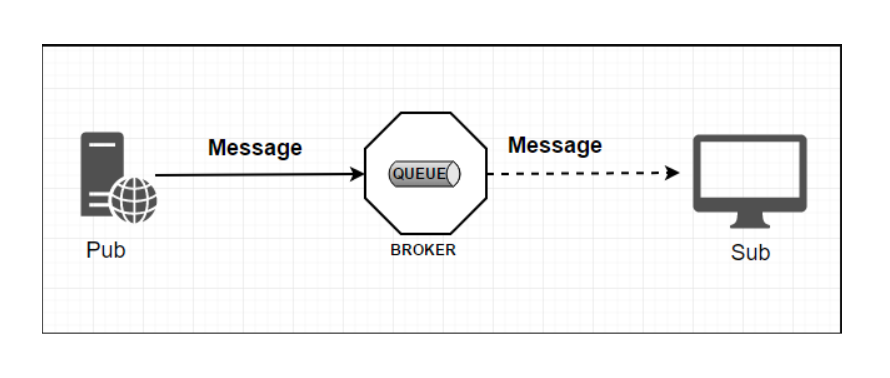
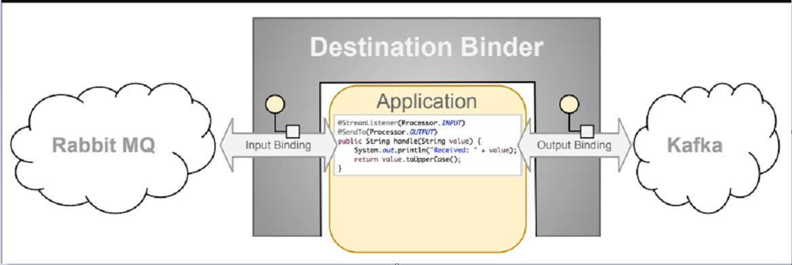
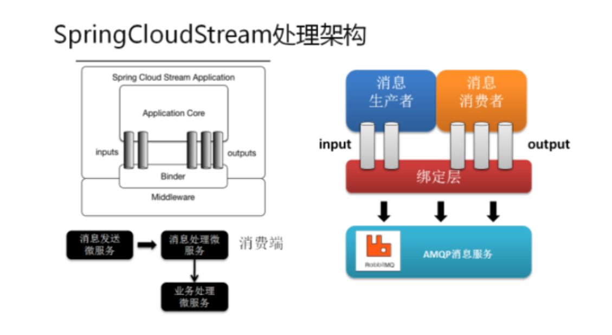
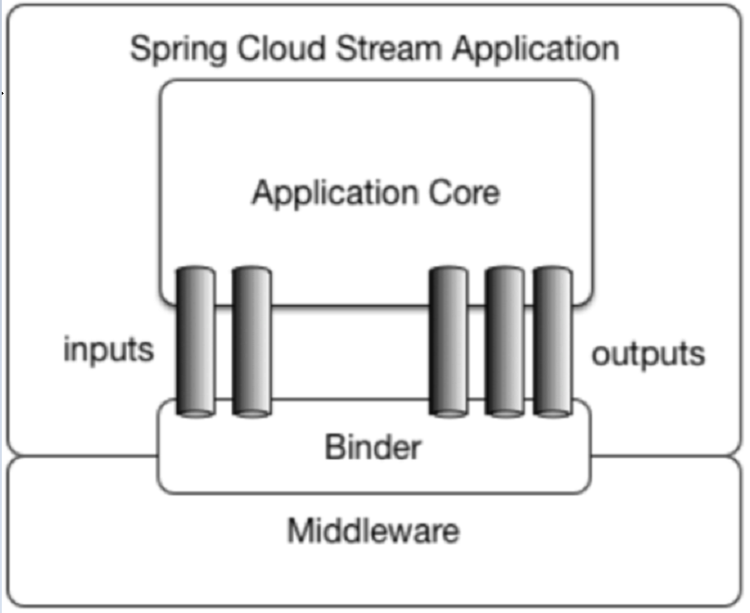
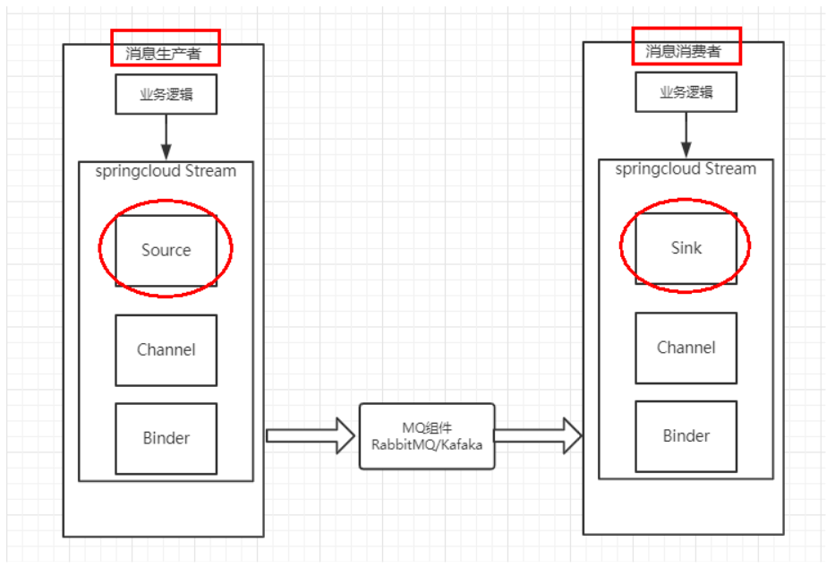
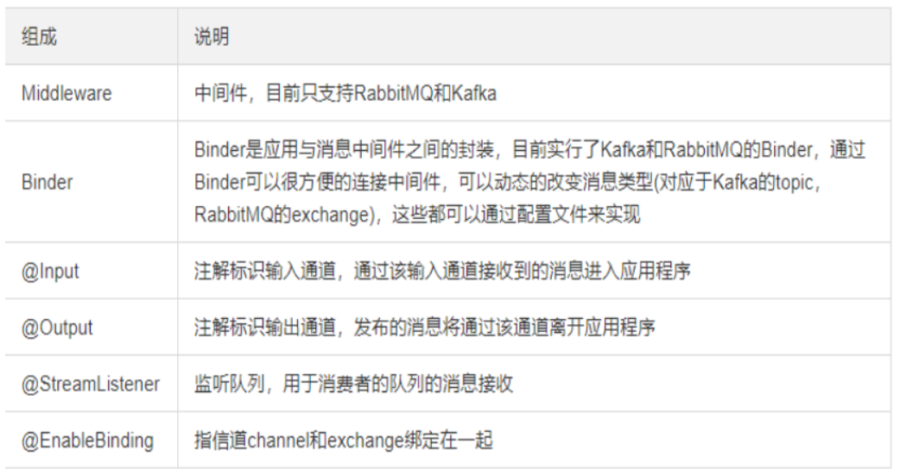

## 消息驱动概述

### 什么是SpringCloudStream

官方定义 Spring Cloud Stream 是一个构建消息驱动微服务的框架。

应用程序通过 inputs 或者 outputs 来与 Spring Cloud Stream中binder对象交互。
通过我们配置来binding(绑定) ，而 Spring Cloud Stream 的 binder对象负责与消息中间件交互。
所以，我们只需要搞清楚如何与 Spring Cloud Stream 交互就可以方便使用消息驱动的方式。

通过使用Spring Integration来连接消息代理中间件以实现消息事件驱动。
Spring Cloud Stream 为一些供应商的消息中间件产品提供了个性化的自动化配置实现，引用了发布-订阅、消费组、分区的三个核心概念。

目前仅支持RabbitMQ、Kafka。


总结：屏蔽底层消息中间件的差异,降低切换成本，统一消息的编程模型


官网

https://spring.io/projects/spring-cloud-stream#overview

Spring Cloud Stream是用于构建与共享消息传递系统连接的高度可伸缩的事件驱动微服务框架，该框架提供了一个灵活的编程模型，它建立在已经建立和熟悉的Spring熟语和最佳实践上，包括支持持久化的发布/订阅、消费组以及消息分区这三个核心概念


https://cloud.spring.io/spring-cloud-static/spring-cloud-stream/3.0.1.RELEASE/reference/html/


Spring Cloud Stream中文指导手册

https://m.wang1314.com/doc/webapp/topic/20971999.html


## 设计思想

### 标准MQ



生产者/消费者之间靠消息媒介传递信息内容： Message

消息必须走特定的通道：消息通道MessageChannel

消息通道里的消息如何被消费呢，谁负责收发处理：消息通道MessageChannel的子接口SubscribableChannel，由MessageHandler消息处理器所订阅


### 为什么用Cloud Stream

比方说我们用到了RabbitMQ和Kafka，由于这两个消息中间件的架构上的不同，
像RabbitMQ有exchange，kafka有Topic和Partitions分区，



这些中间件的差异性导致我们实际项目开发给我们造成了一定的困扰，我们如果用了两个消息队列的其中一种，后面的业务需求，我想往另外一种消息队列进行迁移，这时候无疑就是一个灾难性的，一大堆东西都要重新推倒重新做，因为它跟我们的系统耦合了，这时候springcloud Stream给我们提供了一种解耦合的方式。


#### stream凭什么可以统一底层差异？

在没有绑定器这个概念的情况下，我们的SpringBoot应用要直接与消息中间件进行信息交互的时候，
由于各消息中间件构建的初衷不同，它们的实现细节上会有较大的差异性
通过定义绑定器作为中间层，完美地实现了应用程序与消息中间件细节之间的隔离。
通过向应用程序暴露统一的Channel通道，使得应用程序不需要再考虑各种不同的消息中间件实现。

通过定义绑定器Binder作为中间层，实现了应用程序与消息中间件细节之间的隔离。


#### Binder

在没有绑定器这个概念的情况下，我们的SpringBoot应用要直接与消息中间件进行信息交互的时候，由于各消息中间件构建的初衷不同，它们的实现细节上会有较大的差异性，通过定义绑定器作为中间层，完美地实现了应用程序与消息中间件细节之间的隔离。Stream对消息中间件的进一步封装，可以做到代码层面对中间件的无感知，甚至于动态的切换中间件(rabbitmq切换为kafka)，使得微服务开发的高度解耦，服务可以关注更多自己的业务流程



通过定义绑定器Binder作为中间层，实现了应用程序与消息中间件细节之间的隔离。

Binder可以生成Binding，Binding用来绑定消息容器的生产者和消费者，它有两种类型，INPUT和OUTPUT，INPUT对应于消费者，OUTPUT对应于生产者。


### Stream中的消息通信方式遵循了发布-订阅模式

Topic主题进行广播：

在RabbitMQ就是Exchange

在Kakfa中就是Topic


### Spring Cloud Stream标准流程套路






Binder

很方便的连接中间件，屏蔽差异

Channel

通道，是队列Queue的一种抽象，在消息通讯系统中就是实现存储和转发的媒介，通过Channel对队列进行配置

Source和Sink

简单的可理解为参照对象是Spring Cloud Stream自身，
从Stream发布消息就是输出，接受消息就是输入。


### 编码API和常用注解





## 案例说明

RabbitMQ环境已经OK


工程中新建三个子模块

cloud-stream-rabbitmq-provider8801， 作为生产者进行发消息模块

cloud-stream-rabbitmq-consumer8802，作为消息接收模块

cloud-stream-rabbitmq-consumer8803  作为消息接收模块


## 消息驱动之生产者

新建Module

cloud-stream-rabbitmq-provider8801


POM

```xml
    <dependencies>
        <dependency>
            <groupId>org.springframework.boot</groupId>
            <artifactId>spring-boot-starter-web</artifactId>
        </dependency>
        <dependency>
            <groupId>org.springframework.boot</groupId>
            <artifactId>spring-boot-starter-actuator</artifactId>
        </dependency>
        <dependency>
            <groupId>org.springframework.cloud</groupId>
            <artifactId>spring-cloud-starter-netflix-eureka-client</artifactId>
        </dependency>
        <dependency>
            <groupId>org.springframework.cloud</groupId>
            <artifactId>spring-cloud-starter-stream-rabbit</artifactId>
        </dependency>
        <!--基础配置-->
        <dependency>
            <groupId>org.springframework.boot</groupId>
            <artifactId>spring-boot-devtools</artifactId>
            <scope>runtime</scope>
            <optional>true</optional>
        </dependency>
        <dependency>
            <groupId>org.projectlombok</groupId>
            <artifactId>lombok</artifactId>
            <optional>true</optional>
        </dependency>
        <dependency>
            <groupId>org.springframework.boot</groupId>
            <artifactId>spring-boot-starter-test</artifactId>
            <scope>test</scope>
        </dependency>
    </dependencies>
```


YML

```yaml
server:
  port: 8801

spring:
  application:
    name: cloud-stream-provider
  cloud:
    stream:
      binders: # 在此处配置要绑定的rabbitmq的服务信息；
        defaultRabbit: # 表示定义的名称，用于于binding整合
          type: rabbit # 消息组件类型
          environment: # 设置rabbitmq的相关的环境配置
            spring:
              rabbitmq:
                host: localhost
                port: 5672
                username: guest
                password: guest
      bindings: # 服务的整合处理
        output: # 这个名字是一个通道的名称
          destination: studyExchange # 表示要使用的Exchange名称定义
          content-type: application/json # 设置消息类型，本次为json，文本则设置“text/plain”
          binder: defaultRabbit  # 设置要绑定的消息服务的具体设置

eureka:
  client: # 客户端进行Eureka注册的配置
    service-url:
      defaultZone: http://localhost:7001/eureka
  instance:
    lease-renewal-interval-in-seconds: 2 # 设置心跳的时间间隔（默认是30秒）
    lease-expiration-duration-in-seconds: 5 # 如果现在超过了5秒的间隔（默认是90秒）
    instance-id: send-8801.com  # 在信息列表时显示主机名称
    prefer-ip-address: true     # 访问的路径变为IP地址


```


主启动类StreamMQMain8801

```java
@SpringBootApplication
public class StreamMQMain8801
{
    public static void main(String[] args)
    {
        SpringApplication.run(StreamMQMain8801.class,args);
    }
}
```


业务类

```java
public interface IMessageProvider
{
    public String send() ;
}
```


```java
@EnableBinding(Source.class) // 可以理解为是一个消息的发送管道的定义
public class MessageProviderImpl implements IMessageProvider
{
    @Resource
    private MessageChannel output; // 消息的发送管道

    @Override
    public String send()
    {
        String serial = UUID.randomUUID().toString();
        this.output.send(MessageBuilder.withPayload(serial).build()); // 创建并发送消息
        System.out.println("***serial: "+serial);

        return serial;
    }
}
```


### 测试

启动7001eureka

启动rabbitmq

​	

启动8801

访问

http://localhost:8801/sendMessage


## 消息驱动之消费者


POM

```xml
<dependencies>
        <dependency>
            <groupId>org.springframework.boot</groupId>
            <artifactId>spring-boot-starter-web</artifactId>
        </dependency>
        <dependency>
            <groupId>org.springframework.cloud</groupId>
            <artifactId>spring-cloud-starter-netflix-eureka-client</artifactId>
        </dependency>
        <dependency>
            <groupId>org.springframework.cloud</groupId>
            <artifactId>spring-cloud-starter-stream-rabbit</artifactId>
        </dependency>
        <dependency>
            <groupId>org.springframework.boot</groupId>
            <artifactId>spring-boot-starter-actuator</artifactId>
        </dependency>
        <!--基础配置-->
        <dependency>
            <groupId>org.springframework.boot</groupId>
            <artifactId>spring-boot-devtools</artifactId>
            <scope>runtime</scope>
            <optional>true</optional>
        </dependency>
        <dependency>
            <groupId>org.projectlombok</groupId>
            <artifactId>lombok</artifactId>
            <optional>true</optional>
        </dependency>
        <dependency>
            <groupId>org.springframework.boot</groupId>
            <artifactId>spring-boot-starter-test</artifactId>
            <scope>test</scope>
        </dependency>
    </dependencies>
```


YML

```yaml
server:
  port: 8802

spring:
  application:
    name: cloud-stream-consumer
  cloud:
    stream:
      binders: # 在此处配置要绑定的rabbitmq的服务信息；
        defaultRabbit: # 表示定义的名称，用于于binding整合
          type: rabbit # 消息组件类型
          environment: # 设置rabbitmq的相关的环境配置
            spring:
              rabbitmq:
                host: localhost
                port: 5672
                username: guest
                password: guest
      bindings: # 服务的整合处理
        input: # 这个名字是一个通道的名称
          destination: studyExchange # 表示要使用的Exchange名称定义
          content-type: application/json # 设置消息类型，本次为对象json，如果是文本则设置“text/plain”
          binder: defaultRabbit # 设置要绑定的消息服务的具体设置

eureka:
  client: # 客户端进行Eureka注册的配置
    service-url:
      defaultZone: http://localhost:7001/eureka
  instance:
    lease-renewal-interval-in-seconds: 2 # 设置心跳的时间间隔（默认是30秒）
    lease-expiration-duration-in-seconds: 5 # 如果现在超过了5秒的间隔（默认是90秒）
    instance-id: receive-8802.com  # 在信息列表时显示主机名称
    prefer-ip-address: true     # 访问的路径变为IP地址
```


主启动类StreamMQMain8802

```java
@SpringBootApplication
public class StreamMQMain8802
{
    public static void main(String[] args)
    {
        SpringApplication.run(StreamMQMain8802.class,args);
    }
}
```


业务类

```java
@Component
@EnableBinding(Sink.class)
public class ReceiveMessageListener
{
    @Value("${server.port}")
    private String serverPort;

    @StreamListener(Sink.INPUT)
    public void input(Message<String> message)
    {
        System.out.println("消费者1号，------->接收到的消息：" + message.getPayload()+"\t port: "+serverPort);
    }
}
```


测试8801发送8802接收消息：

成功接收：

`消费者1号，------->接收到的消息：639f1371-f6eb-427b-a077-0f1c89096211	 port: 8802`


## 分组消费与持久化

### 依照8802，clone出来一份运行8803

除了端口和提示信息都一致


### 启动

RabbitMQ

7001服务注册

8801消息生产

8802消息消费

8803消息消费


### 运行后有两个问题

有重复消费问题

消息持久化问题


### 消费

目前是8802/8803同时都收到了，存在重复消费问题

### 如何解决

分组和持久化属性group


### 分组


#### 原理

微服务应用放置于同一个group中，就能够保证消息只会被其中一个应用消费一次。
不同的组是可以消费的，同一个组内会发生竞争关系，只有其中一个可以消费。


8802/8803都变成不同组，group两个不同

```markdown
8802
group: testA
8803
group: testB
```


还是重复消费


8802/8803实现了轮询分组，每次只有一个消费者
8801模块的发的消息只能被8802或8803其中一个接收到，这样避免了重复消费。


8802/8803都变成相同组，group两个相同

```markdown
8802
group: testA
8803
group: testA
```

```yaml
      bindings: # 服务的整合处理
        input: # 这个名字是一个通道的名称，在分析具体源代码的时候会进行说明
          destination: studyExchange # 表示要使用的Exchange名称定义
          content-type: application/json # 设置消息类型，本次为对象json，如果是文本则设置“text/plain”
          binder: defaultRabbit # 设置要绑定的消息服务的具体设置
          group: testA
```


同一个组的多个微服务实例，每次只会有一个拿到


### 持久化

通过上述，解决了重复消费问题，再看看持久化

停止8802/8803并去除掉8802的分组group: 8803的分组group: atguiguA没有去掉


8801先发送4条消息到rabbitmq

先启动8802，无分组属性配置，后台没有打出来消息

再启动8803，有分组属性配置，后台打出来了MQ上的消息