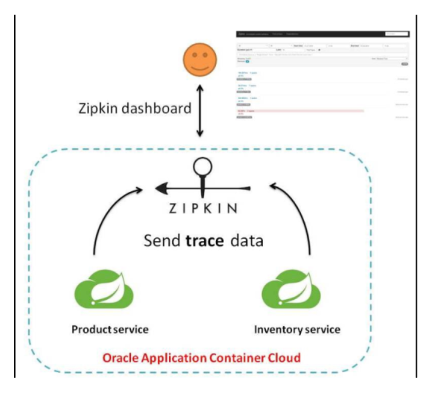
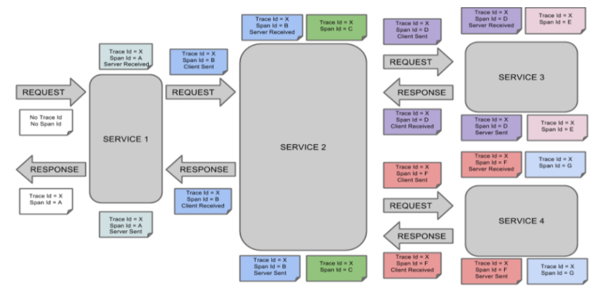
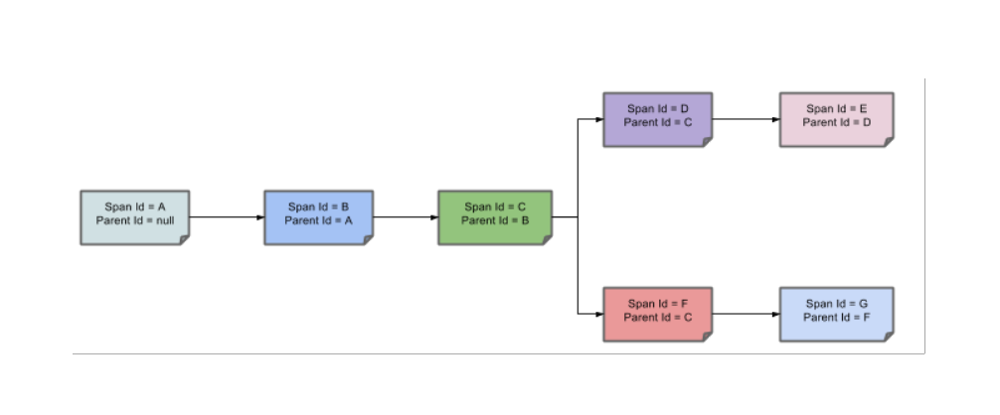
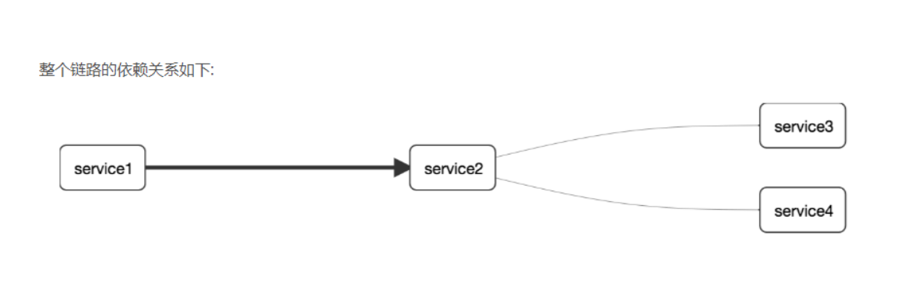
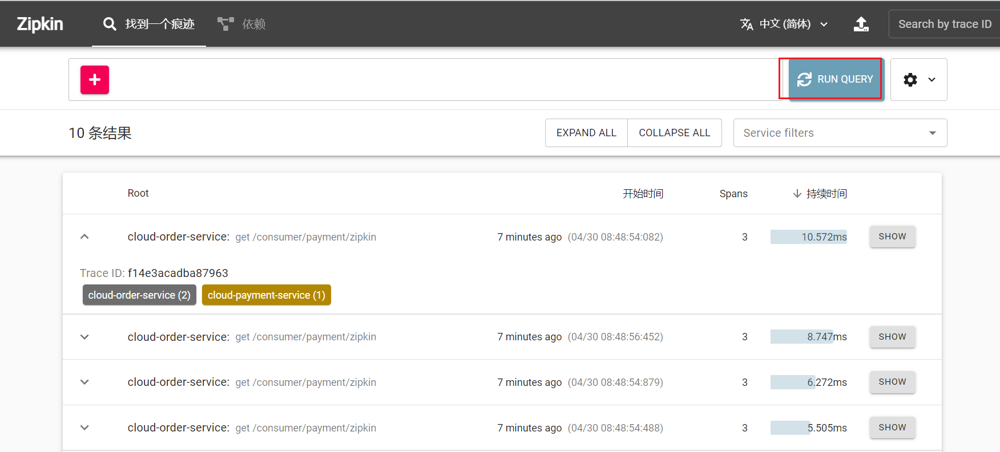
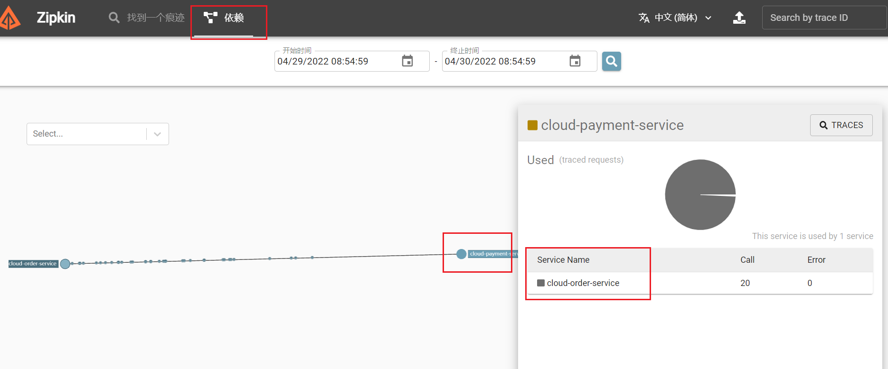

## 概述

为什么会出现这个技术？
需要解决哪些问题？

在微服务框架中，一个由客户端发起的请求在后端系统中会经过多个不同的的服务节点调用来协同产生最后的请求结果，每一个前段请求都会形成一条复杂的分布式服务调用链路，链路中的任何一环出现高延时或错误都会引起整个请求最后的失败。


### 是什么

https://github.com/spring-cloud/spring-cloud-sleuth

Sleuth提供了一套完整的服务跟踪的解决方案

在分布式系统中提供追踪解决方案并且兼容支持了zipkin


### 解决




## 搭建链路监控步骤


### zipkin

#### 下载

SpringCloud从F版起已不需要自己构建Zipkin Server了，只需调用jar包即可

https://zipkin.io/pages/quickstart.html

zipkin-server-2.23.16-exec.jar


#### 运行jar

java -jar zipkin-server-2.23.16-exec.jar


#### 运行控制台

http://localhost:9411/zipkin/


#### 术语

完整的调用链路 

 表示一请求链路，一条链路通过Trace Id唯一标识，Span标识发起的请求信息，各span通过parent id 关联起来




上图what

一条链路通过Trace Id唯一标识，Span标识发起的请求信息，各span通过parent id 关联起来





名词解释：

Trace:类似于树结构的Span集合，表示一条调用链路，存在唯一标识

span:表示调用链路来源，通俗的理解span就是一次请求信息


### 服务提供者

cloud-provider-payment8001


POM

```xml
<!--包含了sleuth+zipkin-->
<dependency>
    <groupId>org.springframework.cloud</groupId>
    <artifactId>spring-cloud-starter-zipkin</artifactId>
</dependency>
```


YML

```yaml
spring:
  application:
    name: cloud-payment-service
  zipkin:
    base-url: http://localhost:9411
  sleuth:
    sampler:
      #采样率值介于 0 到 1 之间，1 则表示全部采集
      probability: 1
```


业务类PaymentController

```java
@GetMapping("/payment/zipkin")
public String paymentZipkin()
{
    return "hi ,i'am paymentzipkin server fall back，welcome to atguigu，O(∩_∩)O哈哈~";
}
```


### 服务消费者(调用方)

cloud-consumer-order80


POM

```xml
<!--包含了sleuth+zipkin-->
<dependency>
    <groupId>org.springframework.cloud</groupId>
    <artifactId>spring-cloud-starter-zipkin</artifactId>
</dependency>
```


YML

```yaml
#spring:
#  application:
#    name: cloud-order-service
  zipkin:
    base-url: http://localhost:9411
  sleuth:
    sampler:
      probability: 1
```


业务类OrderController

```java
    // ====================> zipkin+sleuth
    @GetMapping("/consumer/payment/zipkin")
    public String paymentZipkin()
    {
        String result = restTemplate.getForObject("http://localhost:8001"+"/payment/zipkin/", String.class);
        return result;
    }
```


### 依次启动eureka7001/8001/80

80调用8001几次测试下


### 打开浏览器访问：http://localhost:9411


会出现以下界面




查看依赖关系

