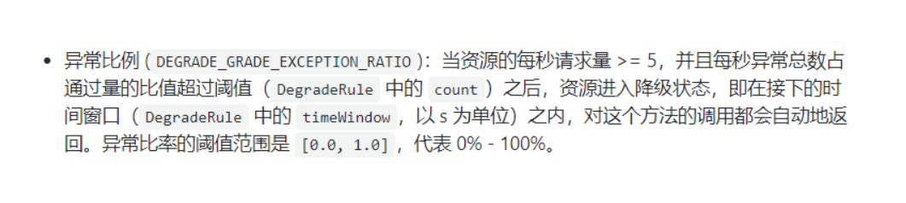

## Sentinel

### 官网

https://github.com/alibaba/Sentinel

中文

https://github.com/alibaba/Sentinel/wiki/%E4%BB%8B%E7%BB%8D


### Sentinel 是什么？

随着微服务的流行，服务和服务之间的稳定性变得越来越重要。Sentinel 以流量为切入点，从流量控制、熔断降级、系统负载保护等多个维度保护服务的稳定性。

一句话解释，之前我们讲解过的Hystrix


### 去哪下

https://github.com/alibaba/Sentinel/releases


### 能干嘛


### 怎么玩

https://spring-cloud-alibaba-group.github.io/github-pages/greenwich/spring-cloud-alibaba.html#_spring_cloud_alibaba_sentinel

服务使用中的各种问题：

服务雪崩

服务降级

服务熔断

服务限流


## 安装Sentinel控制台

 ```markdown
 Sentinel 分为两个部分:
 
 核心库（Java 客户端）不依赖任何框架/库，能够运行于所有 Java 运行时环境，同时对 Dubbo / Spring Cloud 等框架也有较好的支持。
 控制台（Dashboard）基于 Spring Boot 开发，打包后可以直接运行，不需要额外的 Tomcat 等应用容器。
 ```

后台 

前台8080


### 安装步骤

### 下载

https://github.com/alibaba/Sentinel/releases

下载到本地sentinel-dashboard-1.7.0.jar


### 运行命令

前提

java8环境OK

8080端口不能被占用


命令

java -jar sentinel-dashboard-1.7.0.jar

我应该环境变量是jdk17

所以到jdk8路径下执行

```shell
C:\common\java\JDK\jdk8\bin>java -jar C:\Users\Z\Downloads\sentinel-dashboard-1.7.0.jar
INFO: log output type is: file
INFO: log charset is: utf-8
INFO: log base dir is: C:\Users\Z\logs\csp\
INFO: log name use pid is: false
```


### 访问sentinel管理界面

http://localhost:8080

登录账号密码均为sentinel


## 初始化演示工程

启动Nacos8848成功

http://localhost:8848/nacos/#/login


### Module


cloudalibaba-sentinel-service8401


POM

```xml
<dependencies>
    <!--SpringCloud ailibaba nacos -->
    <dependency>
        <groupId>com.alibaba.cloud</groupId>
        <artifactId>spring-cloud-starter-alibaba-nacos-discovery</artifactId>
    </dependency>
    <!--SpringCloud ailibaba sentinel-datasource-nacos 后续做持久化用到-->
    <dependency>
        <groupId>com.alibaba.csp</groupId>
        <artifactId>sentinel-datasource-nacos</artifactId>
    </dependency>
    <!--SpringCloud ailibaba sentinel -->
    <dependency>
        <groupId>com.alibaba.cloud</groupId>
        <artifactId>spring-cloud-starter-alibaba-sentinel</artifactId>
    </dependency>
    <!--openfeign-->
    <dependency>
        <groupId>org.springframework.cloud</groupId>
        <artifactId>spring-cloud-starter-openfeign</artifactId>
    </dependency>
    <!-- SpringBoot整合Web组件+actuator -->
    <dependency>
        <groupId>org.springframework.boot</groupId>
        <artifactId>spring-boot-starter-web</artifactId>
    </dependency>
    <dependency>
        <groupId>org.springframework.boot</groupId>
        <artifactId>spring-boot-starter-actuator</artifactId>
    </dependency>
    <!--日常通用jar包配置-->
    <dependency>
        <groupId>org.springframework.boot</groupId>
        <artifactId>spring-boot-devtools</artifactId>
        <scope>runtime</scope>
        <optional>true</optional>
    </dependency>
    <dependency>
        <groupId>cn.hutool</groupId>
        <artifactId>hutool-all</artifactId>
        <version>4.6.3</version>
    </dependency>
    <dependency>
        <groupId>org.projectlombok</groupId>
        <artifactId>lombok</artifactId>
        <optional>true</optional>
    </dependency>
    <dependency>
        <groupId>org.springframework.boot</groupId>
        <artifactId>spring-boot-starter-test</artifactId>
        <scope>test</scope>
    </dependency>

</dependencies>
```


YML


```yaml
server:
  port: 8401

spring:
  application:
    name: cloudalibaba-sentinel-service
  cloud:
    nacos:
      discovery:
        #Nacos服务注册中心地址
        server-addr: localhost:8848
    sentinel:
      transport:
        #配置Sentinel dashboard地址
        dashboard: localhost:8080
        #默认8719端口，假如被占用会自动从8719开始依次+1扫描,直至找到未被占用的端口
        port: 8719

management:
  endpoints:
    web:
      exposure:
        include: '*'

```


主启动


```java
@EnableDiscoveryClient
@SpringBootApplication
public class MainApp8401
{
    public static void main(String[] args) {
        SpringApplication.run(MainApp8401.class, args);
    }
}
```


业务类FlowLimitController


```java
@RestController
public class FlowLimitController
{

    @GetMapping("/testA")
    public String testA()
    {
        return "------testA";
    }

    @GetMapping("/testB")
    public String testB()
    {
        return "------testB";
    }
}
```


启动Sentinel8080：java -jar sentinel-dashboard-1.7.0.jar


启动微服务8401


### 启动8401微服务后查看sentienl控制台

查看控制台，还是空空如也


因为Sentinel采用的是懒加载，需要执行一下

http://localhost:8401/testA

http://localhost:8401/testB


效果：


结论

sentinel8080正在监控微服务8401


## 流控规则


### 基本介绍


### 流控模式

#### 直接(默认)

直接->快速失败：系统默认


配置及说明

表示1秒钟内查询1次就是OK，若超过次数1，就直接-快速失败，报默认错误


测试

快速点击访问http://localhost:8401/testA


结果

Blocked by Sentinel (flow limiting)


思考???

直接调用默认报错信息，技术方面OK
but,是否应该有我们自己的后续处理?

类似有个fallback的兜底方法？


#### 关联

##### 是什么

当关联的资源达到阈值时，就限流自己

当与A关联的资源B达到阀值后，就限流A自己

B惹事，A挂了


配置A

设置效果
当关联资源/testB的qps阀值超过1时，就限流/testA的Rest访问地址，当关联资源到阈值后限制配置好的资源名


##### postman模拟并发密集访问testB

先保存该http请求


先访问testA testB成功

执行postman模拟testB请求


点击访问http://localhost:8401/testA

再请求testA，发现

`Blocked by Sentinel (flow limiting)`


大批量线程高并发访问B，导致A失效了


#### 链路

多个请求调用了同一个微服务


链路模式：只针对从指定链路访问到本资源的请求做统计，判断是否超过阈值。


## 流控效果


#### 直接->快速失败(默认的流控处理)

直接失败，抛出异常:Blocked by Sentinel (flow limiting)

源码

com.alibaba.csp.sentinel.slots.block.flow.controller.DefaultController


#### 预热

说明

公式：阈值除以coldFactor(默认值为3),经过预热时长后才会达到阈值


官网

https://github.com/alibaba/Sentinel/wiki/%E6%B5%81%E9%87%8F%E6%8E%A7%E5%88%B6


默认coldFactor为3，即请求 QPS 从 threshold / 3 开始，经预热时长逐渐升至设定的 QPS 阈值。

限流 冷启动:https://github.com/alibaba/Sentinel/wiki/%E9%99%90%E6%B5%81---%E5%86%B7%E5%90%AF%E5%8A%A8


源码

com.alibaba.csp.sentinel.slots.block.flow.controller.WarmUpController


WarmUp配置

默认 coldFactor 为 3，即请求QPS从(threshold / 3) 开始，经多少预热时长才逐渐升至设定的 QPS 阈值。
案例，阀值为10+预热时长设置5秒。
系统初始化的阀值为10 / 3 约等于3,即阀值刚开始为3；然后过了5秒后阀值才慢慢升高恢复到10


多次点击http://localhost:8401/testB

刚开始不行，后续慢慢OK


应用场景

如：秒杀系统在开启的瞬间，会有很多流量上来，很有可能把系统打死，预热方式就是把为了保护系统，可慢慢的把流量放进来，慢慢的把阀值增长到设置的阀值。


#### 排队等待

匀速排队，让请求以均匀的速度通过，阀值类型必须设成QPS，否则无效。
设置含义：/testA每秒1次请求，超过的话就排队等待，等待的超时时间为20000毫秒。


匀速排队，阈值必须设置为QPS

官网

https://github.com/alibaba/Sentinel/wiki/%E6%B5%81%E9%87%8F%E6%8E%A7%E5%88%B6


源码

com.alibaba.csp.sentinel.slots.block.flow.controller.RateLimiterController


测试

postman多线程测试,结果为匀速每秒一次访问

```markdown
2022-04-30 19:26:20.283  INFO 12528 --- [nio-8401-exec-5] c.s.controller.FlowLimitController       : http-nio-8401-exec-5	 testA
2022-04-30 19:26:21.387  INFO 12528 --- [nio-8401-exec-6] c.s.controller.FlowLimitController       : http-nio-8401-exec-6	 testA
2022-04-30 19:26:22.488  INFO 12528 --- [nio-8401-exec-7] c.s.controller.FlowLimitController       : http-nio-8401-exec-7	 testA
2022-04-30 19:26:23.566  INFO 12528 --- [nio-8401-exec-8] c.s.controller.FlowLimitController       : http-nio-8401-exec-8	 testA
2022-04-30 19:26:24.674  INFO 12528 --- [nio-8401-exec-9] c.s.controller.FlowLimitController       : http-nio-8401-exec-9	 testA
2022-04-30 19:26:25.788  INFO 12528 --- [io-8401-exec-10] c.s.controller.FlowLimitController       : http-nio-8401-exec-10	 testA
2022-04-30 19:26:26.868  INFO 12528 --- [nio-8401-exec-1] c.s.controller.FlowLimitController       : http-nio-8401-exec-1	 testA
2022-04-30 19:26:27.973  INFO 12528 --- [nio-8401-exec-2] c.s.controller.FlowLimitController       : http-nio-8401-exec-2	 testA

```


## 降级规则

官网

https://github.com/alibaba/Sentinel/wiki/%E7%86%94%E6%96%AD%E9%99%8D%E7%BA%A7


基本介绍

RT（平均响应时间，秒级）
      平均响应时间   超出阈值  且   在时间窗口内通过的请求>=5，两个条件同时满足后触发降级
      窗口期过后关闭断路器
      RT最大4900（更大的需要通过-Dcsp.sentinel.statistic.max.rt=XXXX才能生效）

异常比列（秒级）
    QPS >= 5 且异常比例（秒级统计）超过阈值时，触发降级；时间窗口结束后，关闭降级

异常数（分钟级）
     异常数（分钟统计）超过阈值时，触发降级；时间窗口结束后，关闭降级


进一步说明


Sentinel 熔断降级会在调用链路中某个资源出现不稳定状态时（例如调用超时或异常比例升高），对这个资源的调用进行限制，
让请求快速失败，避免影响到其它的资源而导致级联错误。

当资源被降级后，在接下来的降级时间窗口之内，对该资源的调用都自动熔断（默认行为是抛出 DegradeException）。


Sentinel的断路器是没有半开状态的

半开的状态系统自动去检测是否请求有异常，
没有异常就关闭断路器恢复使用，
有异常则继续打开断路器不可用。具体可以参考Hystrix


### 降级策略实战


RT

是什么


测试

代码

```java
@GetMapping("/testD")
public String testD()
{
    //暂停几秒钟线程
    try { TimeUnit.SECONDS.sleep(1); } catch (InterruptedException e) { e.printStackTrace(); }
    log.info("testD 测试RT");
    return "------testD";
}
```


配置


jmeter压测

  永远一秒钟打进来10个线程（大于5个了）调用testD，我们希望200毫秒处理完本次任务，
如果超过200毫秒还没处理完，在未来1秒钟的时间窗口内，断路器打开(保险丝跳闸)微服务不可用，保险丝跳闸断电了

后续我停止jmeter，没有这么大的访问量了，断路器关闭(保险丝恢复)，微服务恢复OK


异常比例

是什么




测试

代码

```java
@GetMapping("/testD")
public String testD()
{
    log.info("testD 测试比例");
    int age = 10/0;
    return "------testD";
}
```


配置


jmeter

20线程数 永远


结论


 按照上述配置，
单独访问一次，必然来一次报错一次(int age  = 10/0)，调一次错一次；

开启jmeter后，直接高并发发送请求，多次调用达到我们的配置条件了。
断路器开启(保险丝跳闸)，微服务不可用了，不再报错error而是服务降级了。


异常数

是什么


**异常数是按照分钟统计的**


测试


业务代码

```java
@GetMapping("/testD")
public String testE()
{
    log.info("testD 测试异常数");
    int age = 10/0;
    return "------testD 测试异常数";
}
```


jmeter


 http://localhost:8401/testD，第一次访问绝对报错，因为除数不能为零，
我们看到error窗口，但是达到5次报错后，进入熔断后降级。


## 热点key限流

基本介绍

何为热点
热点即经常访问的数据，很多时候我们希望统计或者限制某个热点数据中访问频次最高的TopN数据，并对其访问进行限流或者其它操作

官网

https://github.com/alibaba/Sentinel/wiki/%E7%83%AD%E7%82%B9%E5%8F%82%E6%95%B0%E9%99%90%E6%B5%81


承上启下复习start

@SentinelResource


兜底方法
分为系统默认和客户自定义，两种

  之前的case，限流出问题后，都是用sentinel系统默认的提示：Blocked by Sentinel (flow limiting)


  我们能不能自定?类似hystrix，某个方法出问题了，就找对应的兜底降级方法？


结论
    从HystrixCommand 到@SentinelResource

 

代码

```java
 
@GetMapping("/testHotKey")
@SentinelResource(value = "testHotKey",blockHandler = "dealHandler_testHotKey")
public String testHotKey(@RequestParam(value = "p1",required = false) String p1, 
                         @RequestParam(value = "p2",required = false) String p2){
    return "------testHotKey";
}
public String dealHandler_testHotKey(String p1,String p2,BlockException exception)
{
    return "-----dealHandler_testHotKey";
}
 
 
 //sentinel系统默认的提示：Blocked by Sentinel (flow limiting)

```


### 配置

限流模式只支持QPS模式，固定写死了。（这才叫热点）
@SentinelResource注解的方法参数索引，0代表第一个参数，1代表第二个参数，以此类推
单机阀值以及统计窗口时长表示在此窗口时间超过阀值就限流。
上面的抓图就是第一个参数有值的话，1秒的QPS为1，超过就限流，限流后调用dealHandler_testHotKey支持方法。


@SentinelResource(value = "testHotKey")

异常打到了前台用户界面看到，不友好


@SentinelResource(value = "testHotKey",blockHandler = "dealHandler_testHotKey")

方法testHotKey里面第一个参数只要QPS超过每秒1次，马上降级处理

用了我们自己定义的


测试

error http://localhost:8401/testHotKey?p1=abc

error http://localhost:8401/testHotKey?p1=abc&p2=33

right http://localhost:8401/testHotKey?p2=abc


### 参数例外项

上述案例演示了第一个参数p1，当QPS超过1秒1次点击后马上被限流


特例情况

普通:超过1秒钟一个后，达到阈值1后马上被限流

我们期望p1参数当它是某个特殊值时，它的限流值和平时不一样

特例:假如当p1的值等于5时，它的阈值可以达到200


测试

right http://localhost:8401/testHotKey?p1=5

error http://localhost:8401/testHotKey?p1=3


当p1等于5的时候，阈值变为5

当p1不等于5的时候，阈值就是平常的1


### **前提条件**

热点参数的注意点，参数必须是基本类型或者String


### 其它


@SentinelResource
处理的是Sentinel控制台配置的违规情况，有blockHandler方法配置的兜底处理；


RuntimeException
int age = 10/0,这个是java运行时报出的运行时异常RunTimeException，@SentinelResource不管

总结
 @SentinelResource主管配置出错，运行出错该走异常走异常


## 系统规则

是什么

https://github.com/alibaba/Sentinel/wiki/%E7%B3%BB%E7%BB%9F%E8%87%AA%E9%80%82%E5%BA%94%E9%99%90%E6%B5%81


各项配置参数说明

```markdown
系统规则
系统保护规则是从应用级别的入口流量进行控制，从单台机器的 load、CPU 使用率、平均 RT、入口 QPS 和并发线程数等几个维度监控应用指标，让系统尽可能跑在最大吞吐量的同时保证系统整体的稳定性。

系统保护规则是应用整体维度的，而不是资源维度的，并且仅对入口流量生效。入口流量指的是进入应用的流量（EntryType.IN），比如 Web 服务或 Dubbo 服务端接收的请求，都属于入口流量。

系统规则支持以下的模式：

Load 自适应（仅对 Linux/Unix-like 机器生效）：系统的 load1 作为启发指标，进行自适应系统保护。当系统 load1 超过设定的启发值，且系统当前的并发线程数超过估算的系统容量时才会触发系统保护（BBR 阶段）。系统容量由系统的 maxQps * minRt 估算得出。设定参考值一般是 CPU cores * 2.5。
CPU usage（1.5.0+ 版本）：当系统 CPU 使用率超过阈值即触发系统保护（取值范围 0.0-1.0），比较灵敏。
平均 RT：当单台机器上所有入口流量的平均 RT 达到阈值即触发系统保护，单位是毫秒。
并发线程数：当单台机器上所有入口流量的并发线程数达到阈值即触发系统保护。
入口 QPS：当单台机器上所有入口流量的 QPS 达到阈值即触发系统保护。
```


配置全局QPS

相对于上面的细密度控制，这是粗密度


## @SentinelResource


### 按资源名称限流+后续处理

启动Nacos成功

启动Sentinel成功

Module

修改cloudalibaba-sentinel-service8401

POM

```xml
<dependency><!-- 引入自己定义的api通用包，可以使用Payment支付Entity -->
    <groupId>com.springcloud</groupId>
    <artifactId>cloud-api-commons</artifactId>
    <version>${project.version}</version>
</dependency>
```


业务类RateLimitController

```java
@GetMapping("/byResource")
@SentinelResource(value = "byResource",blockHandler = "handleException")
public CommonResult byResource()
{
    return new CommonResult(200,"按资源名称限流测试OK",new Payment(2020L,"serial001"));
}
public CommonResult handleException(BlockException exception)
{
    return new CommonResult(444,exception.getClass().getCanonicalName()+"\t 服务不可用");
}
```


配置流控规则


表示1秒钟内查询次数大于1，就跑到我们自定义的处流，限流


#### 测试

1秒钟点击1下，OK

超过上述，疯狂点击，返回了自己定义的限流处理信息，限流发生

```json
{
"code": 444,
"message": "com.alibaba.csp.sentinel.slots.block.flow.FlowException\t 服务不可用",
"data": null
}
```


#### 额外问题

此时关闭问服务8401看看

Sentinel控制台，流控规则消失了？？？？？

临时/持久？


### 按照Url地址限流+后续处理

通过访问的URL来限流，会返回Sentinel自带默认的限流处理信息

业务类RateLimitController

```java
@GetMapping("/rateLimit/byUrl")
@SentinelResource(value = "byUrl")
public CommonResult byUrl()
{
    return new CommonResult(200,"按url限流测试OK",new Payment(2020L,"serial002"));
}
```


Sentinel控制台配置


测试

疯狂点击http://localhost:8401/rateLimit/byUrl

结果

`Blocked by Sentinel (flow limiting)`


### 上面兜底方案面临的问题


1    系统默认的，没有体现我们自己的业务要求。

2  依照现有条件，我们自定义的处理方法又和业务代码耦合在一块，不直观。

3  每个业务方法都添加一个兜底的，那代码膨胀加剧。

4  全局统一的处理方法没有体现。


### 客户自定义限流处理逻辑

创建CustomerBlockHandler类用于自定义限流处理逻辑

自定义限流处理类

```java
public class CustomerBlockHandler
{
    public static CommonResult handleException(BlockException exception){
        return new CommonResult(2020,"自定义的限流处理信息......CustomerBlockHandler");
    }
}
```


RateLimitController

```java
/**
     * 自定义通用的限流处理逻辑，
     blockHandlerClass = CustomerBlockHandler.class
     blockHandler = handleException2
     上述配置：找CustomerBlockHandler类里的handleException2方法进行兜底处理
     */
/**
     * 自定义通用的限流处理逻辑
     */
@GetMapping("/rateLimit/customerBlockHandler")
@SentinelResource(value = "customerBlockHandler",
                  blockHandlerClass = CustomerBlockHandler.class, blockHandler = "handleException")
public CommonResult customerBlockHandler()
{
    return new CommonResult(200,"按客户自定义限流处理逻辑");
}
```


启动微服务后先调用一次

http://localhost:8401/rateLimit/customerBlockHandler


Sentinel控制台配置


多次刷新

测试后我们自定义的出来了


进一步说明


### 更多注解属性说明

可以代码实现配置流控规则，不推荐


所有的代码都要用try-catch-finally方式进行处理，o(╥﹏╥)o


Sentinel主要有三个核心Api

SphU定义资源

Tracer定义统计

ContextUtil定义了上下文


## 服务熔断功能

sentinel整合ribbon+openFeign+fallback


### Ribbon系列


启动nacos和sentinel


#### 提供者9003/9004

新建cloudalibaba-provider-payment9003/9004两个一样的做法

POM

```xml
<dependencies>
    <!--SpringCloud ailibaba nacos -->
    <dependency>
        <groupId>com.alibaba.cloud</groupId>
        <artifactId>spring-cloud-starter-alibaba-nacos-discovery</artifactId>
    </dependency>
    <dependency><!-- 引入自己定义的api通用包，可以使用Payment支付Entity -->
        <groupId>com.springcloud</groupId>
        <artifactId>cloud-api-commons</artifactId>
        <version>${project.version}</version>
    </dependency>
    <!-- SpringBoot整合Web组件 -->
    <dependency>
        <groupId>org.springframework.boot</groupId>
        <artifactId>spring-boot-starter-web</artifactId>
    </dependency>
    <dependency>
        <groupId>org.springframework.boot</groupId>
        <artifactId>spring-boot-starter-actuator</artifactId>
    </dependency>
    <!--日常通用jar包配置-->
    <dependency>
        <groupId>org.springframework.boot</groupId>
        <artifactId>spring-boot-devtools</artifactId>
        <scope>runtime</scope>
        <optional>true</optional>
    </dependency>
    <dependency>
        <groupId>org.projectlombok</groupId>
        <artifactId>lombok</artifactId>
        <optional>true</optional>
    </dependency>
    <dependency>
        <groupId>org.springframework.boot</groupId>
        <artifactId>spring-boot-starter-test</artifactId>
        <scope>test</scope>
    </dependency>
</dependencies>
```


YML记得修改不同的端口号

```yaml
server:
  port: 9003

spring:
  application:
    name: nacos-payment-provider
  cloud:
    nacos:
      discovery:
        server-addr: localhost:8848 #配置Nacos地址

management:
  endpoints:
    web:
      exposure:
        include: '*'
```


主启动

```java
@SpringBootApplication
@EnableDiscoveryClient
public class PaymentMain9003
{
    public static void main(String[] args) {
        SpringApplication.run(PaymentMain9003.class, args);
    }
}
```


业务类

```java
@RestController
public class PaymentController
{
    @Value("${server.port}")
    private String serverPort;

    public static HashMap<Long, Payment> hashMap = new HashMap<>();
    static
    {
        hashMap.put(1L,new Payment(1L,"28a8c1e3bc2742d8848569891fb42181"));
        hashMap.put(2L,new Payment(2L,"bba8c1e3bc2742d8848569891ac32182"));
        hashMap.put(3L,new Payment(3L,"6ua8c1e3bc2742d8848569891xt92183"));
    }

    @GetMapping(value = "/paymentSQL/{id}")
    public CommonResult<Payment> paymentSQL(@PathVariable("id") Long id)
    {
        Payment payment = hashMap.get(id);
        CommonResult<Payment> result = new CommonResult(200,"from mysql,serverPort:  "+serverPort,payment);
        return result;
    }


}
```


测试地址

http://localhost:9003/paymentSQL/1


http://localhost:9004/paymentSQL/1

都能正常返回


#### 消费者84

新建cloudalibaba-consumer-nacos-order84


POM

```xml
<dependencies>
    <!--SpringCloud ailibaba nacos -->
    <dependency>
        <groupId>com.alibaba.cloud</groupId>
        <artifactId>spring-cloud-starter-alibaba-nacos-discovery</artifactId>
    </dependency>
    <!--SpringCloud ailibaba sentinel -->
    <dependency>
        <groupId>com.alibaba.cloud</groupId>
        <artifactId>spring-cloud-starter-alibaba-sentinel</artifactId>
    </dependency>
    <!-- 引入自己定义的api通用包，可以使用Payment支付Entity -->
    <dependency>
        <groupId>com.springcloud</groupId>
        <artifactId>cloud-api-commons</artifactId>
        <version>${project.version}</version>
    </dependency>
    <!-- SpringBoot整合Web组件 -->
    <dependency>
        <groupId>org.springframework.boot</groupId>
        <artifactId>spring-boot-starter-web</artifactId>
    </dependency>
    <dependency>
        <groupId>org.springframework.boot</groupId>
        <artifactId>spring-boot-starter-actuator</artifactId>
    </dependency>
    <!--日常通用jar包配置-->
    <dependency>
        <groupId>org.springframework.boot</groupId>
        <artifactId>spring-boot-devtools</artifactId>
        <scope>runtime</scope>
        <optional>true</optional>
    </dependency>
    <dependency>
        <groupId>org.projectlombok</groupId>
        <artifactId>lombok</artifactId>
        <optional>true</optional>
    </dependency>
    <dependency>
        <groupId>org.springframework.boot</groupId>
        <artifactId>spring-boot-starter-test</artifactId>
        <scope>test</scope>
    </dependency>
</dependencies>
```


YML

```yaml
server:
  port: 84


spring:
  application:
    name: nacos-order-consumer
  cloud:
    nacos:
      discovery:
        server-addr: localhost:8848
    sentinel:
      transport:
        #配置Sentinel dashboard地址
        dashboard: localhost:8080
        #默认8719端口，假如被占用会自动从8719开始依次+1扫描,直至找到未被占用的端口
        port: 8719


#消费者将要去访问的微服务名称(注册成功进nacos的微服务提供者)
service-url:
  nacos-user-service: http://nacos-payment-provider
```


主启动

```java
@EnableDiscoveryClient
@SpringBootApplication
public class OrderNacosMain84
{
    public static void main(String[] args) {
        SpringApplication.run(OrderNacosMain84.class, args);
    }
}
```


业务类


ApplicationContextConfig

```java
@Configuration
public class ApplicationContextConfig
{
    @Bean
    @LoadBalanced
    public RestTemplate getRestTemplate()
    {
        return new RestTemplate();
    }
}
```


修改后请重启微服务

热部署对java代码级生效及时

对@SentinelResource注解内属性，有时效果不好


目的

fallback管运行异常

blockHandler管配置违规


没有任何配置

```java
@RestController
@Slf4j
public class CircleBreakerController
{
    public static final String SERVICE_URL = "http://nacos-payment-provider";

    @Resource
    private RestTemplate restTemplate;

    @RequestMapping("/consumer/fallback/{id}")
    @SentinelResource(value = "fallback")
    public CommonResult<Payment> fallback(@PathVariable Long id)
    {
        CommonResult<Payment> result = restTemplate.getForObject(SERVICE_URL + "/paymentSQL/"+id,CommonResult.class,id);

        if (id == 4) {
            throw new IllegalArgumentException ("IllegalArgumentException,非法参数异常....");
        }else if (result.getData() == null) {
            throw new NullPointerException ("NullPointerException,该ID没有对应记录,空指针异常");
        }

        return result;
    }

}
```


测试地址

http://localhost:84/consumer/fallback/1 正常


http://localhost:84/consumer/fallback/4 异常

给客户error页面，不友好


只配置fallback

```java
@RequestMapping("/consumer/fallback/{id}")
@SentinelResource(value = "fallback",fallback = "handlerFallback") //fallback负责业务异常
public CommonResult<Payment> fallback(@PathVariable Long id)
{
    CommonResult<Payment> result = restTemplate.getForObject(SERVICE_URL + "/paymentSQL/"+id, CommonResult.class,id);

    if (id == 4) {
        throw new IllegalArgumentException ("IllegalArgumentException,非法参数异常....");
    }else if (result.getData() == null) {
        throw new NullPointerException ("NullPointerException,该ID没有对应记录,空指针异常");
    }

    return result;
}
public CommonResult handlerFallback(@PathVariable  Long id,Throwable e) {
    Payment payment = new Payment(id,"null");
    return new CommonResult<>(444,"兜底异常handlerFallback,exception内容  "+e.getMessage(),payment);
}
```


结果

http://localhost:84/consumer/fallback/1

```json
{
"code": 200,
"message": "from mysql,serverPort: 9004",
"data": {
"id": 1,
"serial": "28a8c1e3bc2742d8848569891fb42181"
}
}
```

http://localhost:84/consumer/fallback/4

```json
{
"code": 444,
"message": "兜底异常handlerFallback,exception内容 IllegalArgumentException,非法参数异常....",
"data": {
"id": 4,
"serial": "null"
}
}
```


只配置blockHandler

```java
@RequestMapping("/consumer/fallback/{id}")
@SentinelResource(value = "fallback",blockHandler = "blockHandler") //blockHandler负责在sentinel里面配置的降级限流
public CommonResult<Payment> fallback(@PathVariable Long id)
{
    CommonResult<Payment> result = restTemplate.getForObject(SERVICE_URL + "/paymentSQL/"+id, CommonResult.class,id);
    if (id == 4) {
        throw new IllegalArgumentException ("非法参数异常....");
    }else if (result.getData() == null) {
        throw new NullPointerException ("NullPointerException,该ID没有对应记录");
    }
    return result;
}
public CommonResult handlerFallback(@PathVariable  Long id,Throwable e) {
    Payment payment = new Payment(id,"null");
    return new CommonResult<>(444,"fallback,无此流水,exception  "+e.getMessage(),payment);
}
public CommonResult blockHandler(@PathVariable  Long id, BlockException blockException) {
    Payment payment = new Payment(id,"null");
    return new CommonResult<>(445,"blockHandler-sentinel限流,无此流水: blockException  "+blockException.getMessage(),payment);
}
```


本例sentinel需配置


结果

http://localhost:84/consumer/fallback/1

```json
{
"code": 200,
"message": "from mysql,serverPort: 9004",
"data": {
"id": 1,
"serial": "28a8c1e3bc2742d8848569891fb42181"
}
}
```

http://localhost:84/consumer/fallback/4 开始是异常页面，多刷新几次

```json
{
"code": 445,
"message": "blockHandler-sentinel限流,无此流水: blockException null",
"data": {
"id": 4,
"serial": "null"
}
}
```


fallback和blockHandler都配置

```java
@RequestMapping("/consumer/fallback/{id}")
@SentinelResource(value = "fallback",fallback = "handlerFallback",blockHandler = "blockHandler")
public CommonResult<Payment> fallback(@PathVariable Long id)
{
    CommonResult<Payment> result = restTemplate.getForObject(SERVICE_URL + "/paymentSQL/"+id, CommonResult.class,id);
    if (id == 4) {
        throw new IllegalArgumentException ("非法参数异常....");
    }else if (result.getData() == null) {
        throw new NullPointerException ("NullPointerException,该ID没有对应记录");
    }
    return result;
}
public CommonResult handlerFallback(@PathVariable  Long id,Throwable e) {
    Payment payment = new Payment(id,"null");
    return new CommonResult<>(444,"fallback,无此流水,exception  "+e.getMessage(),payment);
}
public CommonResult blockHandler(@PathVariable  Long id, BlockException blockException) {
    Payment payment = new Payment(id,"null");
    return new CommonResult<>(445,"blockHandler-sentinel限流,无此流水: blockException  "+blockException.getMessage(),payment);
}
```


忽略属性.......

```java
  @RequestMapping("/consumer/fallback/{id}")
    @SentinelResource(value = "fallback", fallback = "handlerFallback", blockHandler = "blockHandler",
            exceptionsToIgnore = {IllegalArgumentException.class})
    public CommonResult<Payment> fallback(@PathVariable Long id)
    {
        CommonResult<Payment> result = restTemplate.getForObject(SERVICE_URL + "/paymentSQL/"+id,CommonResult.class,id);
        if (id == 4) {
            throw new IllegalArgumentException ("非法参数异常....");
        }else if (result.getData() == null) {
            throw new NullPointerException ("NullPointerException,该ID没有对应记录");
        }
        return result;
    }
    public CommonResult handlerFallback(@PathVariable  Long id,Throwable e) {
        Payment payment = new Payment(id,"null");
        return new CommonResult<>(444,"fallback,无此流水,exception  "+e.getMessage(),payment);
    }
    public CommonResult blockHandler(@PathVariable  Long id,BlockException blockException) {
        Payment payment = new Payment(id,"null");
        return new CommonResult<>(445,"blockHandler-sentinel限流,无此流水: blockException  "+blockException.getMessage(),payment);
    }

```


忽略该IllegalArgumentException异常后，没有了友好提示信息，直接500报错


总结

fallback管java异常，blockHandler管配置异常


### Feign系列

修改84模块

84消费者调用提供者9003

Feign组件一般是消费侧


POM

```xml
<!--SpringCloud openfeign -->
<dependency>
    <groupId>org.springframework.cloud</groupId>
    <artifactId>spring-cloud-starter-openfeign</artifactId>
</dependency>
```


YML

激活Sentinel对Feign的支持

```yaml
# 激活Sentinel对Feign的支持
feign:
  sentinel:
    enabled: true

```


业务类

带@FeignClient注解的业务接口

```java
@FeignClient(value = "nacos-payment-provider",fallback = PaymentFallbackService.class)//调用中关闭9003服务提供者
public interface PaymentService
{
    @GetMapping(value = "/paymentSQL/{id}")
    public CommonResult<Payment> paymentSQL(@PathVariable("id") Long id);
}
```


fallback = PaymentFallbackService.class

```java
@Component
public class PaymentFallbackService implements PaymentService
{
    @Override
    public CommonResult<Payment> paymentSQL(Long id)
    {
        return new CommonResult<>(444,"服务降级返回,没有该流水信息",new Payment(id, "errorSerial......"));
    }
}
```


Controller


```java
//==================OpenFeign
@Resource
private PaymentService paymentService;

@GetMapping(value = "/consumer/openfeign/{id}")
public CommonResult<Payment> paymentSQL(@PathVariable("id") Long id)
{
    if(id == 4)
    {
        throw new RuntimeException("没有该id");
    }
    return paymentService.paymentSQL(id);
}
```


主启动

添加@EnableFeignClients启动Feign的功能


```java
@EnableDiscoveryClient
@SpringBootApplication
@EnableFeignClients
public class OrderNacosMain84
{
    public static void main(String[] args) {
        SpringApplication.run(OrderNacosMain84.class, args);
    }
}
```


http://localhost:84/consumer/openfeign/1


测试84调用9003，此时故意关闭9003微服务提供者，看84消费侧自动降级，不会被耗死


### 熔断框架比较


## 规则持久化


是什么

一旦我们重启应用，sentinel规则将消失，生产环境需要将配置规则进行持久化


怎么玩

将限流配置规则持久化进Nacos保存，只要刷新8401某个rest地址，sentinel控制台
的流控规则就能看到，只要Nacos里面的配置不删除，针对8401上sentinel上的流控规则持续有效


步骤

修改cloudalibaba-sentinel-service8401


POM

```xml
<!--SpringCloud ailibaba sentinel-datasource-nacos -->
<dependency>
    <groupId>com.alibaba.csp</groupId>
    <artifactId>sentinel-datasource-nacos</artifactId>
</dependency>
```


YML

```yaml
spring:
  application:
    name: cloudalibaba-sentinel-service
  cloud:
    nacos:
      discovery:
        #Nacos服务注册中心地址
        server-addr: localhost:8848
    sentinel:
      transport:
        #配置Sentinel dashboard地址
        dashboard: localhost:8080
        #默认8719端口，假如被占用会自动从8719开始依次+1扫描,直至找到未被占用的端口
        port: 8719
      datasource:
        ds1:
          nacos:
            server-addr: localhost:8848
            dataId: cloudalibaba-sentinel-service
            groupId: DEFAULT_GROUP
            data-type: json
            rule-type: flow
```


添加Nacos业务规则配置


```json
[
    {
        "resource": "/rateLimit/byUrl",
        "limitApp": "default",
        "grade": 1,
        "count": 1,
        "strategy": 0,
        "controlBehavior": 0,
        "clusterMode": false
    }
]


resource：资源名称；
limitApp：来源应用；
grade：阈值类型，0表示线程数，1表示QPS；
count：单机阈值；
strategy：流控模式，0表示直接，1表示关联，2表示链路；
controlBehavior：流控效果，0表示快速失败，1表示Warm Up，2表示排队等待；
clusterMode：是否集群。
```


快速访问测试接口

http://localhost:8401/rateLimit/byUrl

`Blocked by Sentinel (flow limiting)`


启动8401后刷新sentinel发现业务规则有了


停止8401再看sentinel

规则没有了


重新启动8401

再看sentinel

乍一看还是没有，稍等一会儿

多次调用

http://localhost:8401/rateLimit/byUrl

重新配置出现了，持久化验证通过