## 分布式事务问题


### 分布式前

单机单库没这个问题

从1：1  ->  1：N  ->  N：N


### 分布式之后

单体应用被拆分成微服务应用，原来的三个模块被拆分成三个独立的应用，分别使用三个独立的数据源，
业务操作需要调用三个服务来完成。此时每个服务内部的数据一致性由本地事务来保证，但是全局的数据一致性问题没法保证。

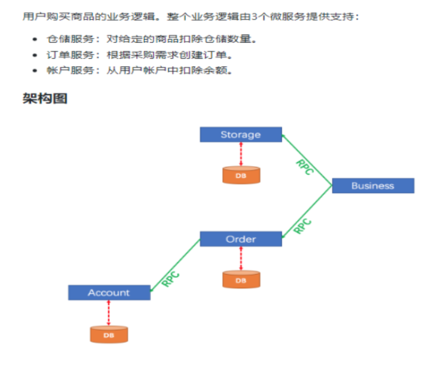

### 一句话

**一次业务操作需要跨多个数据源或需要跨多个系统进行远程调用，就会产生分布式事务问题**


## Seata简介

### 是什么

Seata是一款开源的分布式事务解决方案，致力于在微服务架构下提供高性能和简单易用的分布式事务服务。


官网地址

http://seata.io/zh-cn/


### 能干嘛

一个典型的分布式事务过程

分布式事务处理过程的一ID+三组件模型


Transaction ID XID：全局唯一的事务ID


3组件概念：

Transaction Coordinator (TC) 事务协调器，维护全局事务的运行状态，负责协调并驱动全局事务的提交或回滚；

Transaction Manager (TM) 控制全局事务的边界，负责开启一个全局事务，并最终发起全局提交或全局回滚的决议；

Resource Manager (RM) 控制分支事务，负责分支注册、状态汇报，并接收事务协调器的指令，驱动分支（本地）事务的提交和回滚


### 处理过程

TM 向 TC 申请开启一个全局事务，全局事务创建成功并生成一个全局唯一的 XID；
XID 在微服务调用链路的上下文中传播；
RM 向 TC 注册分支事务，将其纳入 XID 对应全局事务的管辖；
TM 向 TC 发起针对 XID 的全局提交或回滚决议；
TC 调度 XID 下管辖的全部分支事务完成提交或回滚请求。

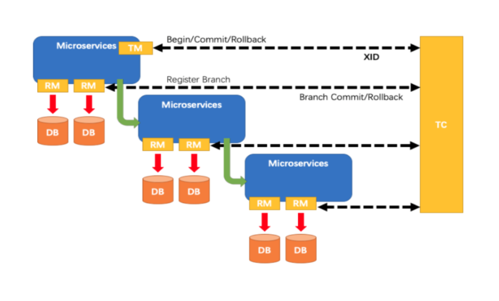

### 去哪下

发布说明: https://github.com/seata/seata/releases


### 怎么玩

本地@Transactional

全局@GlobalTransactional


SEATA 的分布式交易解决方案

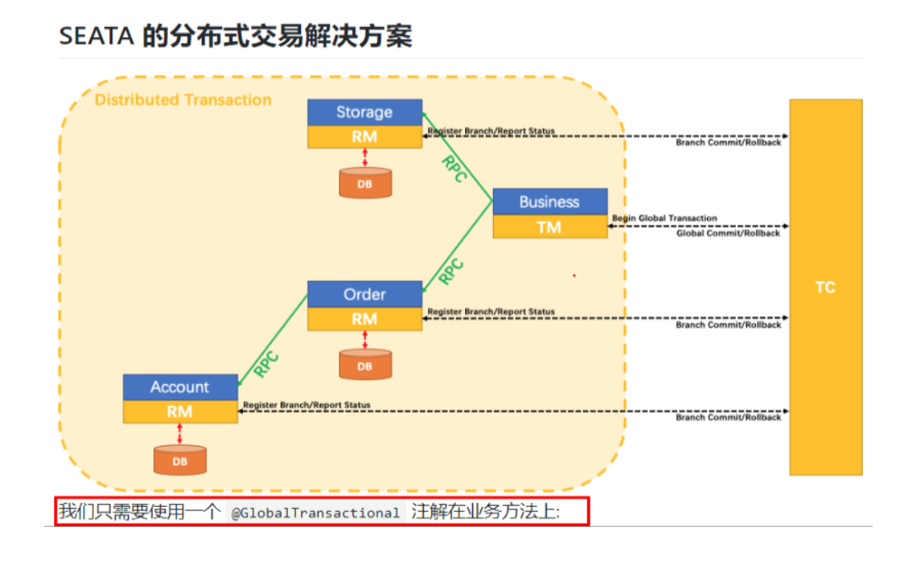


## 订单/库存/账户业务数据库准备

以下演示都需要先启动Nacos后启动Seata，保证两个都OK


### 分布式事务业务说明

业务说明：


这里我们会创建三个服务，一个订单服务，一个库存服务，一个账户服务。

当用户下单时，会在订单服务中创建一个订单，然后通过远程调用库存服务来扣减下单商品的库存，
再通过远程调用账户服务来扣减用户账户里面的余额，
最后在订单服务中修改订单状态为已完成。

该操作跨越三个数据库，有两次远程调用，很明显会有分布式事务问题。


下订单--->扣库存--->减账户(余额)


### 创建业务数据库

seata_order：存储订单的数据库；

seata_storage：存储库存的数据库；

seata_account：存储账户信息的数据库。


建库SQL

```sql
CREATE DATABASE seata_order;
 
CREATE DATABASE seata_storage;
 
CREATE DATABASE seata_account;
```


### 按照上述3库分别建对应业务表

seata_order库下建t_order表

```sql
CREATE TABLE t_order (
    `id` BIGINT(11) NOT NULL AUTO_INCREMENT PRIMARY KEY,
    `user_id` BIGINT(11) DEFAULT NULL COMMENT '用户id',
    `product_id` BIGINT(11) DEFAULT NULL COMMENT '产品id',
    `count` INT(11) DEFAULT NULL COMMENT '数量',
    `money` DECIMAL(11,0) DEFAULT NULL COMMENT '金额',
    `status` INT(1) DEFAULT NULL COMMENT '订单状态：0：创建中；1：已完结' 
) ENGINE=INNODB AUTO_INCREMENT=7 DEFAULT CHARSET=utf8;

SELECT * FROM t_order;

```


seata_storage库下建t_storage 

```sql
CREATE TABLE t_storage (
    `id` BIGINT(11) NOT NULL AUTO_INCREMENT PRIMARY KEY,
    `product_id` BIGINT(11) DEFAULT NULL COMMENT '产品id',
    `total` INT(11) DEFAULT NULL COMMENT '总库存',
    `used` INT(11) DEFAULT NULL COMMENT '已用库存',
    `residue` INT(11) DEFAULT NULL COMMENT '剩余库存'
) ENGINE=INNODB AUTO_INCREMENT=2 DEFAULT CHARSET=utf8;


INSERT INTO seata_storage.t_storage(`id`, `product_id`, `total`, `used`, `residue`)
VALUES ('1', '1', '100', '0', '100');

SELECT * FROM t_storage;
```


seata_account库下建t_account 

```json
CREATE TABLE t_account (
    `id` BIGINT(11) NOT NULL AUTO_INCREMENT PRIMARY KEY COMMENT 'id',
`user_id` BIGINT(11) DEFAULT NULL COMMENT '用户id',
`total` DECIMAL(10,0) DEFAULT NULL COMMENT '总额度',
`used` DECIMAL(10,0) DEFAULT NULL COMMENT '已用余额',
`residue` DECIMAL(10,0) DEFAULT '0' COMMENT '剩余可用额度'
) ENGINE=INNODB AUTO_INCREMENT=2 DEFAULT CHARSET=utf8;

INSERT INTO seata_account.t_account(`id`, `user_id`, `total`, `used`, `residue`)  VALUES ('1', '1', '1000', '0', '1000');

SELECT * FROM t_account;
```


按照上述3库分别建对应的回滚日志表

订单-库存-账户3个库下都需要建各自的回滚日志表

\seata-server-0.9.0\seata\conf目录下的db_undo_log.sql

```sql
-- the table to store seata xid data
-- 0.7.0+ add context
-- you must to init this sql for you business databese. the seata server not need it.
-- 此脚本必须初始化在你当前的业务数据库中，用于AT 模式XID记录。与server端无关（注：业务数据库）
-- 注意此处0.3.0+ 增加唯一索引 ux_undo_log
DROP TABLE `undo_log`;
 
CREATE TABLE `undo_log` (
  `id` BIGINT(20) NOT NULL AUTO_INCREMENT,
  `branch_id` BIGINT(20) NOT NULL,
  `xid` VARCHAR(100) NOT NULL,
  `context` VARCHAR(128) NOT NULL,
  `rollback_info` LONGBLOB NOT NULL,
  `log_status` INT(11) NOT NULL,
  `log_created` DATETIME NOT NULL,
  `log_modified` DATETIME NOT NULL,
  `ext` VARCHAR(100) DEFAULT NULL,
  PRIMARY KEY (`id`),
  UNIQUE KEY `ux_undo_log` (`xid`,`branch_id`)
) ENGINE=INNODB AUTO_INCREMENT=1 DEFAULT CHARSET=utf8;
```


### 最终效果

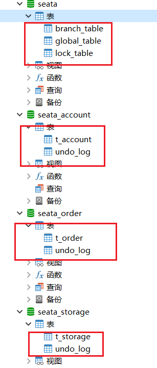


## 订单/库存/账户业务微服务准备

### 业务需求

下订单->减库存->扣余额->改(订单)状态

#### 新建订单Order-Module

POM

```xml
<dependencies>
    <!--nacos-->
    <dependency>
        <groupId>com.alibaba.cloud</groupId>
        <artifactId>spring-cloud-starter-alibaba-nacos-discovery</artifactId>
    </dependency>
    <!--seata-->
    <dependency>
        <groupId>com.alibaba.cloud</groupId>
        <artifactId>spring-cloud-starter-alibaba-seata</artifactId>
        <exclusions>
            <exclusion>
                <artifactId>seata-all</artifactId>
                <groupId>io.seata</groupId>
            </exclusion>
        </exclusions>
    </dependency>
    <dependency>
        <groupId>io.seata</groupId>
        <artifactId>seata-all</artifactId>
        <version>0.9.0</version>
    </dependency>
    <!--feign-->
    <dependency>
        <groupId>org.springframework.cloud</groupId>
        <artifactId>spring-cloud-starter-openfeign</artifactId>
    </dependency>
    <!--web-actuator-->
    <dependency>
        <groupId>org.springframework.boot</groupId>
        <artifactId>spring-boot-starter-web</artifactId>
    </dependency>
    <dependency>
        <groupId>org.springframework.boot</groupId>
        <artifactId>spring-boot-starter-actuator</artifactId>
    </dependency>
    <!--mysql-druid-->
    <dependency>
        <groupId>mysql</groupId>
        <artifactId>mysql-connector-java</artifactId>
        <version>5.1.37</version>
    </dependency>
    <dependency>
        <groupId>com.alibaba</groupId>
        <artifactId>druid-spring-boot-starter</artifactId>
        <version>1.1.10</version>
    </dependency>
    <dependency>
        <groupId>org.mybatis.spring.boot</groupId>
        <artifactId>mybatis-spring-boot-starter</artifactId>
        <version>2.0.0</version>
    </dependency>
    <dependency>
        <groupId>org.springframework.boot</groupId>
        <artifactId>spring-boot-starter-test</artifactId>
        <scope>test</scope>
    </dependency>
    <dependency>
        <groupId>org.projectlombok</groupId>
        <artifactId>lombok</artifactId>
        <optional>true</optional>
    </dependency>
</dependencies>
```


YML

```yaml
server:
  port: 2001

spring:
  application:
    name: seata-order-service
  cloud:
    alibaba:
      seata:
        #自定义事务组名称需要与seata-server中的对应
        tx-service-group: fsp_tx_group
    nacos:
      discovery:
        server-addr: localhost:8848
  datasource:
    driver-class-name: com.mysql.jdbc.Driver
    url: jdbc:mysql://localhost:3306/seata_order
    username: root
    password: 密码

feign:
  hystrix:
    enabled: false

logging:
  level:
    io:
      seata: info

mybatis:
  mapperLocations: classpath:mapper/*.xml
```


file.conf

使用本地的XXX\seata\seata-server-0.9.0\conf目录下面的


registry.conf

使用本地的XXX\seata\seata-server-0.9.0\conf目录下面的


domain

CommonResult

```java
@Data
@AllArgsConstructor
@NoArgsConstructor
public class CommonResult<T>
{
    private Integer code;
    private String  message;
    private T       data;

    public CommonResult(Integer code, String message)
    {
        this(code,message,null);
    }
}
```


Order

```java
@Data
@AllArgsConstructor
@NoArgsConstructor
public class Order
{
    private Long id;

    private Long userId;

    private Long productId;

    private Integer count;

    private BigDecimal money;

    /**
     * 订单状态：0：创建中；1：已完结
     */
    private Integer status;
}
```


Dao接口及实现

OrderDao


```java
@Mapper
public interface OrderDao {

    /**
     * 创建订单
     */
    void create(Order order);

    /**
     * 修改订单金额
     */
    void update(@Param("userId") Long userId, @Param("status") Integer status);
}
```


resources文件夹下新建mapper文件夹后添加

OrderMapper.xml


```xml
<?xml version="1.0" encoding="UTF-8" ?>
<!DOCTYPE mapper PUBLIC "-//mybatis.org//DTD Mapper 3.0//EN" "http://mybatis.org/dtd/mybatis-3-mapper.dtd" >

<mapper namespace="com.springcloud.dao.OrderDao">

    <resultMap id="BaseResultMap" type="com.springcloud.domain.Order">
        <id column="id" property="id" jdbcType="BIGINT"/>
        <result column="user_id" property="userId" jdbcType="BIGINT"/>
        <result column="product_id" property="productId" jdbcType="BIGINT"/>
        <result column="count" property="count" jdbcType="INTEGER"/>
        <result column="money" property="money" jdbcType="DECIMAL"/>
        <result column="status" property="status" jdbcType="INTEGER"/>
    </resultMap>

    <insert id="create">
        INSERT INTO `t_order` (`id`, `user_id`, `product_id`, `count`, `money`, `status`)
        VALUES (NULL, #{userId}, #{productId}, #{count}, #{money}, 0);
    </insert>

    <update id="update">
        UPDATE `t_order`
        SET status = 1
        WHERE user_id = #{userId} AND status = #{status};
    </update>
</mapper>
```

XXXmapper.xml文件首行不能有空格


Service接口及实现

OrderService

```java
public interface OrderService {

    /**
     * 创建订单
     */
    void create(Order order);
}
```


OrderServiceImpl


```java
@Service
@Slf4j
public class OrderServiceImpl implements OrderService
{
    @Resource
    private OrderDao orderDao;

    @Resource
    private StorageService storageService;

    @Resource
    private AccountService accountService;

    /**
     * 创建订单->调用库存服务扣减库存->调用账户服务扣减账户余额->修改订单状态
     * 简单说：
     * 下订单->减库存->减余额->改状态
     */
    @Override
//    @GlobalTransactional(name = "fsp-create-order",rollbackFor = Exception.class)
    public void create(Order order) {
        log.info("------->下单开始");
        //本应用创建订单
        orderDao.create(order);

        //远程调用库存服务扣减库存
        log.info("------->order-service中扣减库存开始");
        storageService.decrease(order.getProductId(),order.getCount());
        log.info("------->order-service中扣减库存结束");

        //远程调用账户服务扣减余额
        log.info("------->order-service中扣减余额开始");
        accountService.decrease(order.getUserId(),order.getMoney());
        log.info("------->order-service中扣减余额结束");

        //修改订单状态为已完成
        log.info("------->order-service中修改订单状态开始");
        orderDao.update(order.getUserId(),0);
        log.info("------->order-service中修改订单状态结束");

        log.info("------->下单结束");
    }
}
```


StorageService


```java
@FeignClient(value = "seata-storage-service")
public interface StorageService {

    /**
     * 扣减库存
     */
    @PostMapping(value = "/storage/decrease")
    CommonResult decrease(@RequestParam("productId") Long productId, @RequestParam("count") Integer count);
}
```


AccountService


```java
@FeignClient(value = "seata-account-service")
public interface AccountService {

    /**
     * 扣减账户余额
     */
    //@RequestMapping(value = "/account/decrease", method = RequestMethod.POST, produces = "application/json; charset=UTF-8")
    @PostMapping("/account/decrease")
    CommonResult decrease(@RequestParam("userId") Long userId, @RequestParam("money") BigDecimal money);
}
```


Controller


```java
@RestController
public class OrderController {

    @Autowired
    private OrderService orderService;

    /**
     * 创建订单
     */
    @GetMapping("/order/create")
    public CommonResult create(Order order) {
        orderService.create(order);
        return new CommonResult(200, "订单创建成功!");
    }
}
```


Config配置

MyBatisConfig

```java
@Configuration
@MapperScan({"com.springcloud.dao"})
public class MyBatisConfig {
}
```


DataSourceProxyConfig


```java
import com.alibaba.druid.pool.DruidDataSource;
import io.seata.rm.datasource.DataSourceProxy;
import org.apache.ibatis.session.SqlSessionFactory;
import org.mybatis.spring.SqlSessionFactoryBean;
import org.mybatis.spring.transaction.SpringManagedTransactionFactory;
import org.springframework.beans.factory.annotation.Value;
import org.springframework.boot.context.properties.ConfigurationProperties;
import org.springframework.context.annotation.Bean;
import org.springframework.context.annotation.Configuration;
import org.springframework.core.io.support.PathMatchingResourcePatternResolver;
import javax.sql.DataSource;


@Configuration
public class DataSourceProxyConfig {

    @Value("${mybatis.mapperLocations}")
    private String mapperLocations;

    @Bean
    @ConfigurationProperties(prefix = "spring.datasource")
    public DataSource druidDataSource(){
        return new DruidDataSource();
    }

    @Bean
    public DataSourceProxy dataSourceProxy(DataSource dataSource) {
        return new DataSourceProxy(dataSource);
    }

    @Bean
    public SqlSessionFactory sqlSessionFactoryBean(DataSourceProxy dataSourceProxy) throws Exception {
        SqlSessionFactoryBean sqlSessionFactoryBean = new SqlSessionFactoryBean();
        sqlSessionFactoryBean.setDataSource(dataSourceProxy);
        sqlSessionFactoryBean.setMapperLocations(new PathMatchingResourcePatternResolver().getResources(mapperLocations));
        sqlSessionFactoryBean.setTransactionFactory(new SpringManagedTransactionFactory());
        return sqlSessionFactoryBean.getObject();
    }

}
```


主启动


```java
@EnableDiscoveryClient
@EnableFeignClients
@SpringBootApplication(exclude = DataSourceAutoConfiguration.class)//取消数据源的自动创建
public class SeataOrderMainApp2001
{

    public static void main(String[] args)
    {
        SpringApplication.run(SeataOrderMainApp2001.class, args);
    }
}
```


新建库存Storage-Module

新建账户Account-Module

Storage-Module和Account-Module参照此模块，端口和实体类不同。

order订单模块通过openfeigin接口方式访问库存和账户模块。

测试全局事务@GlobalTransactional


## Test

下订单->减库存->扣余额->改(订单)状态

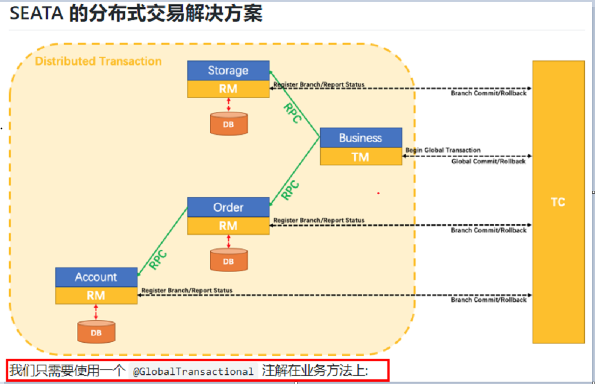


数据库初始情况


### 正常下单

http://localhost:2001/order/create?userId=1&productId=1&count=10&money=100

正常扣款，正常新建订单，正常扣库存


### 账号模块添加超时异常，没加@GlobalTransactional

AccountServiceImpl添加超时

当库存和账户金额扣减后，订单状态并没有设置为已经完成，没有从零改为1

而且由于feign的重试机制，账户余额还有可能被多次扣减


### 超时异常，添加@GlobalTransactional

AccountServiceImpl添加超时

下单后数据库数据并没有任何改变：记录都添加不进来


## 一部分补充

Seata

2019年1月份蚂蚁金服和阿里巴巴共同开源的分布式事务解决方案

Simple Extensible Autonomous Transaction Architecture，简单可扩展自治事务框架

2020起始，参加工作后用1.0以后的版本


### 再看TC/TM/RM三大组件

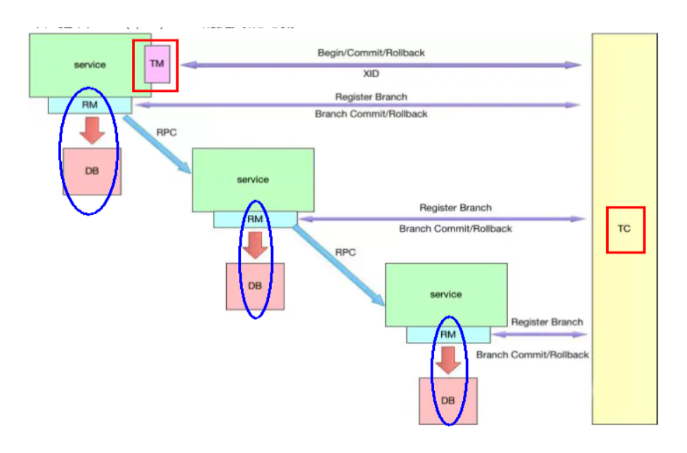

分布式事务的执行流程：

TM 开启分布式事务（TM 向 TC 注册全局事务记录）；

按业务场景，编排数据库、服务等事务内资源（RM 向 TC 汇报资源准备状态 ）；

TM 结束分布式事务，事务一阶段结束（TM 通知 TC 提交/回滚分布式事务）；

TC 汇总事务信息，决定分布式事务是提交还是回滚；

TC 通知所有 RM 提交/回滚 资源，事务二阶段结束。


### AT模式如何做到对业务的无侵入

是什么

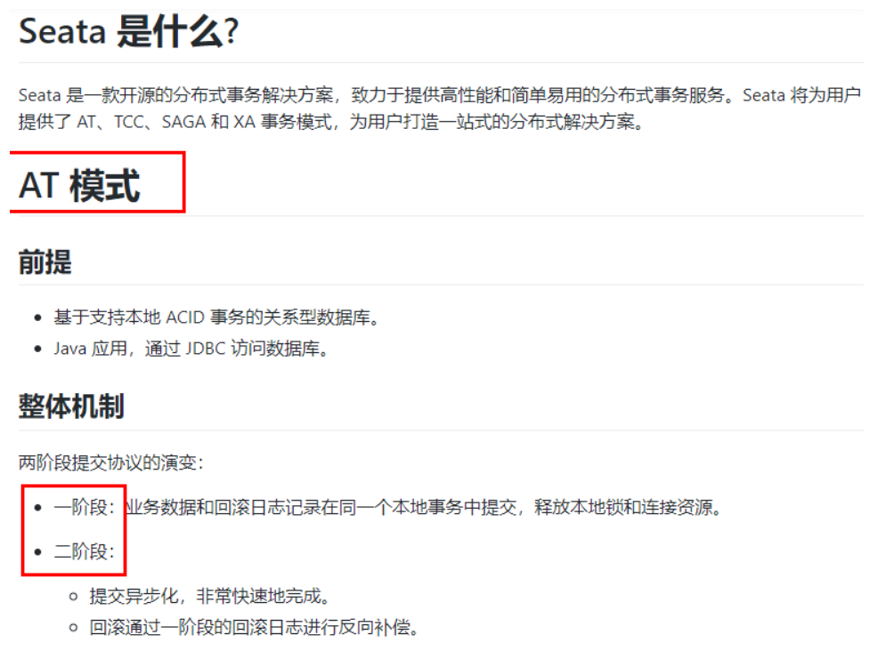


一阶段加载

在一阶段，Seata 会拦截“业务 SQL”，
1  解析 SQL 语义，找到“业务 SQL”要更新的业务数据，在业务数据被更新前，将其保存成“before image”，
2  执行“业务 SQL”更新业务数据，在业务数据更新之后，
3  其保存成“after image”，最后生成行锁。
以上操作全部在一个数据库事务内完成，这样保证了一阶段操作的原子性。

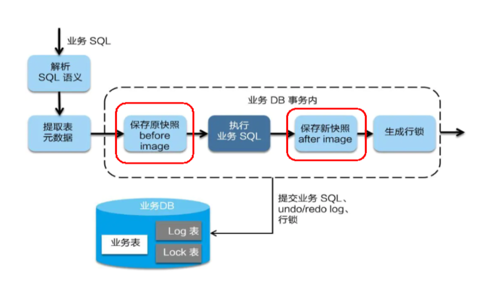


二阶段提交

二阶段如是顺利提交的话，
因为“业务 SQL”在一阶段已经提交至数据库，所以Seata框架只需将一阶段保存的快照数据和行锁删掉，完成数据清理即可。

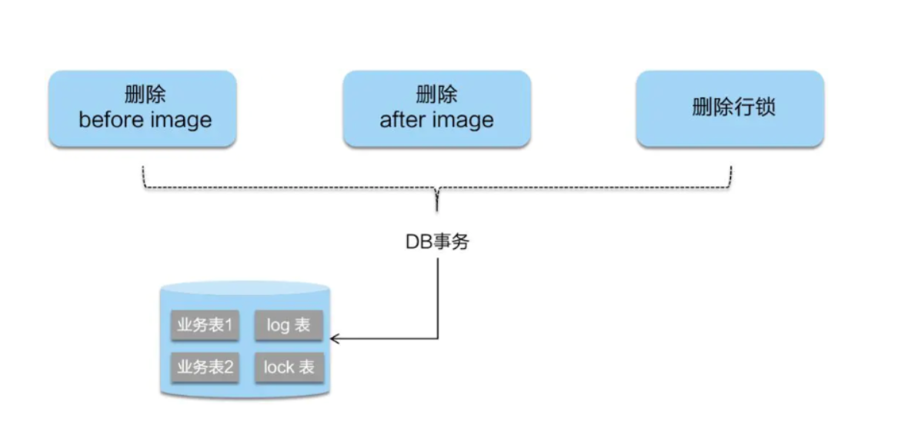


二阶段回滚

二阶段回滚：
二阶段如果是回滚的话，Seata 就需要回滚一阶段已经执行的“业务 SQL”，还原业务数据。
回滚方式便是用“before image”还原业务数据；但在还原前要首先要校验脏写，对比“数据库当前业务数据”和 “after image”，
如果两份数据完全一致就说明没有脏写，可以还原业务数据，如果不一致就说明有脏写，出现脏写就需要转人工处理。

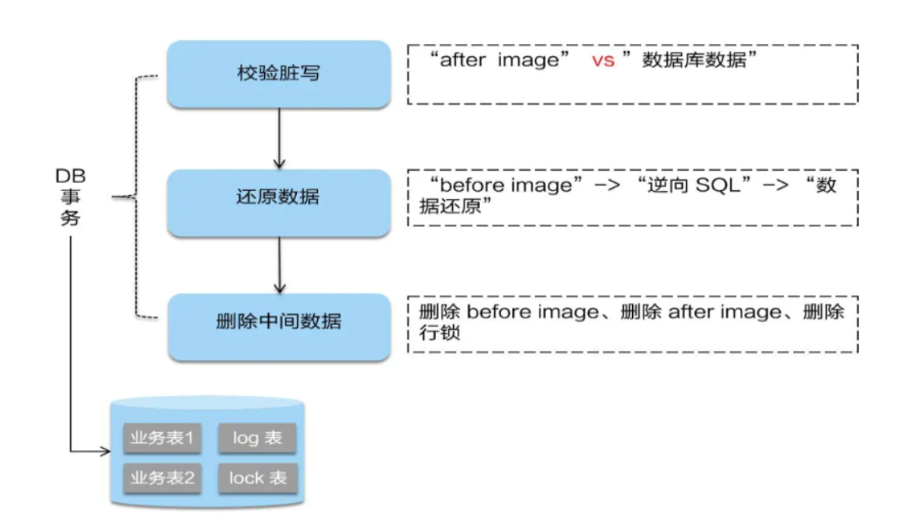


debug


补充

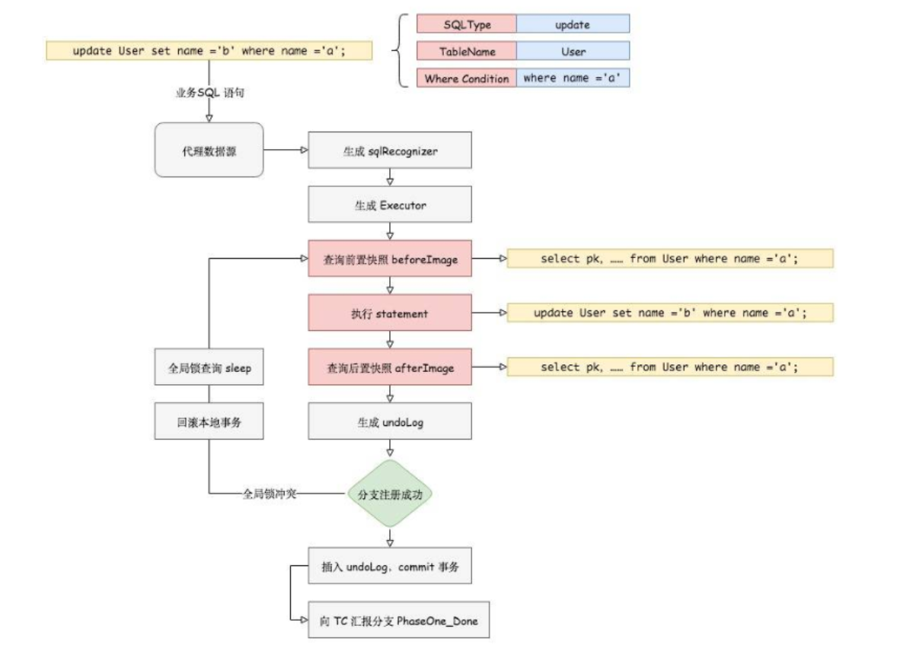

