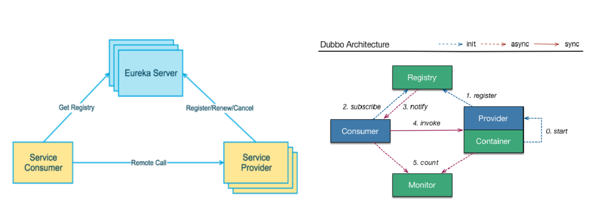
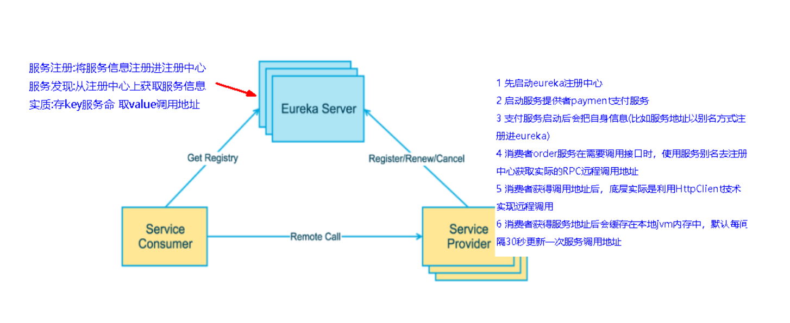
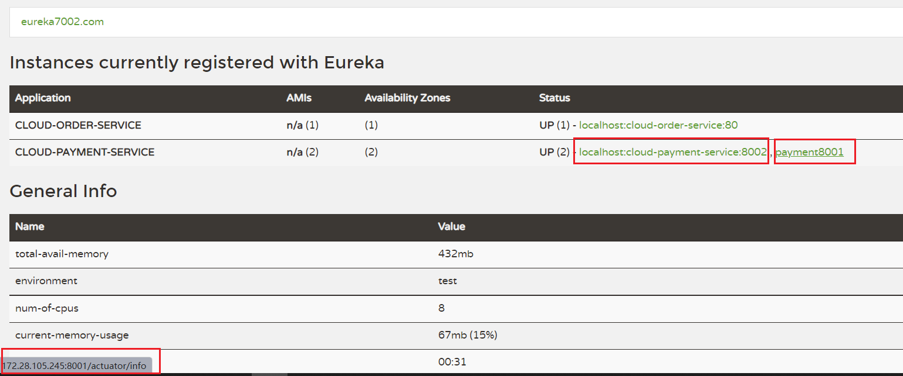
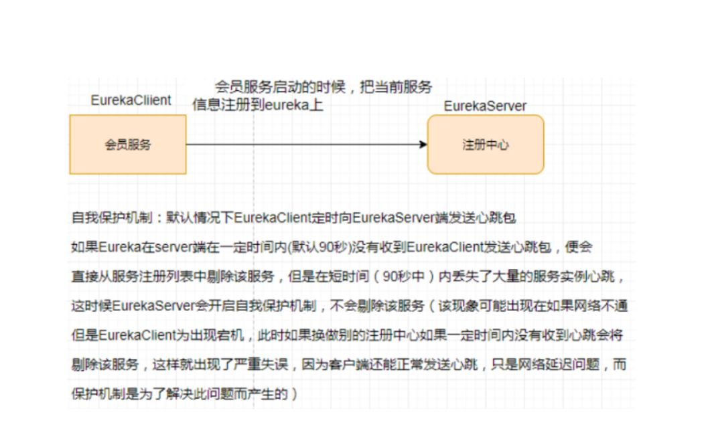

## Eureka基础知识

###  什么是服务治理

Spring Cloud 封装了 Netflix 公司开发的 Eureka 模块来实现服务治理

 	在传统的rpc远程调用框架中，管理每个服务与服务之间依赖关系比较复杂，管理比较复杂，所以需要使用服务治理，管理服务于服务之间依赖关系，可以实现服务调用、负载均衡、容错等，实现服务发现与注册。


### 什么是服务注册


Eureka采用了CS的设计架构，Eureka Server 作为服务注册功能的服务器，它是服务注册中心。而系统中的其他微服务，使用 Eureka的客户端连接到 Eureka Server并维持心跳连接。这样系统的维护人员就可以通过 Eureka Server 来监控系统中各个微服务是否正常运行。
在服务注册与发现中，有一个注册中心。当服务器启动的时候，会把当前自己服务器的信息 比如 服务地址通讯地址等以别名方式注册到注册中心上。另一方（消费者|服务提供者），以该别名的方式去注册中心上获取到实际的服务通讯地址，然后再实现本地RPC调用RPC远程调用框架核心设计思想：在于注册中心，因为使用注册中心管理每个服务与服务之间的一个依赖关系(服务治理概念)。在任何rpc远程框架中，都会有一个注册中心(存放服务地址相关信息(接口地址))
下左图是Eureka系统架构，右图是Dubbo的架构，请对比

 

 

###  Eureka两组件


Eureka包含两个组件：Eureka Server和Eureka Client

Eureka Server提供服务注册服务
各个微服务节点通过配置启动后，会在EurekaServer中进行注册，这样EurekaServer中的服务注册表中将会存储所有可用服务节点的信息，服务节点的信息可以在界面中直观看到。

EurekaClient通过注册中心进行访问
是一个Java客户端，用于简化Eureka Server的交互，客户端同时也具备一个内置的、使用轮询(round-robin)负载算法的负载均衡器。在应用启动后，将会向Eureka Server发送心跳(默认周期为30秒)。如果Eureka Server在多个心跳周期内没有接收到某个节点的心跳，EurekaServer将会从服务注册表中把这个服务节点移除（默认90秒）


## 单机Eureka构建步骤


### IDEA生成eurekaServer端服务注册中心

类似物业公司


### 建Module

cloud-eureka-server7001

### 改POM

```xml
<dependencies>
    <!--eureka-server-->
    <dependency>
        <groupId>org.springframework.cloud</groupId>
        <artifactId>spring-cloud-starter-netflix-eureka-server</artifactId>
    </dependency>
    <!-- 引入自己定义的api通用包，可以使用Payment支付Entity -->
    <dependency>
        <groupId>com.springcloud</groupId>
        <artifactId>cloud-api-commons</artifactId>
        <version>${project.version}</version>
    </dependency>
    <!--boot web actuator-->
    <dependency>
        <groupId>org.springframework.boot</groupId>
        <artifactId>spring-boot-starter-web</artifactId>
    </dependency>
    <dependency>
        <groupId>org.springframework.boot</groupId>
        <artifactId>spring-boot-starter-actuator</artifactId>
    </dependency>
    <!--一般通用配置-->
    <dependency>
        <groupId>org.springframework.boot</groupId>
        <artifactId>spring-boot-devtools</artifactId>
        <scope>runtime</scope>
        <optional>true</optional>
    </dependency>
    <dependency>
        <groupId>org.projectlombok</groupId>
        <artifactId>lombok</artifactId>
    </dependency>
    <dependency>
        <groupId>org.springframework.boot</groupId>
        <artifactId>spring-boot-starter-test</artifactId>
        <scope>test</scope>
    </dependency>
    <dependency>
        <groupId>junit</groupId>
        <artifactId>junit</artifactId>
    </dependency>
</dependencies>
```


### 1.X和2.X的对比说明

以前的老版本（当前使用2018）

```xml
<dependency>
        <groupId>org.springframework.cloud</groupId>
        <artifactId>spring-cloud-starter-eureka</artifactId>
</dependency>
```

现在新版本（当前使用2020.2）

```xml
<dependency>
    <groupId>org.springframework.cloud</groupId>
    <artifactId>spring-cloud-starter-netflix-eureka-server</artifactId>
</dependency>
```


###  写YML

```yaml
server:
  port: 7001

eureka:
  instance:
    hostname: localhost #eureka服务端的实例名称
  client:
    #false表示不向注册中心注册自己。
    register-with-eureka: false
    #false表示自己端就是注册中心，我的职责就是维护服务实例，并不需要去检索服务
    fetch-registry: false
    service-url:
    #设置与Eureka Server交互的地址查询服务和注册服务都需要依赖这个地址。
      defaultZone: http://${eureka.instance.hostname}:${server.port}/eureka/
```


### 主启动:@EnableEurekaServer

```java
@SpringBootApplication
@EnableEurekaServer
public class EurekaMain7001
{
    public static void main(String[] args)
    {
        SpringApplication.run(EurekaMain7001.class,args);
    }
}
```


### 测试:

http://localhost:7001/

打开eureka页面即成功


### 将8001消费提供端和80消费端都注册到eureka


#### 修改EurekaClient端cloud-provider-payment8001

将注册进EurekaServer成为服务提供者provider，类似尚硅谷学校对外提供授课服务


#### 修改EurekaClient端cloud-consumer-order80

将注册进EurekaServer成为服务消费者consumer，类似来尚硅谷上课消费的各位同学


都需要引入jar：

```xml
<!--eureka-client-->
<dependency>
    <groupId>org.springframework.cloud</groupId>
    <artifactId>spring-cloud-starter-netflix-eureka-client</artifactId>
</dependency>

```


YAL：8001

```yaml
eureka:
  client:
    #表示是否将自己注册进EurekaServer默认为true。
    register-with-eureka: true
    #是否从EurekaServer抓取已有的注册信息，默认为true。单节点无所谓，集群必须设置为true才能配合ribbon使用负载均衡
    fetchRegistry: true
    service-url:
      defaultZone: http://localhost:7001/eureka
```


#### 80消费者需要指定应用名，否则在eureka管理页面，应用名为**UNKNOWN**

```yaml
spring:
  application:
    name: cloud-order-service

eureka:
  client:
    #表示是否将自己注册进EurekaServer默认为true。
    register-with-eureka: true
    #是否从EurekaServer抓取已有的注册信息，默认为true。单节点无所谓，集群必须设置为true才能配合ribbon使用负载均衡
    fetchRegistry: true
    service-url:
      defaultZone: http://localhost:7001/eureka
```


#### 都需要开启eureka

```java
@EnableEurekaClient
```

该注解 与7001eureka服务的@EnableEurekaServer对应


测试：

启动8001和80 

http://localhost:7001/会有两个应用了


http://localhost/consumer/payment/get/1 依旧可以查询到数据，不影响之前的逻辑


### 注意：

写YAML时注意缩进和空格，否则可能报错

`Failed to bind properties under 'eureka.client.service-url' to java.util.Map<java.lang.String, java.lang.String>`


## 集群Eureka构建步骤


### Eureka集群原理说明




问题：微服务RPC远程服务调用最核心的是什么 
       高可用，试想你的注册中心只有一个only one， 它出故障了那就呵呵(￣▽￣)"了，会导致整个为服务环境不可用，所以

　　解决办法：搭建Eureka注册中心集群 ，实现负载均衡+故障容错


### EurekaServer集群环境构建步骤

参考cloud-eureka-server7001

新建cloud-eureka-server7002


改POM

复制7001POM文件


修改映射配置

找到C:\Windows\System32\drivers\etc路径下的hosts文件

```shell
127.0.0.1  eureka7001.com
127.0.0.1  eureka7002.com
```


7001YAML:

```yaml
server:
  port: 7001

eureka:
  instance:
    hostname: eureka7001.com #eureka服务端的实例名称
  #hostname: localhost #eureka服务端的实例名称
  client:
    #false表示不向注册中心注册自己。
    register-with-eureka: false
    #false表示自己端就是注册中心，我的职责就是维护服务实例，并不需要去检索服务
    fetch-registry: false
    service-url:
      #设置与Eureka Server交互的地址查询服务和注册服务都需要依赖这个地址。
      #defaultZone: http://${eureka.instance.hostname}:${server.port}/eureka/
      defaultZone: http://eureka7002.com:7002/eureka/
```


7002YAML:

```yaml
server:
  port: 7002

eureka:
  instance:
    hostname: eureka7002.com #eureka服务端的实例名称
  #hostname: localhost #eureka服务端的实例名称
  client:
    #false表示不向注册中心注册自己。
    register-with-eureka: false
    #false表示自己端就是注册中心，我的职责就是维护服务实例，并不需要去检索服务
    fetch-registry: false
    service-url:
      #设置与Eureka Server交互的地址查询服务和注册服务都需要依赖这个地址。
      #defaultZone: http://${eureka.instance.hostname}:${server.port}/eureka/
      defaultZone: http://eureka7001.com:7001/eureka/
```


7002主启动类，参照7001

```java
@SpringBootApplication
@EnableEurekaServer
public class EurekaMain7002 {
    public static void main(String[] args){
        SpringApplication.run(EurekaMain7002.class,args);
    }
}
```


将支付服务8001微服务发布到上面2台Eureka集群配置中

```yaml
defaultZone: http://eureka7001.com:7001/eureka,http://eureka7002.com:7002/eureka  # 集群版
```


将订单服务80微服务发布到上面2台Eureka集群配置中

```yaml
eureka:
  client:
    #表示是否将自己注册进EurekaServer默认为true。
    register-with-eureka: true
    #是否从EurekaServer抓取已有的注册信息，默认为true。单节点无所谓，集群必须设置为true才能配合ribbon使用负载均衡
    fetchRegistry: true
    service-url:
      #defaultZone: http://localhost:7001/eureka
      defaultZone: http://eureka7001.com:7001/eureka,http://eureka7002.com:7002/eureka  # 集群版
```


### 测试01

先要启动EurekaServer，7001/7002服务

再要启动服务提供者provider，8001

再要启动消费者，80

http://localhost/consumer/payment/get/1 --- 正常访问


### 支付服务提供者8001集群环境构建

参考cloud-provider-payment8001

新建cloud-provider-payment8002


改POM

参照8001


写YML

```yaml
spring:
  application:
    name: cloud-payment-service	#应用名需要一致
```


8001eureka修改注册地址

```yaml
defaultZone: http://eureka7001.com:7001/eureka,http://eureka7002.com:7002/eureka  # 集群版
```


8002

```yaml
eureka:
  client:
    #表示是否将自己注册进EurekaServer默认为true。
    register-with-eureka: true
    #是否从EurekaServer抓取已有的注册信息，默认为true。单节点无所谓，集群必须设置为true才能配合ribbon使用负载均衡
    fetchRegistry: true
    service-url:
      #defaultZone: http://localhost:7001/eureka
      defaultZone: http://eureka7001.com:7001/eureka,http://eureka7002.com:7002/eureka  # 集群版
```


主启动

```java
@SpringBootApplication
@EnableEurekaClient
public class PaymentMain8002 {

    public static void main(String[] args){
        SpringApplication.run(PaymentMain8002.class,args);
    }

}
```


业务类

参照8001


修改8001/8002的Controller

```java
@RestController
@Slf4j
public class PaymentController
{
    @Resource
    private PaymentService paymentService;

    @Value("${server.port}")
    private String serverPort;
    
    @PostMapping(value = "/payment/create")
    public CommonResult create(@RequestBody Payment payment)
    {
        int result = paymentService.create(payment);
        log.info("*****新增结果:" + result);

        if(result > 0)
        {
            return new CommonResult(200,"插入成功,返回结果"+result+"\t 服务端口："+serverPort,payment);
        }else{
            return new CommonResult(444,"插入失败",null);
        }
    }

    @GetMapping(value = "/payment/get/{id}")
    public CommonResult<Payment> getPaymentById(@PathVariable("id") Long id)
    {
        Payment payment = paymentService.getPaymentById(id);
        log.info("*****查询结果:{}",payment);
        if (payment != null) {
            return new CommonResult(200,"查询成功"+"\t 服务端口："+serverPort,payment);
        }else{
            return new CommonResult(444,"没有对应记录,查询ID: "+id,null);
        }
    }
}
```


### 负载均衡

80消费者调用url不能写死,修改为服务名

```java
//    public static final String PaymentSrv_URL = "http://localhost:8001";

    // 通过在eureka上注册过的微服务名称调用
    public static final String PaymentSrv_URL = "http://CLOUD-PAYMENT-SERVICE";
```


使用@LoadBalanced注解赋予RestTemplate负载均衡的能力，这是Ribbon的负载均衡功能

```java
@Configuration
public class ApplicationContextConfig {

    @Bean
    @LoadBalanced //使用@LoadBalanced注解赋予RestTemplate负载均衡的能力
    public RestTemplate getRestTemplate(){
        return new RestTemplate();
    }
}
```


### 测试02

先要启动EurekaServer，7001/7002服务

再要启动服务提供者provider，8001/8002服务

http://localhost/consumer/payment/get/1

结果:负载均衡效果达到

8001/8002端口交替出现

Ribbon和Eureka整合后Consumer可以直接调用服务而不用再关心地址和端口号，且该服务还有负载功能了。O(∩_∩)O


## actuator微服务信息完善

主机名称:服务名称修改

访问信息有IP信息提示

```yaml
  instance:
    instance-id: payment8001	#修改status显示名称
    prefer-ip-address: true     #访问路径可以显示IP地址
```





修改后对比发现：

status里面的名称使用的是自定义的，

超链接ip不再是localhost


## 服务发现Discovery

对于注册进eureka里面的微服务，可以通过服务发现来获得该服务的信息


修改cloud-provider-payment8001的Controller

```java
@Resource
private DiscoveryClient discoveryClient;

@GetMapping(value = "/payment/discovery")
    public Object discovery()
    {
        List<String> services = discoveryClient.getServices();
        for (String element : services) {
            System.out.println(element);
        }

        List<ServiceInstance> instances = discoveryClient.getInstances("CLOUD-PAYMENT-SERVICE");
        for (ServiceInstance element : instances) {
            System.out.println(element.getServiceId() + "\t" + element.getHost() + "\t" + element.getPort() + "\t"
                    + element.getUri());
        }
        return this.discoveryClient;
    }
```


8001主启动类,添加服务发现注解

```java
@EnableDiscoveryClient //服务发现
```


自测

先要启动EurekaServer

再启动8001主启动类，需要稍等一会儿

http://localhost:8001/payment/discovery

```java
cloud-payment-service
cloud-order-service
CLOUD-PAYMENT-SERVICE	172.28.105.245	8001	http://172.28.105.245:8001
CLOUD-PAYMENT-SERVICE	localhost	8002	http://localhost:8002
```


可以通过该一个服务，获取同在Eureka注册中心的其他服务和实例


## Eureka自我保护

### 故障现象

概述
保护模式主要用于一组客户端和Eureka Server之间存在网络分区场景下的保护。一旦进入保护模式，
Eureka Server将会尝试保护其服务注册表中的信息，不再删除服务注册表中的数据，也就是不会注销任何微服务。

如果在Eureka Server的首页看到以下这段提示，则说明Eureka进入了保护模式：

**EMERGENCY! EUREKA MAY BE INCORRECTLY CLAIMING INSTANCES ARE UP WHEN THEY'RE NOT. RENEWALS ARE LESSER THAN THRESHOLD AND HENCE THE INSTANCES ARE NOT BEING EXPIRED JUST TO BE SAFE.**

 

###  导致原因

一句话：某时刻某一个微服务不可用了，Eureka不会立刻清理，依旧会对该微服务的信息进行保存

属于CAP里面的AP分支


### 为什么会产生Eureka自我保护机制？

为了防止EurekaClient可以正常运行，但是 与 EurekaServer网络不通情况下，EurekaServer不会立刻将EurekaClient服务剔除

### 什么是自我保护模式？

默认情况下，如果EurekaServer在一定时间内没有接收到某个微服务实例的心跳，EurekaServer将会注销该实例（默认90秒）。但是当网络分区故障发生(延时、卡顿、拥挤)时，微服务与EurekaServer之间无法正常通信，以上行为可能变得非常危险了——因为微服务本身其实是健康的，此时本不应该注销这个微服务。Eureka通过“自我保护模式”来解决这个问题——当EurekaServer节点在短时间内丢失过多客户端时（可能发生了网络分区故障），那么这个节点就会进入自我保护模式。




***在自我保护模式中，Eureka Server会保护服务注册表中的信息，不再注销任何服务实例。***
它的设计哲学就是宁可保留错误的服务注册信息，也不盲目注销任何可能健康的服务实例。一句话讲解：好死不如赖活着

综上，自我保护模式是一种应对网络异常的安全保护措施。它的架构哲学是宁可同时保留所有微服务（健康的微服务和不健康的微服务都会保留）也不盲目注销任何健康的微服务。使用自我保护模式，可以让Eureka集群更加的健壮、稳定。


## 怎么禁止自我保护

方便测试，下面都使用单机测试

------


### 注册中心eureakeServer端7001:

出厂默认，自我保护机制是开启的

使用eureka.server.enable-self-preservation = false 可以禁用自我保护模式


在eurekaServer端7001处设置关闭自我保护机制

```yaml
  server:
    #关闭自我保护机制，保证不可用服务被及时踢除
       enable-self-preservation: false
    eviction-interval-timer-in-ms: 2000
```


http://eureka7001.com:7001/查看关闭效果：

`**THE SELF PRESERVATION MODE IS TURNED OFF. THIS MAY NOT PROTECT INSTANCE EXPIRY IN CASE OF NETWORK/OTHER PROBLEMS.**`


### 生产者客户端eureakeClient端8001:

默认

```properties
eureka.instance.lease-renewal-interval-in-seconds=30

eureka.instance.lease-expiration-duration-in-seconds=90
```


配置

```yaml
server:
  port: 8001

spring:
  application:
    name: cloud-payment-service
  datasource:
    type: com.alibaba.druid.pool.DruidDataSource            # 当前数据源操作类型
    driver-class-name: org.gjt.mm.mysql.Driver              # mysql驱动包 com.mysql.jdbc.Driver
    url: jdbc:mysql://localhost:3307/db2022?useUnicode=true&characterEncoding=utf-8&useSSL=false
    username: root
    password: root


mybatis:
  mapperLocations: classpath:mapper/*.xml
  type-aliases-package: com.springcloud.entity    # 所有Entity别名类所在包


eureka:
  client:
    #表示是否将自己注册进EurekaServer默认为true。
    register-with-eureka: true
    #是否从EurekaServer抓取已有的注册信息，默认为true。单节点无所谓，集群必须设置为true才能配合ribbon使用负载均衡
    fetchRegistry: true
    service-url:
      #defaultZone: http://localhost:7001/eureka
      #defaultZone: http://eureka7001.com:7001/eureka,http://eureka7002.com:7002/eureka  # 集群版
      defaultZone: http://eureka7001.com:7001/eureka
  instance:
    instance-id: payment8001
    prefer-ip-address: true     #访问路径可以显示IP地址

  #心跳检测与续约时间
  #开发时设置小些，保证服务关闭后注册中心能即使剔除服务
    #Eureka客户端向服务端发送心跳的时间间隔，单位为秒(默认是30秒)
    lease-renewal-interval-in-seconds: 1
    #Eureka服务端在收到最后一次心跳后等待时间上限，单位为秒(默认是90秒)，超时将剔除服务
    lease-expiration-duration-in-seconds: 2
```


测试

7001和8001都配置完成

先启动7001再启动8001

先关闭8001

效果：8001服务马上被删除了，不会等待