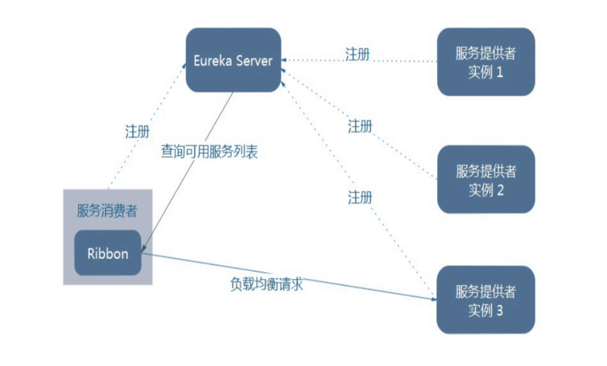
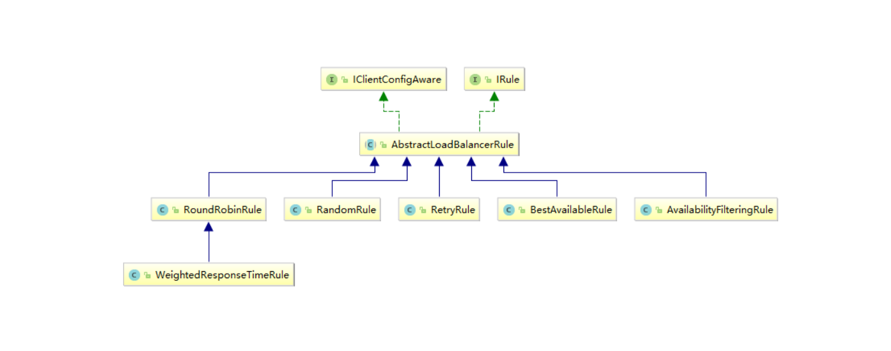

## 概述

### 是什么

Spring Cloud Ribbon是基于Netflix Ribbon实现的一套客户端       负载均衡的工具。

简单的说，Ribbon是Netflix发布的开源项目，主要功能是提供客户端的软件负载均衡算法和服务调用。Ribbon客户端组件提供一系列完善的配置项如连接超时，重试等。简单的说，就是在配置文件中列出Load Balancer（简称LB）后面所有的机器，Ribbon会自动的帮助你基于某种规则（如简单轮询，随机连接等）去连接这些机器。我们很容易使用Ribbon实现自定义的负载均衡算法。


### 官网资料

https://github.com/Netflix/ribbon/wiki/Getting-Started

Ribbon目前也进入维护模式

`Project Status: On Maintenance`

`Recognizing these realities and deficiencies, we are placing Ribbon in maintenance mode`

未来替换方案

SpringCloud LoadBalancer


### 能干吗

LB（负载均衡）

​	集中式LB

即在服务的消费方和提供方之间使用独立的LB设施(可以是硬件，如F5, 也可以是软件，如nginx), 由该设施负责把访问请求通过某种策略转发至服务的提供方；


​	进程内LB

将LB逻辑集成到消费方，消费方从服务注册中心获知有哪些地址可用，然后自己再从这些地址中选择出一个合适的服务器。

Ribbon就属于进程内LB，它只是一个类库，集成于消费方进程，消费方通过它来获取到服务提供方的地址。

 

### LB负载均衡(Load Balance)是什么

简单的说就是将用户的请求平摊的分配到多个服务上，从而达到系统的HA（高可用）。
常见的负载均衡有软件Nginx，LVS，硬件 F5等。

Ribbon本地负载均衡客户端 VS Nginx服务端负载均衡区别
 Nginx是服务器负载均衡，客户端所有请求都会交给nginx，然后由nginx实现转发请求。即负载均衡是由服务端实现的。

 Ribbon本地负载均衡，在调用微服务接口时候，会在注册中心上获取注册信息服务列表之后缓存到JVM本地，从而在本地实现RPC远程服务调用技术。

 

 前面我们讲解过了80通过轮询负载访问8001/8002

 

一句话:

负载均衡+RestTemplate调用


## Ribbon负载均衡演示

架构说明



Ribbon在工作时分成两步
第一步先选择 EurekaServer ,它优先选择在同一个区域内负载较少的server.
第二步再根据用户指定的策略，在从server取到的服务注册列表中选择一个地址。
其中Ribbon提供了多种策略：比如轮询、随机和根据响应时间加权。


总结：Ribbon其实就是一个软负载均衡的客户端组件，
他可以和其他所需请求的客户端结合使用，和eureka结合只是其中的一个实例。


POM

之前写样例时候没有引入spring-cloud-starter-ribbon也可以使用ribbon,

```xml
<dependency>
    <groupId>org.springframework.cloud</groupId>
    <artifactId>spring-cloud-starter-netflix-ribbon</artifactId>
</dependency>
```

猜测spring-cloud-starter-netflix-eureka-client自带了spring-cloud-starter-ribbon引用，
证明如下： 可以看到spring-cloud-starter-netflix-eureka-client 确实引入了Ribbon


## 二说RestTemplate的使用

官网

https://docs.spring.io/spring-framework/docs/5.2.2.RELEASE/javadoc-api/org/springframework/web/client/RestTemplate.html


getForObject方法/getForEntity方法

返回对象为响应体中数据转化成的对象，基本上可以理解为Json

```java
restTemplate.getForObject(PaymentSrv_URL + "/payment/get/"+id, CommonResult.class, id);
```

返回对象为ResponseEntity对象，包含了响应中的一些重要信息，比如响应头、响应状态码、响应体等

```java
   @GetMapping("/consumer/payment/getForEntity/{id}")
    public CommonResult getForEntity(@PathVariable Long id)
    {
        ResponseEntity<CommonResult> entity = restTemplate.getForEntity(PaymentSrv_URL + "/payment/get/" + id, CommonResult.class);
        if(entity.getStatusCode().is2xxSuccessful()){
            return entity.getBody();
        }else{
            return new CommonResult(444,"操作失败！");
        }
    }
```


postForObject/postForEntity

```java
    @GetMapping("/consumer/payment/create") //客户端用浏览器是get请求，但是底层实质发送post调用服务端8001
    public CommonResult create(Payment payment)
    {
        return restTemplate.postForEntity(PaymentSrv_URL + "/payment/create",payment,CommonResult.class).getBody();

//        return restTemplate.postForObject(PaymentSrv_URL + "/payment/create",payment,CommonResult.class);
    }
```


GET请求方法

```java
 
<T> T getForObject(String url, Class<T> responseType, Object... uriVariables);
 
<T> T getForObject(String url, Class<T> responseType, Map<String, ?> uriVariables);
 
<T> T getForObject(URI url, Class<T> responseType);
 
<T> ResponseEntity<T> getForEntity(String url, Class<T> responseType, Object... uriVariables);
 
<T> ResponseEntity<T> getForEntity(String url, Class<T> responseType, Map<String, ?> uriVariables);
 
<T> ResponseEntity<T> getForEntity(URI var1, Class<T> responseType);


```


POST请求方法

```java
 
<T> T postForObject(String url, @Nullable Object request, Class<T> responseType, Object... uriVariables);
 
<T> T postForObject(String url, @Nullable Object request, Class<T> responseType, Map<String, ?> uriVariables);
 
<T> T postForObject(URI url, @Nullable Object request, Class<T> responseType);
 
<T> ResponseEntity<T> postForEntity(String url, @Nullable Object request, Class<T> responseType, Object... uriVariables);
 
<T> ResponseEntity<T> postForEntity(String url, @Nullable Object request, Class<T> responseType, Map<String, ?> uriVariables);
 
<T> ResponseEntity<T> postForEntity(URI url, @Nullable Object request, Class<T> responseType);
```


## Ribbon核心组件IRule


### IRule：根据特定算法中从服务列表中选取一个要访问的服务



com.netflix.loadbalancer.RoundRobinRule 轮询

com.netflix.loadbalancer.RandomRule 随机

com.netflix.loadbalancer.RetryRule  先按照RoundRobinRule的策略获取服务，如果获取服务失败则在指定时间内会进行重试，获取可用的服务

WeightedResponseTimeRule 对RoundRobinRule的扩展，响应速度越快的实例选择权重越大，越容易被选择

BestAvailableRule 会先过滤掉由于多次访问故障而处于断路器跳闸状态的服务，然后选择一个并发量最小的服务

AvailabilityFilteringRule 先过滤掉故障实例，再选择并发较小的实例

ZoneAvoidanceRule 默认规则,复合判断server所在区域的性能和server的可用性选择服务器


### 如何替换

修改cloud-consumer-order80


注意配置细节:

官方文档明确给出了警告：
这个自定义配置类不能放在@ComponentScan所扫描的当前包下以及子包下，
否则我们自定义的这个配置类就会被所有的Ribbon客户端所共享，达不到特殊化定制的目的了。


新建package 

`com.myrule`


上面包下新建MySelfRule规则类

```java
@Configuration
public class MySelfRule
{
    @Bean
    public IRule myRule()
    {
        return new RandomRule();//定义为随机
    }
}
```


主启动类添加@RibbonClient

```java
@SpringBootApplication
@EnableEurekaClient
@RibbonClient(name = "CLOUD-PAYMENT-SERVICE",configuration=MySelfRule.class)
public class OrderMain80
{
    public static void main(String[] args)
    {
        SpringApplication.run(OrderMain80.class,args);
    }
}
```


测试

启动eureka集群7001 7002

服务提供者 8001 8002

消费者 80

~~如果eureka单机 则不生效~~重新测试不开集群也可以，应该是之前配置有问题

http://localhost/consumer/payment/get/1

生效了，随机调用8001 8002，


## Ribbon负载均衡算法

原理

```markdown
 
负载均衡算法：rest接口第几次请求数 % 服务器集群总数量 = 实际调用服务器位置下标  ，每次服务重启动后rest接口计数从1开始。
 
List<ServiceInstance> instances = discoveryClient.getInstances("CLOUD-PAYMENT-SERVICE");
 
如：   List [0] instances = 127.0.0.1:8002
　　　List [1] instances = 127.0.0.1:8001
 
8001+ 8002 组合成为集群，它们共计2台机器，集群总数为2， 按照轮询算法原理：
 
当总请求数为1时： 1 % 2 =1 对应下标位置为1 ，则获得服务地址为127.0.0.1:8001
当总请求数位2时： 2 % 2 =0 对应下标位置为0 ，则获得服务地址为127.0.0.1:8002
当总请求数位3时： 3 % 2 =1 对应下标位置为1 ，则获得服务地址为127.0.0.1:8001
当总请求数位4时： 4 % 2 =0 对应下标位置为0 ，则获得服务地址为127.0.0.1:8002
如此类推......
```


RoundRobinRule源码


自己试着写一个本地负载均衡器试试

### 7001/7002集群启动


### 8001/8002微服务改造

controller

```java
@GetMapping(value = "/payment/lb")
public String getPaymentLB()
{
    return serverPort;
}
```


### 80订单微服务改造

ApplicationContextBean去掉注解@LoadBalanced

```java
@Bean
//@LoadBalanced
public RestTemplate getRestTemplate()
{
    return new RestTemplate();
}
```


LoadBalancer接口

```java
public interface LoadBalancer
{
    ServiceInstance instances(List<ServiceInstance> serviceInstances);
}
```


MyLB

```java
@Component
public class MyLB implements LoadBalancer
{
    private AtomicInteger atomicInteger = new AtomicInteger(0);

    public final int getAndIncrement()
    {
        int current;
        int next;
        do
        {
            current = this.atomicInteger.get();
            next = current >= 2147483647 ? 0 : current + 1;
        } while(!this.atomicInteger.compareAndSet(current, next));
        System.out.println("*****next: "+next);
        return next;
    }


    @Override
    public ServiceInstance instances(List<ServiceInstance> serviceInstances)
    {
        int index = getAndIncrement() % serviceInstances.size();
        return serviceInstances.get(index);
    }
}
```


OrderController

```java
@Resource
private DiscoveryClient discoveryClient;
@Resource
private LoadBalancer loadBalancer;

@GetMapping("/consumer/payment/lb")
public String getPaymentLB()
{
    List<ServiceInstance> instances = discoveryClient.getInstances("CLOUD-PAYMENT-SERVICE");

    if(instances == null || instances.size()<=0) {
        return null;
    }
    ServiceInstance serviceInstance = loadBalancer.instances(instances);
    URI uri = serviceInstance.getUri();

    return restTemplate.getForObject(uri+"/payment/lb",String.class);
}

```


测试

http://localhost/consumer/payment/lb

8001 8002交替出现，轮询算法成功


注意 @LoadBalanced 注解不去除会报错

`No instances available for 172.28.105.245`