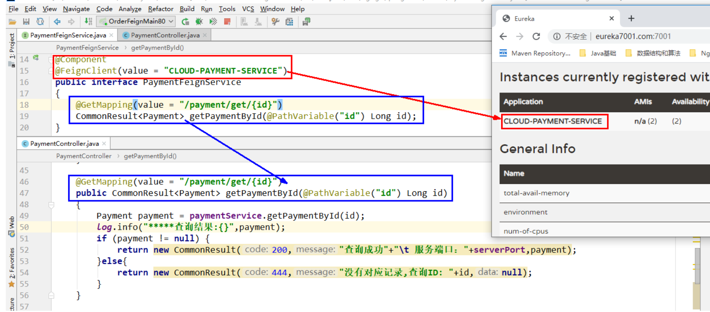
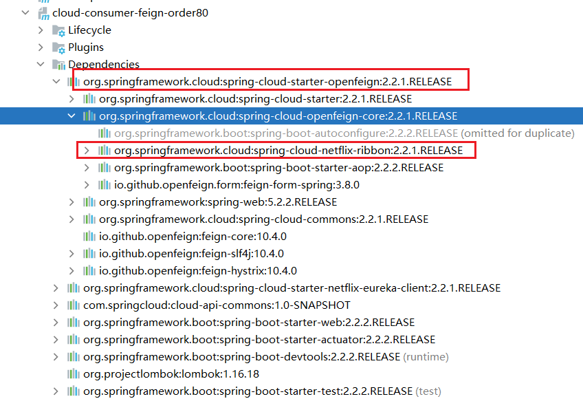

## 概述


### OpenFeign是什么

Feign是一个声明式的Web服务客户端，让编写Web服务客户端变得非常容易，只需创建一个接口并在接口上添加注解即可

GitHub：https://github.com/spring-cloud/spring-cloud-openfeign


官网解释：
https://cloud.spring.io/spring-cloud-static/Hoxton.SR1/reference/htmlsingle/#spring-cloud-openfeign

Feign是一个声明式WebService客户端。使用Feign能让编写Web Service客户端更加简单。
它的使用方法是定义一个服务接口然后在上面添加注解。Feign也支持可拔插式的编码器和解码器。Spring Cloud对Feign进行了封装，使其支持了Spring MVC标准注解和HttpMessageConverters。Feign可以与Eureka和Ribbon组合使用以支持负载均衡


###  Feign能干什么

Feign旨在使编写Java Http客户端变得更容易。
前面在使用Ribbon+RestTemplate时，利用RestTemplate对http请求的封装处理，形成了一套模版化的调用方法。但是在实际开发中，由于对服务依赖的调用可能不止一处，往往一个接口会被多处调用，所以通常都会针对每个微服务自行封装一些客户端类来包装这些依赖服务的调用。所以，Feign在此基础上做了进一步封装，由他来帮助我们定义和实现依赖服务接口的定义。在Feign的实现下，我们只需创建一个接口并使用注解的方式来配置它(以前是Dao接口上面标注Mapper注解,现在是一个微服务接口上面标注一个Feign注解即可)，即可完成对服务提供方的接口绑定，简化了使用Spring cloud Ribbon时，自动封装服务调用客户端的开发量。

Feign集成了Ribbon
利用Ribbon维护了Payment的服务列表信息，并且通过轮询实现了客户端的负载均衡。而与Ribbon不同的是，通过feign只需要定义服务绑定接口且以声明式的方法，优雅而简单的实现了服务调用


### Feign和OpenFeign两者区别

| Feign                                                        |                          OpenFeign                           |
| ------------------------------------------------------------ | :----------------------------------------------------------: |
| Feign是Spring Cloud组件中的一个轻量级RESTful的HTTP服务客户端<br/>Feign内置了Ribbon，用来做客户端负载均衡，去调用服务注册中心的服务。Feign的使用方式是：使用Feign的注解定义接口，调用这个接口，就可以调用服务注册中心的服务 | OpenFeign是Spring Cloud 在Feign的基础上支持了SpringMVC的注解，如@RequesMapping等等。OpenFeign的@FeignClient可以解析SpringMVC的@RequestMapping注解下的接口，并通过动态代理的方式产生实现类，实现类中做负载均衡并调用其他服务。 |
| <dependency><br/>    <groupId>org.springframework.cloud</groupId><br/>    <artifactId>spring-cloud-starter-feign</artifactId><br/></dependency> | <dependency><br/>    <groupId>org.springframework.cloud</groupId><br/>    <artifactId>spring-cloud-starter-openfeign</artifactId><br/></dependency> |


## OpenFeign使用步骤

### 接口+注解

微服务调用接口+@FeignClient


### 新建cloud-consumer-feign-order80

Feign在消费端使用

```markdown
1. Features
Declarative REST Client: Feign creates a dynamic implementation of an interface decorated with JAX-RS or Spring MVC annotations
```


### POM

```xml
<dependencies>
    <!--openfeign-->
    <dependency>
        <groupId>org.springframework.cloud</groupId>
        <artifactId>spring-cloud-starter-openfeign</artifactId>
    </dependency>
    <!--eureka client-->
    <dependency>
        <groupId>org.springframework.cloud</groupId>
        <artifactId>spring-cloud-starter-netflix-eureka-client</artifactId>
    </dependency>
    <!-- 引入自己定义的api通用包，可以使用Payment支付Entity -->
    <dependency>
        <groupId>com.springcloud</groupId>
        <artifactId>cloud-api-commons</artifactId>
        <version>${project.version}</version>
    </dependency>
    <!--web-->
    <dependency>
        <groupId>org.springframework.boot</groupId>
        <artifactId>spring-boot-starter-web</artifactId>
    </dependency>
    <dependency>
        <groupId>org.springframework.boot</groupId>
        <artifactId>spring-boot-starter-actuator</artifactId>
    </dependency>
    <!--一般基础通用配置-->
    <dependency>
        <groupId>org.springframework.boot</groupId>
        <artifactId>spring-boot-devtools</artifactId>
        <scope>runtime</scope>
        <optional>true</optional>
    </dependency>
    <dependency>
        <groupId>org.projectlombok</groupId>
        <artifactId>lombok</artifactId>
        <optional>true</optional>
    </dependency>
    <dependency>
        <groupId>org.springframework.boot</groupId>
        <artifactId>spring-boot-starter-test</artifactId>
        <scope>test</scope>
    </dependency>
</dependencies>
```


### YML

```yaml
server:
  port: 80

eureka:
  client:
    register-with-eureka: false	#没有注册到eureka
    service-url:
      defaultZone: http://eureka7001.com:7001/eureka/,http://eureka7002.com:7002/eureka/
      #defaultZone: http://eureka7001.com:7001/eureka/
```


### 主启动

```java
@SpringBootApplication
@EnableFeignClients
public class OrderFeignMain80
{
    public static void main(String[] args)
    {
        SpringApplication.run(OrderFeignMain80.class,args);
    }
}
```


### 业务类

业务逻辑接口+@FeignClient配置调用provider服务

新建PaymentFeignService接口并新增注解@FeignClient

**此处的@FeignClient注解和主启动类的@EnableFeignClients相对应**

```java
@Component
@FeignClient(value = "CLOUD-PAYMENT-SERVICE")
public interface PaymentFeignService
{
    @GetMapping(value = "/payment/get/{id}")
    CommonResult<Payment> getPaymentById(@PathVariable("id") Long id);
}
```


控制层Controller

```java
@RestController
public class OrderFeignController
{
    @Resource
    private PaymentFeignService paymentFeignService;

    @GetMapping(value = "/consumer/payment/get/{id}")
    public CommonResult<Payment> getPaymentById(@PathVariable("id") Long id)
    {
        return paymentFeignService.getPaymentById(id);
    }
}
```


### 测试

先启动2个eureka集群7001/7002

再启动2个微服务8001/8002

启动OpenFeign启动

http://localhost/consumer/payment/get/1

**Feign自带负载均衡配置项**

8001 8002 交替访问


### 小总结

OpenFeign 使用我们熟悉的**面向接口编程**，放弃了rest访问方式




## OpenFeign超时控制


### 超时设置，故意设置超时演示出错情况

服务提供方8001故意写暂停程序

```java
@GetMapping(value = "/payment/feign/timeout")
public String paymentFeignTimeOut()
{
    System.out.println("*****paymentFeignTimeOut from port: "+serverPort);
    //暂停几秒钟线程
    try { TimeUnit.SECONDS.sleep(3); } catch (InterruptedException e) { e.printStackTrace(); }
    return serverPort;
}
```


服务消费方80添加超时方法PaymentFeignService

```java
@Component
@FeignClient(value = "CLOUD-PAYMENT-SERVICE")
public interface PaymentFeignService
{
    @GetMapping(value = "/payment/get/{id}")
    CommonResult<Payment> getPaymentById(@PathVariable("id") Long id);

    @GetMapping(value = "/payment/feign/timeout")
    String paymentFeignTimeOut();
}
```


服务消费方80添加超时方法OrderFeignController

```java
@GetMapping(value = "/consumer/payment/feign/timeout")
public String paymentFeignTimeOut()
{
    return paymentFeignService.paymentFeignTimeOut();
}
```


测试

只启动8001服务提供者

http://localhost/consumer/payment/feign/timeout

错误页面

`connect timed out executing GET http://CLOUD-PAYMENT-SERVICE/payment/feign/timeout`


### OpenFeign默认等待1秒钟，超过后报错 


### 超时控制是什么


  默认Feign客户端只等待一秒钟，但是服务端处理需要超过1秒钟，导致Feign客户端不想等待了，直接返回报错。
为了避免这样的情况，有时候我们需要设置Feign客户端的超时控制。


yml文件中开启配置

 

### OpenFeign默认支持Ribbon

 


### YML文件里需要开启OpenFeign客户端超时控制

```yaml
server:
  port: 80

eureka:
  client:
    register-with-eureka: false
    service-url:
      defaultZone: http://eureka7001.com:7001/eureka/,http://eureka7002.com:7002/eureka/

#设置feign客户端超时时间(OpenFeign默认支持ribbon)
ribbon:
#指的是建立连接所用的时间，适用于网络状况正常的情况下,两端连接所用的时间
  ReadTimeout: 5000
#指的是建立连接后从服务器读取到可用资源所用的时间
  ConnectTimeout: 5000
```


### 配置成功后再测试

http://localhost/consumer/payment/feign/timeout

可以正常访问


## OpenFeign日志打印功能

### 日志打印功能是什么

Feign 提供了日志打印功能，我们可以通过配置来调整日志级别，从而了解 Feign 中 Http 请求的细节。
说白了就是对Feign接口的调用情况进行监控和输出


### 日志级别

```markdown
 
NONE：默认的，不显示任何日志；
 
BASIC：仅记录请求方法、URL、响应状态码及执行时间；
 
HEADERS：除了 BASIC 中定义的信息之外，还有请求和响应的头信息；
 
FULL：除了 HEADERS 中定义的信息之外，还有请求和响应的正文及元数据。
```


配置日志bean

```java
@Configuration
public class FeignConfig
{
    @Bean
    Logger.Level feignLoggerLevel()
    {
        return Logger.Level.FULL;
    }
}
```


### YML文件里需要开启日志的Feign客户端

```yaml
logging:
  level:
    # feign日志以什么级别监控哪个接口
    com.springcloud.service.PaymentFeignService: debug
```


### 后台日志查看

```markdown
2022-04-25 11:31:23.332 DEBUG 7208 --- [p-nio-80-exec-1] c.s.service.PaymentFeignService          : [PaymentFeignService#paymentFeignTimeOut] <--- HTTP/1.1 200 (3426ms)
2022-04-25 11:31:23.333 DEBUG 7208 --- [p-nio-80-exec-1] c.s.service.PaymentFeignService          : [PaymentFeignService#paymentFeignTimeOut] connection: keep-alive
2022-04-25 11:31:23.333 DEBUG 7208 --- [p-nio-80-exec-1] c.s.service.PaymentFeignService          : [PaymentFeignService#paymentFeignTimeOut] content-length: 4
2022-04-25 11:31:23.333 DEBUG 7208 --- [p-nio-80-exec-1] c.s.service.PaymentFeignService          : [PaymentFeignService#paymentFeignTimeOut] content-type: text/plain;charset=UTF-8
2022-04-25 11:31:23.333 DEBUG 7208 --- [p-nio-80-exec-1] c.s.service.PaymentFeignService          : [PaymentFeignService#paymentFeignTimeOut] date: Mon, 25 Apr 2022 03:31:23 GMT
2022-04-25 11:31:23.334 DEBUG 7208 --- [p-nio-80-exec-1] c.s.service.PaymentFeignService          : [PaymentFeignService#paymentFeignTimeOut] keep-alive: timeout=60
2022-04-25 11:31:23.334 DEBUG 7208 --- [p-nio-80-exec-1] c.s.service.PaymentFeignService          : [PaymentFeignService#paymentFeignTimeOut] 
2022-04-25 11:31:23.336 DEBUG 7208 --- [p-nio-80-exec-1] c.s.service.PaymentFeignService          : [PaymentFeignService#paymentFeignTimeOut] 8001
2022-04-25 11:31:23.337 DEBUG 7208 --- [p-nio-80-exec-1] c.s.service.PaymentFeignService          : [PaymentFeignService#paymentFeignTimeOut] <--- END HTTP (4-byte body)
```

