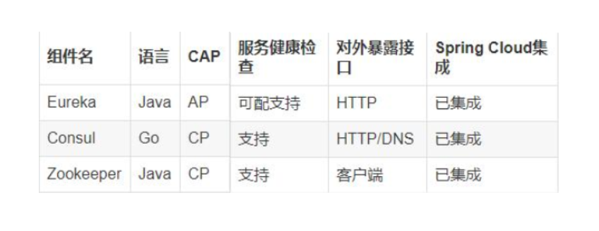
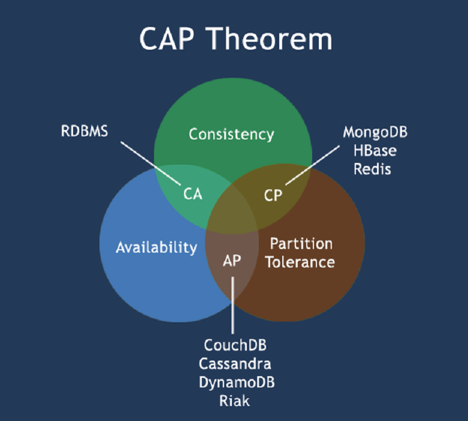
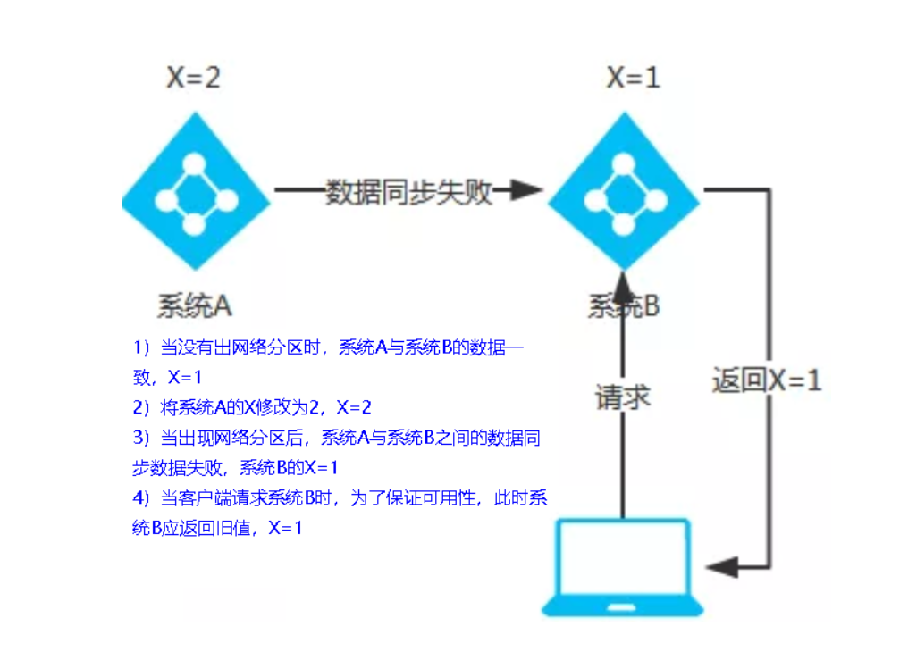
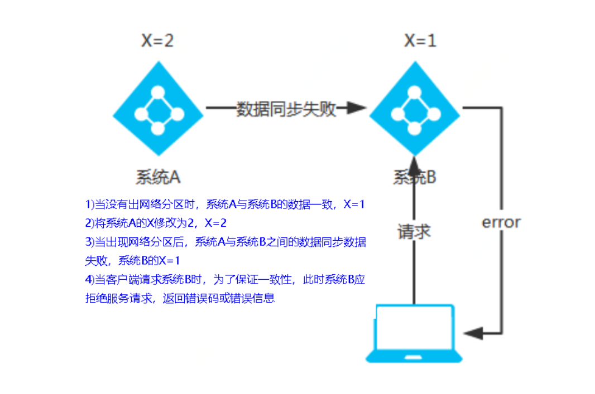

## 三个注册中心异同点

## CAP

​	C:Consistency（强一致性）

​	A:Availability（可用性）

​	P:Partition tolerance（分区容错性）

​	CAP理论关注粒度是数据，而不是整体系统设计的策略

## 经典CAP图

最多只能同时较好的满足两个。
 CAP理论的核心是：一个分布式系统不可能同时很好的满足一致性，可用性和分区容错性这三个需求，
因此，根据 CAP 原理将 NoSQL 数据库分成了满足 CA 原则、满足 CP 原则和满足 AP 原则三 大类：
CA - 单点集群，满足一致性，可用性的系统，通常在可扩展性上不太强大。
CP - 满足一致性，分区容忍必的系统，通常性能不是特别高。
AP - 满足可用性，分区容忍性的系统，通常可能对一致性要求低一些。

 

## AP(Eureka)

AP架构
当网络分区出现后，为了保证可用性，系统B可以返回旧值，保证系统的可用性。
结论：违背了一致性C的要求，只满足可用性和分区容错，即AP

 

 

## CP(Zookeeper/Consul)

CP架构
当网络分区出现后，为了保证一致性，就必须拒接请求，否则无法保证一致性
结论：违背了可用性A的要求，只满足一致性和分区容错，即CP

 

