## Nacos简介

### 为什么叫Nacos

前四个字母分别为Naming和Configuration的前两个字母，最后的s为Service。


### 是什么

一个更易于构建云原生应用的动态服务发现、配置管理和服务管理平台。

Nacos: Dynamic Naming and Configuration Service

Nacos就是注册中心 

等价于Nacos = Eureka+Config +Bus


### 能干嘛

替代Eureka做服务注册中心

替代Config做服务配置中心


### 去哪下

https://github.com/alibaba/Nacos

官网文档

https://nacos.io/zh-cn/index.html

https://spring-cloud-alibaba-group.github.io/github-pages/greenwich/spring-cloud-alibaba.html#_spring_cloud_alibaba_nacos_discovery


### 各种注册中心比较

| 服务注册与发现框架 | CAP模型 | 控制台管理 | 社区活跃度      |
| ------------------ | ------- | ---------- | --------------- |
| Eureka             | AP      | 支持       | 低(2x版本闭源） |
| Zookeeper          | CP      | 不支持     | 中              |
| Consul             | CP      | 支持       | 高              |
| Nacos              | AP      | 支持       | 高              |

据说 Nacos 在阿里巴巴内部有超过 10 万的实例运行，已经过了类似双十一等各种大型流量的考验


## Nacos作为服务注册中心演示


### 官网文档

https://spring-cloud-alibaba-group.github.io/github-pages/greenwich/spring-cloud-alibaba.html#_spring_cloud_alibaba_nacos_config


### 基于Nacos的服务提供者

新建Module：cloudalibaba-provider-payment9001


POM

父POM

```xml
<dependency>
    <groupId>com.alibaba.cloud</groupId>
    <artifactId>spring-cloud-alibaba-dependencies</artifactId>
    <version>2.1.0.RELEASE</version>
    <type>pom</type>
    <scope>import</scope>
</dependency>
```


当前POM

```xml
<dependencies>
    <!--SpringCloud ailibaba nacos -->
    <dependency>
        <groupId>com.alibaba.cloud</groupId>
        <artifactId>spring-cloud-starter-alibaba-nacos-discovery</artifactId>
    </dependency>
    <!-- SpringBoot整合Web组件 -->
    <dependency>
        <groupId>org.springframework.boot</groupId>
        <artifactId>spring-boot-starter-web</artifactId>
    </dependency>
    <dependency>
        <groupId>org.springframework.boot</groupId>
        <artifactId>spring-boot-starter-actuator</artifactId>
    </dependency>
    <!--日常通用jar包配置-->
    <dependency>
        <groupId>org.springframework.boot</groupId>
        <artifactId>spring-boot-devtools</artifactId>
        <scope>runtime</scope>
        <optional>true</optional>
    </dependency>
    <dependency>
        <groupId>org.projectlombok</groupId>
        <artifactId>lombok</artifactId>
        <optional>true</optional>
    </dependency>
    <dependency>
        <groupId>org.springframework.boot</groupId>
        <artifactId>spring-boot-starter-test</artifactId>
        <scope>test</scope>
    </dependency>
</dependencies>
```


YML

```yaml
server:
  port: 9001

spring:
  application:
    name: nacos-payment-provider
  cloud:
    nacos:
      discovery:
        server-addr: localhost:8848 #配置Nacos地址

management:
  endpoints:
    web:
      exposure:
        include: '*'
```


主启动

```java
@EnableDiscoveryClient
@SpringBootApplication
public class PaymentMain9001
{
    public static void main(String[] args) {
        SpringApplication.run(PaymentMain9001.class, args);
    }
}
```


业务类

```java
@RestController
public class PaymentController
{
    @Value("${server.port}")
    private String serverPort;

    @GetMapping(value = "/payment/nacos/{id}")
    public String getPayment(@PathVariable("id") Integer id)
    {
        return "nacos registry, serverPort: "+ serverPort+"\t id"+id;
    }
}
```


测试:

http://localhost:9001/payment/nacos/1

nacos控制台:会在服务列表显示出服务名

nacos服务注册中心+服务提供者9001都OK了


为了下一章节演示nacos的负载均衡，参照9001新建9002

新建cloudalibaba-provider-payment9002

只有端口不同，改为9002


或者取巧不想新建重复体力劳动，直接拷贝虚拟端口映射


### 基于Nacos的服务消费者

新建Module：cloudalibaba-consumer-nacos-order83


POM

```xml
<!--SpringCloud ailibaba nacos -->
<dependency>
    <groupId>com.alibaba.cloud</groupId>
    <artifactId>spring-cloud-starter-alibaba-nacos-discovery</artifactId>
</dependency>
```


为什么nacos支持负载均衡

内嵌了ribbon


YML

```yaml
server:
  port: 83


spring:
  application:
    name: nacos-order-consumer
  cloud:
    nacos:
      discovery:
        server-addr: localhost:8848


#消费者将要去访问的微服务名称(注册成功进nacos的微服务提供者)
service-url:
  nacos-user-service: http://nacos-payment-provider
```


主启动

```java
@EnableDiscoveryClient
@SpringBootApplication
public class OrderNacosMain83
{
    public static void main(String[] args)
    {
        SpringApplication.run(OrderNacosMain83.class,args);
    }
}
```


业务类

```java
@Configuration
public class ApplicationContextBean
{
    @Bean
    @LoadBalanced
    public RestTemplate getRestTemplate()
    {
        return new RestTemplate();
    }
}
```


```java
@RestController
public class OrderNacosController
{
    @Resource
    private RestTemplate restTemplate;

    @Value("${service-url.nacos-user-service}")
    private String serverURL;

    @GetMapping("/consumer/payment/nacos/{id}")
    public String paymentInfo(@PathVariable("id") Long id)
    {
        return restTemplate.getForObject(serverURL+"/payment/nacos/"+id,String.class);
    }

}
```


测试

nacos控制台:


http://localhost:83/consumer/payment/nacos/13

83访问9001/9002，轮询负载OK


### 服务注册中心对比

各种注册中心对比


Nacos全景图所示


Nacos和CAP


切换

Nacos 支持AP和CP模式的切换


C是所有节点在同一时间看到的数据是一致的；而A的定义是所有的请求都会收到响应。


何时选择使用何种模式？
一般来说，
如果不需要存储服务级别的信息且服务实例是通过nacos-client注册，并能够保持心跳上报，那么就可以选择AP模式。当前主流的服务如 Spring cloud 和 Dubbo 服务，都适用于AP模式，AP模式为了服务的可能性而减弱了一致性，因此AP模式下只支持注册临时实例。

如果需要在服务级别编辑或者存储配置信息，那么 CP 是必须，K8S服务和DNS服务则适用于CP模式。
CP模式下则支持注册持久化实例，此时则是以 Raft 协议为集群运行模式，该模式下注册实例之前必须先注册服务，如果服务不存在，则会返回错误。

`curl -X PUT '$NACOS_SERVER:8848/nacos/v1/ns/operator/switches?entry=serverMode&value=CP'`

 

## Nacos作为服务配置中心演示


### Nacos作为配置中心-基础配置


cloudalibaba-config-nacos-client3377


POM

```xml
 <dependencies>
        <!--nacos-config-->
        <dependency>
            <groupId>com.alibaba.cloud</groupId>
            <artifactId>spring-cloud-starter-alibaba-nacos-config</artifactId>
        </dependency>
        <!--nacos-discovery-->
        <dependency>
            <groupId>com.alibaba.cloud</groupId>
            <artifactId>spring-cloud-starter-alibaba-nacos-discovery</artifactId>
        </dependency>
        <!--web + actuator-->
        <dependency>
            <groupId>org.springframework.boot</groupId>
            <artifactId>spring-boot-starter-web</artifactId>
        </dependency>
        <dependency>
            <groupId>org.springframework.boot</groupId>
            <artifactId>spring-boot-starter-actuator</artifactId>
        </dependency>
        <!--一般基础配置-->
        <dependency>
            <groupId>org.springframework.boot</groupId>
            <artifactId>spring-boot-devtools</artifactId>
            <scope>runtime</scope>
            <optional>true</optional>
        </dependency>
        <dependency>
            <groupId>org.projectlombok</groupId>
            <artifactId>lombok</artifactId>
            <optional>true</optional>
        </dependency>
        <dependency>
            <groupId>org.springframework.boot</groupId>
            <artifactId>spring-boot-starter-test</artifactId>
            <scope>test</scope>
        </dependency>
    </dependencies>
```


YML

why配置两个


Nacos同springcloud-config一样，在项目初始化时，要保证先从配置中心进行配置拉取，
拉取配置之后，才能保证项目的正常启动。

springboot中配置文件的加载是存在优先级顺序的，bootstrap优先级高于application


bootstrap

```yaml
# nacos配置
server:
  port: 3377

spring:
  application:
    name: nacos-config-client
  cloud:
    nacos:
      discovery:
        server-addr: localhost:8848 #Nacos服务注册中心地址
      config:
        server-addr: localhost:8848 #Nacos作为配置中心地址
        file-extension: yaml #指定yaml格式的配置


  # ${spring.application.name}-${spring.profile.active}.${spring.cloud.nacos.config.file-extension}

```


application

```yaml
spring:
  profiles:
    active: dev # 表示开发环境
```


主启动

```java
@EnableDiscoveryClient
@SpringBootApplication
public class NacosConfigClientMain3377
{
    public static void main(String[] args) {
        SpringApplication.run(NacosConfigClientMain3377.class, args);
    }
}
```


业务类

ConfigClientController

通过SpringCloud 原生注解@RefreshScope实现配置自动更新


```java
@RestController
@RefreshScope //在控制器类加入@RefreshScope注解使当前类下的配置支持Nacos的动态刷新功能。
public class ConfigClientController
{
    @Value("${config.info}")
    private String configInfo;

    @GetMapping("/config/info")
    public String getConfigInfo() {
        return configInfo;
    }
}
```


### 在Nacos中添加配置信息

Nacos中的匹配规则

#### 理论

Nacos中的dataid的组成格式及与SpringBoot配置文件中的匹配规则

官网


https://nacos.io/zh-cn/docs/quick-start-spring-cloud.html

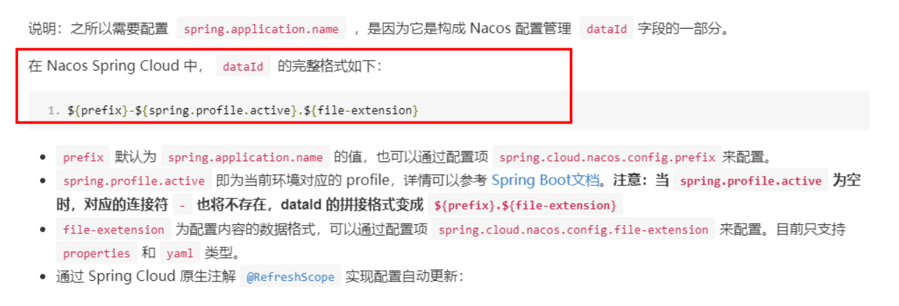 

最后公式：
${spring.application.name}-${spring.profiles.active}.${spring.cloud.nacos.config.file-extension}

 

#### 实操

配置新增

Nacos界面配置对应

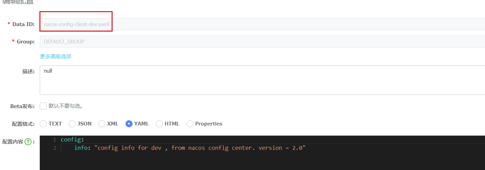

设置DataId：

公式：${spring.application.name}-${spring.profiles.active}.${spring.cloud.nacos.config.file-extension}

prefix 默认为 spring.application.name 的值

spring.profile.active 即为当前环境对应的 profile，可以通过配置项 spring.profile.active 来配置。

file-exetension 为配置内容的数据格式，可以通过配置项 spring.cloud.nacos.config.file-extension 来配置

小总结说明

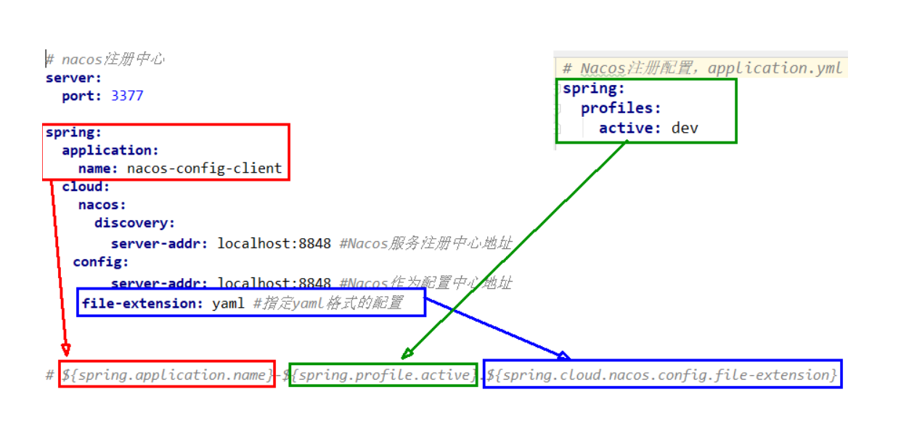


#### 历史配置

Nacos会记录配置文件的历史版本默认保留30天，此外还有一键回滚功能，回滚操作将会触发配置更新

回滚

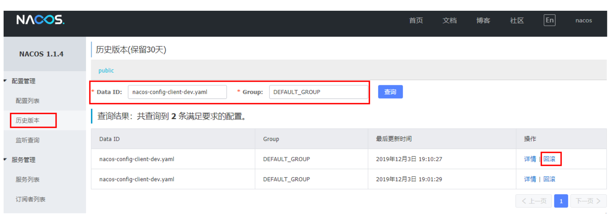


#### 测试

启动前需要在nacos客户端-配置管理-配置管理栏目下有对应的yaml配置文件

运行cloud-config-nacos-client3377的主启动类

调用接口查看配置信息：http://localhost:3377/config/info

```markdown
config info for dev , from nacos config center. version = 2.0
```


#### 自带动态刷新

修改下Nacos中的yaml配置文件，再次调用查看配置的接口，就会发现配置已经刷新


### Nacos作为配置中心-分类配置

#### 问题

多环境多项目管理

问题1：
实际开发中，通常一个系统会准备
dev开发环境
test测试环境
prod生产环境。
如何保证指定环境启动时服务能正确读取到Nacos上相应环境的配置文件呢？

问题2：
一个大型分布式微服务系统会有很多微服务子项目，
每个微服务项目又都会有相应的开发环境、测试环境、预发环境、正式环境......
那怎么对这些微服务配置进行管理呢？


#### Nacos的图形化管理界面

配置管理

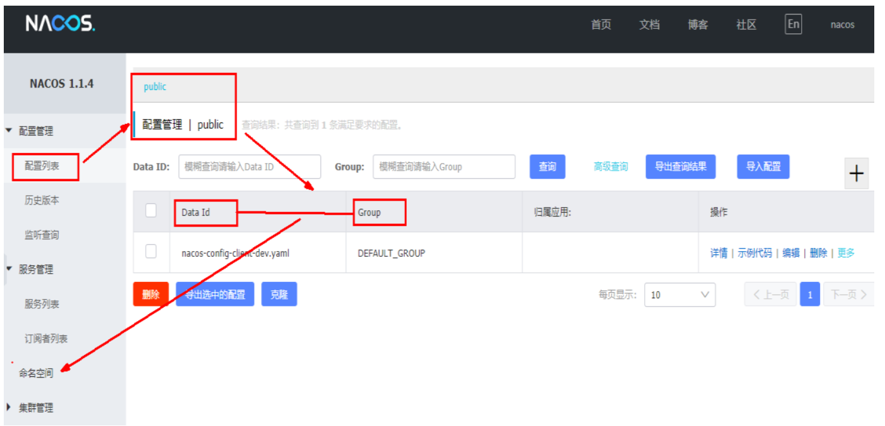


命名空间

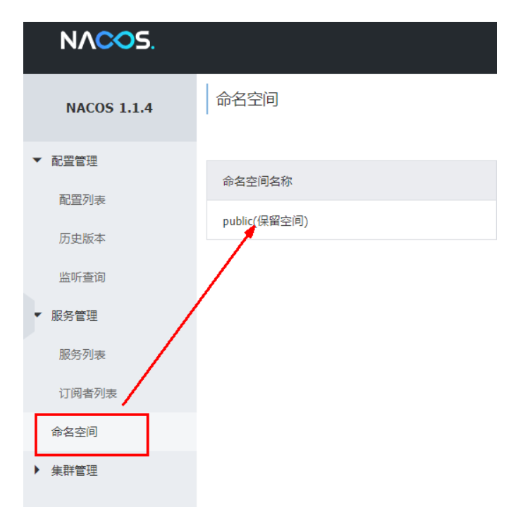


#### Namespace+Group+Data ID三者关系？为什么这么设计？

1 是什么
   类似Java里面的package名和类名
   最外层的namespace是可以用于区分部署环境的，Group和DataID逻辑上区分两个目标对象。
2 三者情况

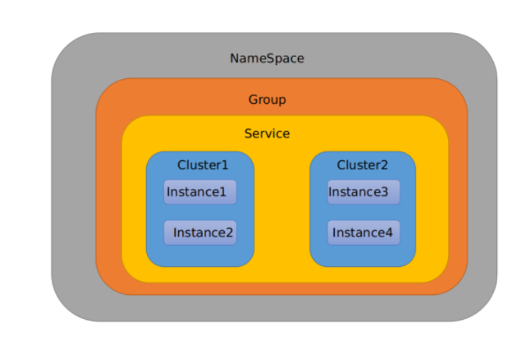    
默认情况：
Namespace=public，Group=DEFAULT_GROUP, 默认Cluster是DEFAULT

Nacos默认的命名空间是public，Namespace主要用来实现隔离。
比方说我们现在有三个环境：开发、测试、生产环境，我们就可以创建三个Namespace，不同的Namespace之间是隔离的。

Group默认是DEFAULT_GROUP，Group可以把不同的微服务划分到同一个分组里面去

Service就是微服务；一个Service可以包含多个Cluster（集群），Nacos默认Cluster是DEFAULT，Cluster是对指定微服务的一个虚拟划分。
比方说为了容灾，将Service微服务分别部署在了杭州机房和广州机房，
这时就可以给杭州机房的Service微服务起一个集群名称（HZ），
给广州机房的Service微服务起一个集群名称（GZ），还可以尽量让同一个机房的微服务互相调用，以提升性能。

最后是Instance，就是微服务的实例。

 

####  Case:三种方案加载配置

##### DataID方案

指定spring.profile.active和配置文件的DataID来使不同环境下读取不同的配置


默认空间+默认分组+新建dev和test两个DataID

新建dev配置DataID

 新建test配置DataID

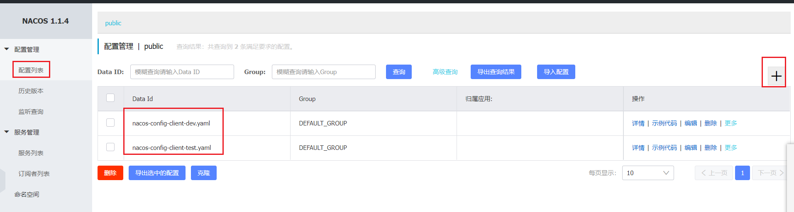

 

 通过spring.profile.active属性就能进行多环境下配置文件的读取

 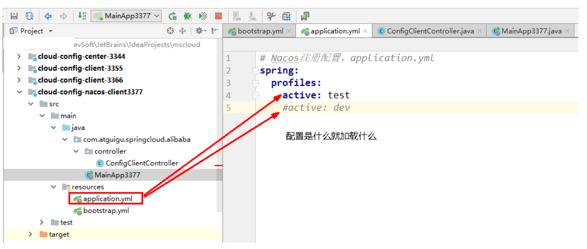

 

 测试

http://localhost:3377/config/info


##### Group方案

通过Group实现环境区分

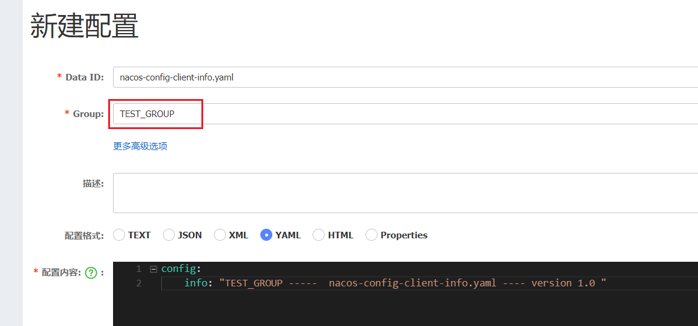

在nacos图形界面控制台上面新建配置文件DataID

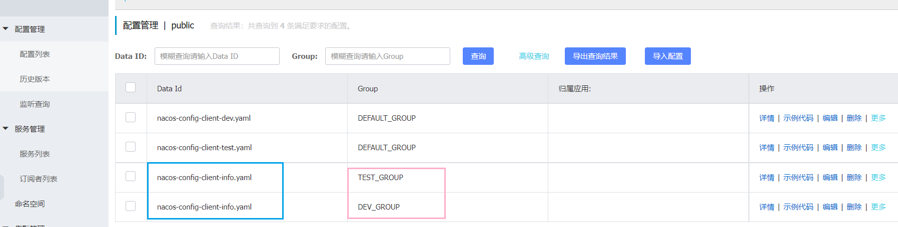


bootstrap+application

在config下增加一条group的配置即可。
可配置为DEV_GROUP或TEST_GROUP

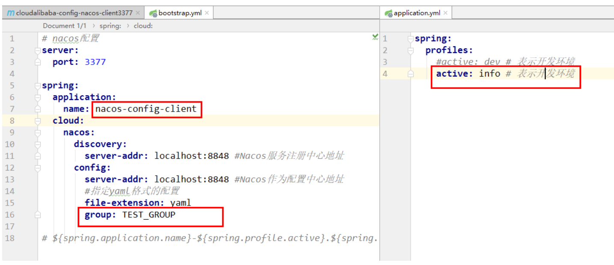


##### Namespace方案


新建dev/test的Namespace


回到服务管理-服务列表查看

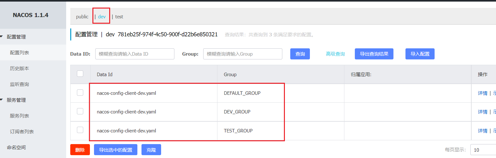

按照域名配置填写


YML

bootstrap

```yaml
spring:
  application:
    name: nacos-config-client
  cloud:
    nacos:
      discovery:
        server-addr: localhost:8848 #Nacos服务注册中心地址
      config:
        server-addr: localhost:8848 #Nacos作为配置中心地址
        file-extension: yaml #指定yaml格式的配置
        group: DEV_GROUP
        namespace: 781eb25f-974f-4c50-900f-d22b6e850321

  # ${spring.application.name}-${spring.profile.active}.${spring.cloud.nacos.config.file-extension}
```


application

```yaml
spring:
  profiles:
    active: dev
  #active: info
  #active: test # 表示开发环境
```


会按照 命名空间id（781eb25f-974f-4c50-900f-d22b6e850321）下面的DEV_GROUP

下面的(application.name)-(profiles.active）.（file-extension）

`781eb25f-974f-4c50-900f-d22b6e850321>DEV_GROUP>nacos-config-client-dev.yaml`


## Nacos集群和持久化配置（重要）

### 官网说明

https://nacos.io/zh-cn/docs/cluster-mode-quick-start.html


集群部署架构图

因此开源的时候推荐用户把所有服务列表放到一个vip下面，然后挂到一个域名下面

[http://ip1](http://ip1/):port/openAPI 直连ip模式，机器挂则需要修改ip才可以使用。

[http://SLB](http://slb/):port/openAPI 挂载SLB模式(内网SLB，不可暴露到公网，以免带来安全风险)，直连SLB即可，下面挂server真实ip，可读性不好。

[http://nacos.com](http://nacos.com/):port/openAPI 域名 + SLB模式(内网SLB，不可暴露到公网，以免带来安全风险)，可读性好，而且换ip方便，推荐模式

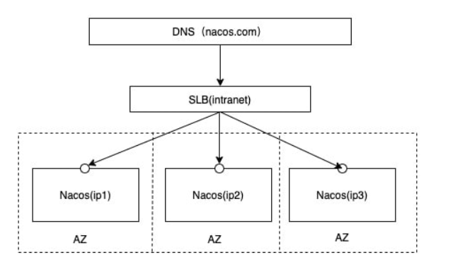


### 上图官网翻译，真实情况

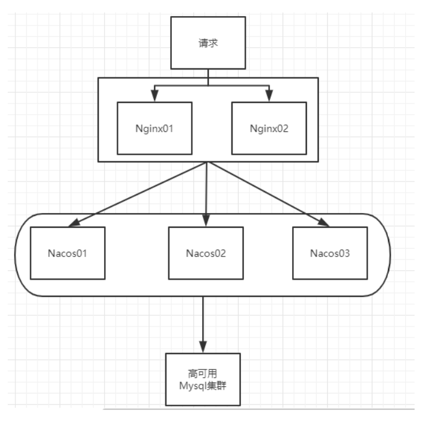


### 说明

默认Nacos使用嵌入式数据库实现数据的存储。所以，如果启动多个默认配置下的Nacos节点，数据存储是存在一致性问题的。
为了解决这个问题，Nacos采用了集中式存储的方式来支持集群化部署，目前只支持MySQL的存储。


```markdown
Nacos部署环境
Nacos定义为一个IDC内部应用组件，并非面向公网环境的产品，建议在内部隔离网络环境中部署，强烈不建议部署在公共网络环境。

以下文档中提及的VIP，网卡等所有网络相关概念均处于内部网络环境。

Nacos支持三种部署模式
单机模式 - 用于测试和单机试用。
集群模式 - 用于生产环境，确保高可用。
多集群模式 - 用于多数据中心场景。
单机模式下运行Nacos
Linux/Unix/Mac
Standalone means it is non-cluster Mode. * sh startup.sh -m standalone
Windows
Standalone means it is non-cluster Mode. * cmd startup.cmd -m standalone
单机模式支持mysql
在0.7版本之前，在单机模式时nacos使用嵌入式数据库实现数据的存储，不方便观察数据存储的基本情况。0.7版本增加了支持mysql数据源能力，具体的操作步骤：

1.安装数据库，版本要求：5.6.5+
2.初始化mysql数据库，数据库初始化文件：nacos-mysql.sql
3.修改conf/application.properties文件，增加支持mysql数据源配置（目前只支持mysql），添加mysql数据源的url、用户名和密码。
spring.datasource.platform=mysql

db.num=1
db.url.0=jdbc:mysql://11.162.196.16:3306/nacos_devtest?characterEncoding=utf8&connectTimeout=1000&socketTimeout=3000&autoReconnect=true
db.user=nacos_devtest
db.password=youdontknow
再以单机模式启动nacos，nacos所有写嵌入式数据库的数据都写到了mysql
```


按照上述，我们需要mysql数据库

官网说明

https://nacos.io/zh-cn/docs/deployment.html


### Nacos持久化配置解释

Nacos默认自带的是嵌入式数据库derby

https://github.com/alibaba/nacos/blob/develop/config/pom.xml


#### derby到mysql切换配置步骤

nacos-server-1.1.4\nacos\conf目录下找到sql脚本执行


nacos-server-1.1.4\nacos\conf目录下找到application.properties

在行尾添加

```sql
spring.datasource.platform=mysql
 
db.num=1
db.url.0=jdbc:mysql://127.0.0.1:3306/nacos_config?characterEncoding=utf8&connectTimeout=1000&socketTimeout=3000&autoReconnect=true
db.user=root
db.password=密码
```


如果使用mysql8.0，需要修改对应的驱动版本


### Linux版Nacos+MySQL生产环境配置


预计需要，1个Nginx+3个nacos注册中心+1个mysql


Nacos下载Linux版

https://github.com/alibaba/nacos/releases/tag/1.1.4

nacos-server-1.1.4.tar.gz

解压后安装


#### 集群配置步骤(重点)

Linux服务器上mysql数据库配置

SQL脚本和windows版一样，

nacos-mysql.sql在config路径下


#### application.properties 配置

和windows一样移除默认数据库，加入自己的

加在行尾

```shell
spring.datasource.platform=mysql
 
db.num=1
db.url.0=jdbc:mysql://127.0.0.1:3306/nacos_config?characterEncoding=utf8&connectTimeout=1000&socketTimeout=3000&autoReconnect=true
db.user=root
db.password=123456
```


Linux服务器上nacos的集群配置cluster.conf

梳理出3台nacos集器的不同服务端口号

这个IP不能写127.0.0.1，必须是
Linux命令hostname -i能够识别的IP

```shell
111.222.333.444:3333
111.222.333.444:4444
111.222.333.444:5555
```


编辑Nacos的启动脚本startup.sh，使它能够接受不同的启动端口

/mynacos/nacos/bin 目录下有startup.sh

```shell
while getopts ":m:f:s:p:" opt
do
    case $opt in
        m)
            MODE=$OPTARG;;
        f)
            FUNCTION_MODE=$OPTARG;;
        s)
            SERVER=$OPTARG;;
        p)
           PORT=$OPTARG;;
        ?)
        echo "Unknown parameter"
        exit 1;;
    esac
done

```


```shell
nohup $JAVA -Dserver.port=${PORT} ${JAVA_OPT} nacos.nacos >> ${BASE_DIR}/logs/start.out 2>&1 &
```


执行方式

```shell
./startup.sh -p 3333
./startup.sh -p 4444
./startup.sh -p 5555
```


查看启动了多数nacos

```shell
ps -ef|grep nacos |wc -l
```


查看日志

```shell
cd ../logs/
cat nacos.log
```


#### Nginx的配置，由它作为负载均衡器

修改nginx的配置文件

nginx.conf

```shell
upstream cluster{
server 127.0.0.1:3333;
server 127.0.0.1:4444;
server 127.0.0.1:5555;
}


#gzip  on;

server {
listen       1111;
server_name  localhost;

#charset koi8-r;

#access_log  logs/host.access.log  main;

location / {
#root   html;
# index  index.html index.htm;
proxy_pass http://cluster;
}

```


启动

```shell
[root@test sbin]# ./nginx -c /home/nginx/nginx-1.18.0/conf/nginx.conf

```


#### 截止到此处，1个Nginx+3个nacos注册中心+1个mysql


测试通过nginx访问nacos

http://192.168.111.144:1111/nacos/#/login

新增一条配置，可以在数据库查看


#### 测试

微服务cloudalibaba-provider-payment9002启动注册进nacos集群

yml

```yaml
spring:
  application:
    name: nacos-payment-provider
  cloud:
    nacos:
      discovery:
        #server-addr: localhost:8848 #配置Nacos地址
        #配置Nacos地址
        #server-addr: localhost:8848
        # 换成nginx的1111端口，做集群
        server-addr: 192.168.5.192:1111
```


结果

服务注册成功


高可用小总结

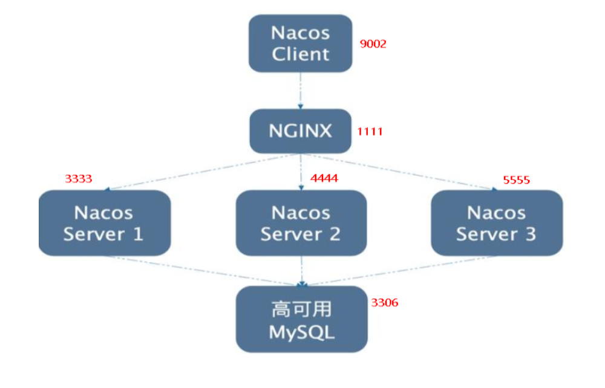

