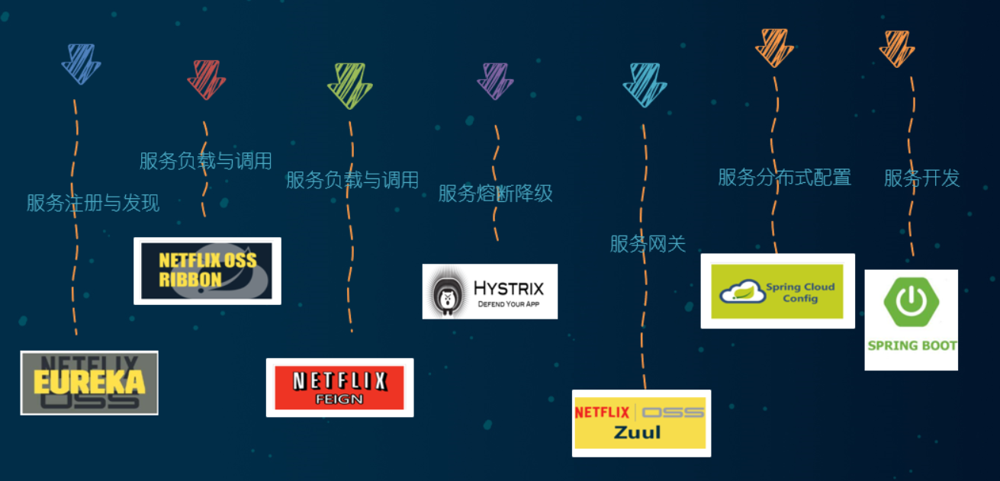
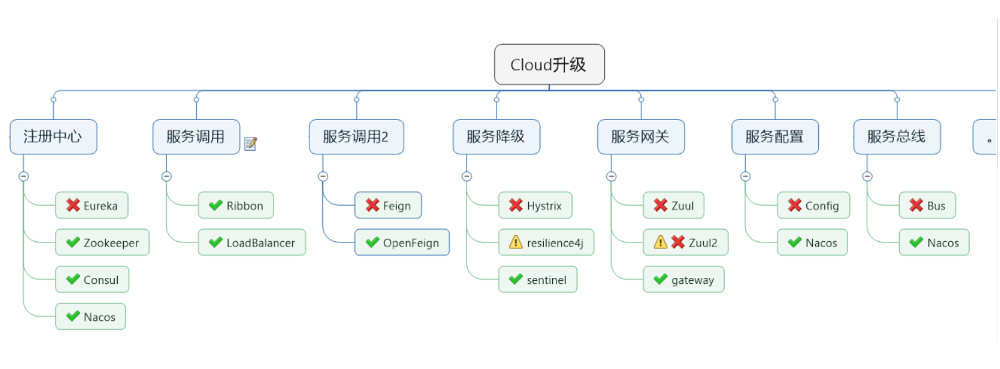

## 停更不停用

被动修复bugs

不再接受合并请求

不再发布新版本

### 以前

### 现在

## 参考资料见官网

Spring Cloud

https://cloud.spring.io/spring-cloud-static/Hoxton.SR1/reference/htmlsingle/

Spring Cloud中文文档

https://www.bookstack.cn/read/spring-cloud-docs/docs-index.md

Spring Boot

https://docs.spring.io/spring-boot/docs/2.2.2.RELEASE/reference/htmlsingle/

