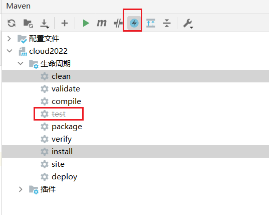
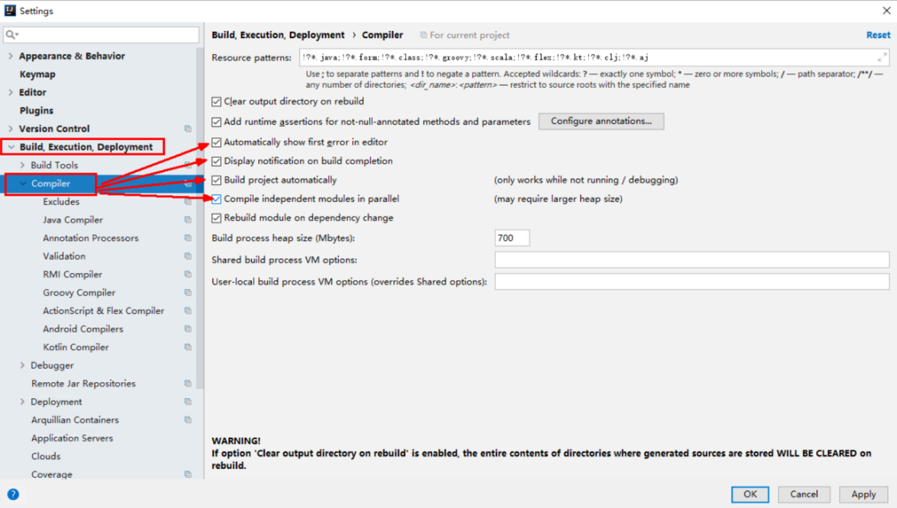
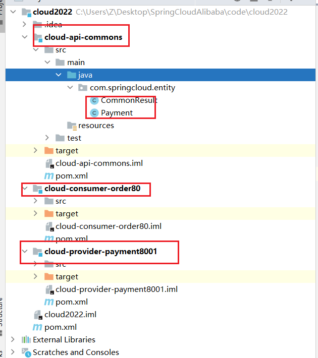

## 约定 > 配置 > 编码


## IDEA新建project工作空间


1  新建Empty Project，类似工作空间

2  新project设置
    2.1    project都选择8
    2.2    module点击+号，新建一个maven模块

3  新Module的设置
    3.1    由于第一个是pom统一工程，不选择模板create from archetype

​	3.2 	group:com.springcloud

​				项目名:cloud2022

​				version:1.0-SNAPSHOT

3.3    Language Level 选择 8


### 4  新project设置

​    4.1    Editor | File Encodings 设置为UTF8
​    4.2    Build, Execution, Deployment | Compiler | Annotation Processors 每个module都打勾
​    4.3    File | Settings | Build, Execution, Deployment | Compiler | Java Compiler  设置为1.8

5  cloud2022该模块下鼠标右键新建其下的子module
    5.1    新建子module    microservicecloud-api   可以不勾选create from archetype
    5.2    IDEA工具右边的maven projects视图刷新，出现新的子模块
    5.3    右上角设置，选择Group Modules
    5.4    视图上选择+号，选中api里面的pom.xml

6  IDEA工具隐藏*.iml等
    点击File-->setting(或者Ctrl+Alt+S)-->Editor--> Flie Types 在ignore files and folders，然后在输入框最后面跟上*.idea;*.iml;

 


### 父工程POM 

```xml
 
<?xml version="1.0" encoding="UTF-8"?>

<project xmlns="http://maven.apache.org/POM/4.0.0" xmlns:xsi="http://www.w3.org/2001/XMLSchema-instance"
         xsi:schemaLocation="http://maven.apache.org/POM/4.0.0 http://maven.apache.org/xsd/maven-4.0.0.xsd">
    <modelVersion>4.0.0</modelVersion>

    <groupId>com.atguigu.springcloud</groupId>
    <artifactId>mscloud03</artifactId>
    <version>1.0-SNAPSHOT</version>
    <packaging>pom</packaging>
 
    <!-- 统一管理jar包版本 -->
    <properties>
        <project.build.sourceEncoding>UTF-8</project.build.sourceEncoding>
        <maven.compiler.source>1.8</maven.compiler.source>
        <maven.compiler.target>1.8</maven.compiler.target>
        <junit.version>4.12</junit.version>
        <log4j.version>1.2.17</log4j.version>
        <lombok.version>1.16.18</lombok.version>
        <mysql.version>5.1.47</mysql.version>
        <druid.version>1.1.16</druid.version>
        <mybatis.spring.boot.version>1.3.0</mybatis.spring.boot.version>
    </properties>
 
    <!-- 子模块继承之后，提供作用：锁定版本+子modlue不用写groupId和version  -->
    <dependencyManagement>
        <dependencies>
            <!--spring boot 2.2.2-->
            <dependency>
                <groupId>org.springframework.boot</groupId>
                <artifactId>spring-boot-dependencies</artifactId>
                <version>2.2.2.RELEASE</version>
                <type>pom</type>
                <scope>import</scope>
            </dependency>
            <!--spring cloud Hoxton.SR1-->
            <dependency>
                <groupId>org.springframework.cloud</groupId>
                <artifactId>spring-cloud-dependencies</artifactId>
                <version>Hoxton.SR1</version>
                <type>pom</type>
                <scope>import</scope>
            </dependency>
            <!--spring cloud alibaba 2.1.0.RELEASE-->
            <dependency>
                <groupId>com.alibaba.cloud</groupId>
                <artifactId>spring-cloud-alibaba-dependencies</artifactId>
                <version>2.1.0.RELEASE</version>
                <type>pom</type>
                <scope>import</scope>
            </dependency>
            <dependency>
                <groupId>mysql</groupId>
                <artifactId>mysql-connector-java</artifactId>
                <version>${mysql.version}</version>
            </dependency>
            <dependency>
                <groupId>com.alibaba</groupId>
                <artifactId>druid</artifactId>
                <version>${druid.version}</version>
            </dependency>
            <dependency>
                <groupId>org.mybatis.spring.boot</groupId>
                <artifactId>mybatis-spring-boot-starter</artifactId>
                <version>${mybatis.spring.boot.version}</version>
            </dependency>
            <dependency>
                <groupId>junit</groupId>
                <artifactId>junit</artifactId>
                <version>${junit.version}</version>
            </dependency>
            <dependency>
                <groupId>log4j</groupId>
                <artifactId>log4j</artifactId>
                <version>${log4j.version}</version>
            </dependency>
            <dependency>
                <groupId>org.projectlombok</groupId>
                <artifactId>lombok</artifactId>
                <version>${lombok.version}</version>
                <optional>true</optional>
            </dependency>
        </dependencies>
    </dependencyManagement>

    <build>
        <plugins>
            <plugin>
                <groupId>org.springframework.boot</groupId>
                <artifactId>spring-boot-maven-plugin</artifactId>
                <configuration>
                    <fork>true</fork>
                    <addResources>true</addResources>
                </configuration>
            </plugin>
        </plugins>
    </build>

</project>
```


### Maven工程落地细节复习

Maven中的DependencyManagement和Dependencies

#### dependencyManagement

Maven 使用dependencyManagement 元素来提供了一种管理依赖版本号的方式。
通常会在一个组织或者项目的最顶层的父POM 中看到dependencyManagement 元素。

使用pom.xml 中的dependencyManagement 元素能让所有在子项目中引用一个依赖而不用显式的列出版本号。
Maven 会沿着父子层次向上走，直到找到一个拥有dependencyManagement 元素的项目，然后它就会使用这个
dependencyManagement 元素中指定的版本号。


这样做的好处就是：如果有多个子项目都引用同一样依赖，则可以避免在每个使用的子项目里都声明一个版本号，这样当想升级或切换到另一个版本时，只需要在顶层父容器里更新，而不需要一个一个子项目的修改 ；另外如果某个子项目需要另外的一个版本，只需要声明version就可。

*     dependencyManagement里只是声明依赖，并不实现引入，因此子项目需要显示的声明需要用的依赖。

*   如果不在子项目中声明依赖，是不会从父项目中继承下来的；只有在子项目中写了该依赖项，并且没有指定具体版本，
     才会从父项目中继承该项，并且version和scope都读取自父pom;

*     如果子项目中指定了版本号，那么会使用子项目中指定的jar版本。

 

###  maven中跳过单元测试



父工程创建完成执行mvn:install将父工程发布到仓库方便子工程继承


## MySQL驱动说明


com.mysql.jdbc.Driver和mysql-connector-java 5一起用。
com.mysql.cj.jdbc.Driver和mysql-connector-java 6 一起用。

com.mysql.cj.jdbc.Driver是mysql-connector-java 6 中的特性，相比mysql-connector-java 5 多了一个时区：serverTimezone，把数据源配置的驱动改一下就好了


org.gjt.mm.mysql.Driver是当时最好的MySQL JDBC，但不是MySQL公司的，然后MySQL将MM的JDBC驱动 收为官方的JDBC驱动，所以将驱动的package也改了，但还保留了org.gjt.mm.mysql.Driver这个路径的引用，也就是你使用新版的JDBC驱动时还可以通过这个来引用，打开下载的新版JDBC驱动的jar文件可以看到，只有一个文件的目录是org.gjt.mm.mysql，就是为了兼容而设计的。


# Rest微服务工程构建


## 微服务提供者支付Module模块

cloud-provider-payment8001:服务提供者proivder


建cloud-provider-payment8001

父工程pom会多一个模块

```xml
<modules>
    <module>cloud-provider-payment8001</module>
</modules>
```


改POM

```xml
<parent>
    <artifactId>cloud2022</artifactId>
    <groupId>com.springcloud</groupId>
    <version>1.0-SNAPSHOT</version>
</parent>
<modelVersion>4.0.0</modelVersion>

<artifactId>cloud-provider-payment8001</artifactId>

<dependencies>
    <dependency>
        <groupId>org.springframework.boot</groupId>
        <artifactId>spring-boot-starter-web</artifactId>
    </dependency>
    <dependency>
        <groupId>org.springframework.boot</groupId>
        <artifactId>spring-boot-starter-actuator</artifactId>
    </dependency>
    <dependency>
        <groupId>org.mybatis.spring.boot</groupId>
        <artifactId>mybatis-spring-boot-starter</artifactId>
    </dependency>
    <dependency>
        <groupId>com.alibaba</groupId>
        <artifactId>druid-spring-boot-starter</artifactId>
        <version>1.1.10</version>
    </dependency>
    <!--mysql-connector-java-->
    <dependency>
        <groupId>mysql</groupId>
        <artifactId>mysql-connector-java</artifactId>
    </dependency>
    <!--jdbc-->
    <dependency>
        <groupId>org.springframework.boot</groupId>
        <artifactId>spring-boot-starter-jdbc</artifactId>
    </dependency>
    <dependency>
        <groupId>org.springframework.boot</groupId>
        <artifactId>spring-boot-devtools</artifactId>
        <scope>runtime</scope>
        <optional>true</optional>
    </dependency>
    <dependency>
        <groupId>org.projectlombok</groupId>
        <artifactId>lombok</artifactId>
        <optional>true</optional>
    </dependency>
    <dependency>
        <groupId>org.springframework.boot</groupId>
        <artifactId>spring-boot-starter-test</artifactId>
        <scope>test</scope>
    </dependency>
</dependencies>
```


写YML:application.yml

```yaml
server:
  port: 8001

spring:
  application:
    name: cloud-payment-service
  datasource:
    type: com.alibaba.druid.pool.DruidDataSource            # 当前数据源操作类型
    driver-class-name: org.gjt.mm.mysql.Driver              # mysql驱动包 com.mysql.jdbc.Driver
    url: jdbc:mysql://localhost:3307/db2022?useUnicode=true&characterEncoding=utf-8&useSSL=false
    username: root
    password: root


mybatis:
  mapperLocations: classpath:mapper/*.xml
  type-aliases-package: com.springcloud.entity    # 所有Entity别名类所在包
```


主启动类：

```java
@SpringBootApplication
public class PaymentMain8001 {

    public static void main(String[] args){
        SpringApplication.run(PaymentMain8001.class,args);
    }

}
```


## 业务类

建表SQL

```sql
 CREATE TABLE `payment` (
     `id` bigint(20) NOT NULL AUTO_INCREMENT COMMENT 'ID',
     `serial` varchar(200) DEFAULT '',
     PRIMARY KEY (`id`)
 ) ENGINE=InnoDB AUTO_INCREMENT=1 DEFAULT CHARSET=utf8
```


实体类

```java
@Data
@AllArgsConstructor
@NoArgsConstructor
public class Payment implements Serializable {

    private Long id;
    @JsonProperty(value = "serial")
    private String serial;

}
```

通用返回结果类：

```java
@Data
@AllArgsConstructor
@NoArgsConstructor
public class CommonResult<T>
{
    private Integer code;
    private String  message;
    private T data;

    public CommonResult(Integer code, String message)
    {
        this(code,message,null);
    }
}
```


dao

```java
@Mapper  //import org.apache.ibatis.annotations.Mapper;
public interface PaymentDao
{
    public int create(Payment payment);

    public Payment getPaymentById(@Param("id") Long id);
}
```

对应mapper文件，在src\main\resources\mapper\PaymentMapper.xml路径下

```xml
<?xml version="1.0" encoding="UTF-8" ?>
<!DOCTYPE mapper PUBLIC "-//mybatis.org//DTD Mapper 3.0//EN" "http://mybatis.org/dtd/mybatis-3-mapper.dtd" >

<mapper namespace="com.springcloud.dao.PaymentDao">

    <resultMap id="BaseResultMap" type="com.springcloud.entity.Payment">
        <id column="id" property="id" jdbcType="BIGINT"/>
        <result column="serial" property="serial" jdbcType="VARCHAR"/>
    </resultMap>

    <insert id="create" parameterType="Payment" useGeneratedKeys="true" keyProperty="id">
        INSERT INTO payment(SERIAL) VALUES(#{serial});
    </insert>

    <select id="getPaymentById" parameterType="Long" resultMap="BaseResultMap" >
        SELECT * FROM payment WHERE id=#{id};
    </select>

</mapper>
```


service接口和实现类

```java
public interface PaymentService
{
    public int create(Payment payment);

    public Payment getPaymentById(@Param("id") Long id);

}
```

```java
@Service
public class PaymentServiceImpl implements PaymentService
{
    @Resource
    private PaymentDao paymentDao;


    @Override
    public int create(Payment payment)
    {
        return paymentDao.create(payment);
    }

    @Override
    public Payment getPaymentById(Long id)
    {
        return paymentDao.getPaymentById(id);
    }
}
```


Controller

```java
@RestController
@Slf4j
public class PaymentController
{
    @Resource
    private PaymentService paymentService;

    @PostMapping(value = "/payment/create")
    public CommonResult create(Payment payment)
    {
        int result = paymentService.create(payment);
        log.info("*****插入操作返回结果:" + result);

        if(result > 0)
        {
            return new CommonResult(200,"插入数据库成功",result);
        }else{
            return new CommonResult(444,"插入数据库失败",null);
        }
    }

    @GetMapping(value = "/payment/get/{id}")
    public CommonResult<Payment> getPaymentById(@PathVariable("id") Long id)
    {
        Payment payment = paymentService.getPaymentById(id);
        log.info("*****查询结果:{}",payment);
        if (payment != null) {
            return new CommonResult(200,"查询成功",payment);
        }else{
            return new CommonResult(444,"没有对应记录,查询ID: "+id,null);
        }
    }
}
```


** @PostMapping新增数据时，如果有@RequestBody注解，会找不到类型，加上@JsonProperties也不行**


## 小总结

建module

改POM

写YML

主启动

业务类


## **热部署Devtools**

添加jar

```xml
<dependency>
    <groupId>org.springframework.boot</groupId>
    <artifactId>spring-boot-devtools</artifactId>
    <scope>runtime</scope>
    <optional>true</optional>
</dependency>

```


下段配置我们粘贴进聚合父类总工程的pom.xml里

```xml
<build>
    <finalName>你自己的工程名字</finalName>
    <plugins>
        <plugin>
            <groupId>org.springframework.boot</groupId>
            <artifactId>spring-boot-maven-plugin</artifactId>
            <configuration>
                <fork>true</fork>
                <addResources>true</addResources>
            </configuration>
        </plugin>
    </plugins>
</build>
```


idea修改




## 微服务消费者订单Module模块

cloud-consumer-order80-服务消费者consumer


POM

```xml
    <parent>
        <artifactId>cloud2022</artifactId>
        <groupId>com.springcloud</groupId>
        <version>1.0-SNAPSHOT</version>
    </parent>
    <modelVersion>4.0.0</modelVersion>

    <artifactId>cloud-consumer-order80</artifactId>

    <dependencies>
        <dependency>
            <groupId>org.springframework.boot</groupId>
            <artifactId>spring-boot-starter-web</artifactId>
        </dependency>
        <dependency>
            <groupId>org.springframework.boot</groupId>
            <artifactId>spring-boot-starter-actuator</artifactId>
        </dependency>

        <dependency>
            <groupId>org.springframework.boot</groupId>
            <artifactId>spring-boot-devtools</artifactId>
            <scope>runtime</scope>
            <optional>true</optional>
        </dependency>
        <dependency>
            <groupId>org.projectlombok</groupId>
            <artifactId>lombok</artifactId>
            <optional>true</optional>
        </dependency>
        <dependency>
            <groupId>org.springframework.boot</groupId>
            <artifactId>spring-boot-starter-test</artifactId>
            <scope>test</scope>
        </dependency>
    </dependencies>
```


YML

```yaml
server:
  port: 80
```


主启动类

```java
@SpringBootApplication
public class MainApp80 {

    public static void main(String[] args){
        SpringApplication.run(MainApp80.class,args);
    }
}
```


实体类和8001服务提供者一致


## 首说RestTemplate


RestTemplate提供了多种便捷访问远程Http服务的方法， 
是一种简单便捷的访问restful服务模板类，是Spring提供的用于访问Rest服务的客户端模板工具集

 

官网地址

https://docs.spring.io/spring-framework/docs/5.2.2.RELEASE/javadoc-api/org/springframework/web/client/RestTemplate.html


使用
使用restTemplate访问restful接口非常的简单粗暴无脑。
(url, requestMap, ResponseBean.class)这三个参数分别代表 
REST请求地址、请求参数、HTTP响应转换被转换成的对象类型。


配置

```java
@Configuration
public class ApplicationContextConfig {
    
    @Bean
    public RestTemplate getRestTemplate(){
        return new RestTemplate();
    }
}
```


controller中使用

```java
@RestController
public class OrderController
{

    public static final String PaymentSrv_URL = "http://localhost:8001";

    @Autowired
    private RestTemplate restTemplate;

    @GetMapping("/consumer/payment/create") //客户端用浏览器是get请求，但是底层实质发送post调用服务端8001
    public CommonResult create(Payment payment)
    {
        return restTemplate.postForObject(PaymentSrv_URL + "/payment/create",payment,CommonResult.class);
    }


    @GetMapping("/consumer/payment/get/{id}")
    public CommonResult getPayment(@PathVariable Long id)
    {
        return restTemplate.getForObject(PaymentSrv_URL + "/payment/get/"+id, CommonResult.class, id);
    }
}
```


## 测试

http://localhost/consumer/payment/get/1

不要忘记@RequestBody注解--**暂时没弄清楚，为什么访问8001为什么不能加上注解**

http://localhost/consumer/payment/create?serial=aaaaa1


## 工程重构

观察问题：

系统中有重复部分，重构

实体类重复了，后期如果有多个项目，实体类会膨胀


新建：cloud-api-commons

POM

```xml
    <parent>
        <artifactId>cloud2022</artifactId>
        <groupId>com.springcloud</groupId>
        <version>1.0-SNAPSHOT</version>
    </parent>
    <modelVersion>4.0.0</modelVersion>

    <artifactId>cloud-api-commons</artifactId>

    <dependencies>
        <dependency>
            <groupId>org.springframework.boot</groupId>
            <artifactId>spring-boot-devtools</artifactId>
            <scope>runtime</scope>
            <optional>true</optional>
        </dependency>
        <dependency>
            <groupId>org.projectlombok</groupId>
            <artifactId>lombok</artifactId>
            <optional>true</optional>
        </dependency>
        <dependency>
            <groupId>cn.hutool</groupId>
            <artifactId>hutool-all</artifactId>
            <version>5.1.0</version>
        </dependency>
    </dependencies>
```


添加Payment和CommonResult实体类，参照在8001服务提供者模块


maven命令clean install，打包方便其它模块引用


订单80和支付8001分别改造：

删除原来的entity包

引入

```xml
<dependency>
    <groupId>com.springcloud</groupId>
    <artifactId>cloud-api-commons</artifactId>
    <version>${project.version}</version>
</dependency>
```


自测通过

http://localhost/consumer/payment/get/1

http://localhost/consumer/payment/create?serial=test199


## 目前工程样图

